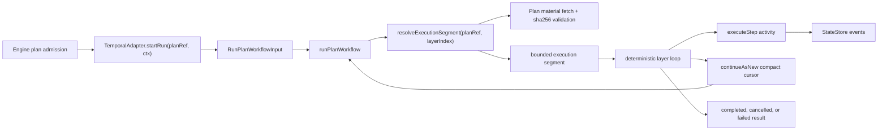
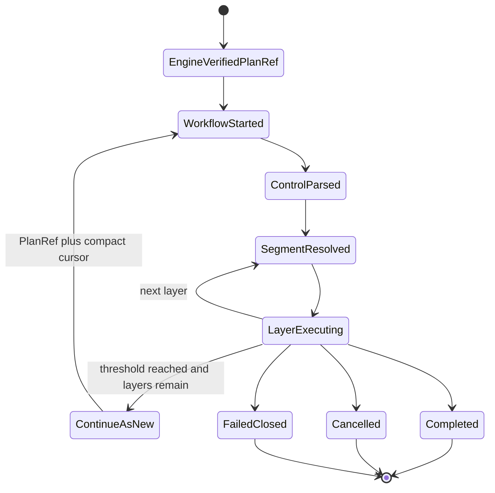
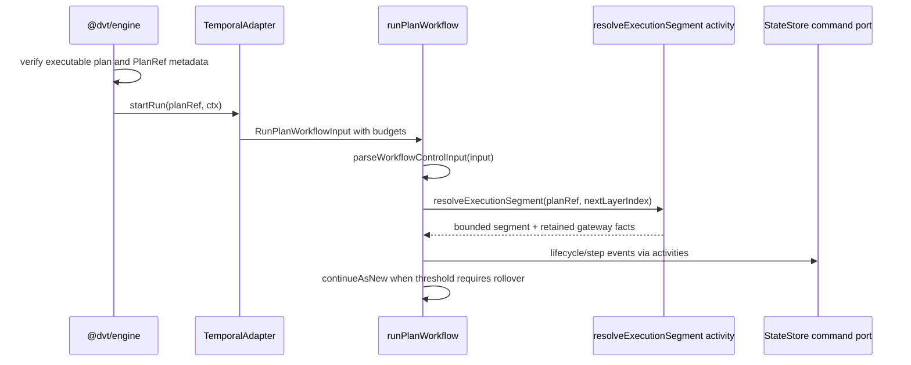

# Temporal PlanRef workflow boundary component

This local component guide documents the Temporal workflow boundary that
executes an engine-approved `PlanRef` without moving the full execution plan
through Temporal durable input.

Use this guide with:

- [Temporal adapter spec](./temporal-adapter-spec.md)
- [Temporal DBT worker plugin profile](./temporal-dbt-worker-plugin-profile.md)
- [Temporal PlanRef drained cutover runbook](../../../../../runbooks/temporal-planref-drained-cutover-20260427.md)
- [Temporal worker DBT plugin runtime runbook](../../../../../runbooks/temporal-worker-dbt-plugin-runtime-20260414.md)
- [Fowler PlanRef architecture analysis](../../../../../../buzon/20260428-codex-fowler-temporal-planref-workflow-boundary-analysis-and-remediation.md)
- [ADR-0001 Temporal integration test policy](../../../../../adr/adr-0001-temporal-integration-test-policy.md)
- [ADR-0003 execution model](../../../../../adr/adr-0003-execution-model.md)
- [ADR-0046 execution plan definition and run execution policy separation](../../../../../adr/adr-0046-execution-plan-definition-and-run-execution-policy-separation.md)
- [ADR-0047 runtime-owned realized lifecycle](../../../../../adr/adr-0047-runtime-owned-realized-lifecycle-for-signal-driven-transitions.md)

## Owned concern

The component owns one concern:

- run the Temporal interpreter workflow from an immutable `PlanRef`, a resolved
  run context, explicit rollover budgets, and a compact cursor while preserving
  DVT lifecycle and execution semantics outside provider state

It does **not** own:

- engine start-run approval
- executable-plan authoring
- provider-independent lifecycle truth
- business retry or recovery workflows
- direct StateStore mutation outside activities
- executor-specific plugin installation or DBT runtime packaging

## Public API

- `TemporalAdapter.startRun(planRef, ctx)`
  Adapter entrypoint that receives the already-approved immutable pointer and
  resolved execution context from engine dispatch.
- `runPlanWorkflow(input: RunPlanWorkflowInput)`
  Temporal workflow entrypoint. It parses control input, resolves a bounded
  execution segment through activities, executes deterministic layer loops, and
  returns a canonical `RunPlanWorkflowResult`.
- `RunPlanWorkflowInput`
  Durable workflow input. The public input is `PlanRef plus compact cursor`:
  `planRef: WorkflowPlanRef`, `ctx: WorkflowCtx`,
  `maxContinueAsNewPayloadBytes: number`,
  `continueAsNewAfterLayerCount: number`, and optional
  `cursor?: WorkflowExecutionCursor`.
- `resolveExecutionSegment({ planRef, layerIndex })`
  Activity port that fetches and verifies plan material before projecting one
  bounded execution layer plus compact gateway retention metadata.
- `executeStep(...)`
  Activity port that performs provider side effects for one step and returns
  canonical step outcome/evidence.
- `emitEvent(...)`
  Activity port that emits DVT lifecycle and step events through the StateStore
  command boundary.
- `TEMPORAL_MAX_START_PAYLOAD_BYTES`
  Start payload admission guard configured before workflow start.
- `TEMPORAL_MAX_CONTINUE_AS_NEW_PAYLOAD_BYTES`
  Continue-as-new payload guard evaluated before rollover.
- `TEMPORAL_CONTINUE_AS_NEW_AFTER_LAYERS`
  Layer threshold injected into workflow input. `0` is allowed only as an
  explicit local diagnostic or incident rollback value.

## Invariants

- The full `ExecutionPlan` MUST NOT cross the workflow-start or
  continue-as-new durable input boundary.
- `RunPlanWorkflowInput.continueAsNewAfterLayerCount` is required; missing
  rollover budget input fails before execution.
- Continue-as-new state contains `PlanRef plus compact cursor` only: next layer,
  gateway decisions, compact dependency facts, skipped step ids, processed
  control-signal ids, and latest result evidence.
- Runtime segment resolution re-fetches plan material by `PlanRef` and verifies
  bytes against `PlanRef.sha256` before any step execution.
- A `PlanRef` whose `expiresAt` is at or before the integrity-validator clock
  fails closed as `PLAN_REF_EXPIRED` before plan bytes are fetched or a
  provider segment is resolved.
- Plan artifact absence during segment resolution is reported as
  `PLAN_REF_UNAVAILABLE`; continuation failures caused by cursor payload budget
  overflow are reported as `CURSOR_OVERFLOW`.
- Workflow code remains deterministic; all provider side effects and StateStore
  writes go through activities.
- Gateway dependency facts must be present when future gateway decisions depend
  on them; missing facts fail closed instead of inventing provider state.
- `continueAsNewAfterLayerCount > 0` with pending layers triggers rollover
  before Temporal history becomes the hidden storage layer.
- `continueAsNewAfterLayerCount = 0` disables rollover only when an operator has
  made that risk explicit outside large-DAG readiness.
- The DBT plugin runtime remains outside this component. Its step-kind registry
  is composed by the Temporal worker DBT profile, not by the PlanRef workflow or
  the core activity registry.

## Transitions

1. Engine validates executable plan bytes, metadata, and canonical `planId`.
2. Engine dispatches `TemporalAdapter.startRun(planRef, ctx)`.
3. Adapter starts `runPlanWorkflow` with explicit payload and rollover budgets.
4. Workflow parses control input before resolving the first segment.
5. Activity resolves the bounded segment for `ctrl.nextLayerIndex`.
6. Workflow executes deterministic layer orchestration.
7. Activities emit lifecycle and step events through DVT StateStore ports.
8. Workflow either resolves the next segment, continues as new with compact
   cursor state, completes, cancels, or fails closed.

## Consumers

- `@dvt/engine` dispatches provider runs after engine-owned plan verification.
- `TemporalAdapter.startRun` converts the provider adapter call into a Temporal
  workflow start.
- `apps/api provider-adapter factory` composes the protected API runtime with
  the Temporal provider adapter.
- `apps/temporal-worker runtime host` registers workflow and activity
  implementations for execution.
- StateStore command ports consume emitted lifecycle and step events.
- Operational runbooks consume the same invariants for drained cutover,
  threshold rollback, and payload-size incident handling.
- Adapter tests and architecture tests consume this guide as a semantic fitness
  function.

## Component map

| Module                                    | Owned concern                                                                       |
| ----------------------------------------- | ----------------------------------------------------------------------------------- |
| `RunPlanWorkflow.ts`                      | Temporal PlanRef workflow orchestration entrypoint                                  |
| `runPlanWorkflow.types.ts`                | Workflow public API contracts and runtime state model                               |
| `runPlanWorkflow.state.ts`                | Workflow control input parsing and cursor hydration                                 |
| `workflowCursorHelpers.ts`                | Compact continue-as-new cursor construction and payload guard                       |
| `executionSegmentResolver.ts`             | PlanRef execution-segment projection from canonical plans                           |
| `runPlanWorkflow.layers.ts`               | Deterministic workflow layer-loop orchestration                                     |
| `runPlanWorkflow.layerHelpers.ts`         | Layer selection and continue-as-new decision helpers                                |
| `runPlanWorkflow.layerResults.ts`         | Layer result application and gateway fact retention                                 |
| `runPlanWorkflow.stepExecution.ts`        | Per-layer step activity execution orchestration                                     |
| `runPlanWorkflow.activities.ts`           | Temporal activity proxy binding for workflow ports                                  |
| `runPlanWorkflow.lifecycle.ts`            | Workflow bootstrap, terminal, failure, and rollover outcomes                        |
| `runPlanWorkflow.cancellation.ts`         | Runtime-owned cancellation lifecycle settlement                                     |
| `runPlanWorkflow.signals.ts`              | Runtime control-signal registration and dedupe state                                |
| `workflowGatewayHelpers.ts`               | Gateway dependency validation and fact lookup                                       |
| `workflowArtifactHelpers.ts`              | Execution artifact payload interpretation                                           |
| `workflowControlSignalRetentionPolicy.ts` | Bounded retention policy for control-signal dedupe ids across workflow continuation |
| `workflowRuntimePayloadHelpers.ts`        | Runtime event payload shaping                                                       |
| `workflowErrorHelpers.ts`                 | Workflow-safe error-message normalization                                           |
| `workflowInputParsingHelpers.ts`          | Deterministic workflow input primitive parsing                                      |

## Diagrams

## Drift guards

- `packages/@dvt/adapter-temporal/test/workflow-component-semantics.architecture.test.ts`
  asserts each workflow module declares an exact `@ownedConcern`.
- The same test asserts this guide contains the public API, invariants,
  transitions, consumers, component map, and diagrams.
- Adapter behavioral tests still prove negative runtime behavior:
  missing rollover input fails, payload budgets are enforced, gateway facts fail
  closed, hash drift rejects execution, and continue-as-new advances layer
  progress without carrying the full plan.
- `workflowControlSignalRetentionPolicy.ts` keeps only the recent bounded
  control-signal id window in cursor state so adversarial or long-lived
  pause/resume/cancel traffic cannot make continue-as-new payloads grow without
  limit.
