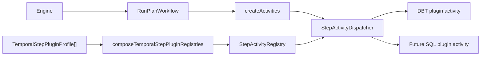
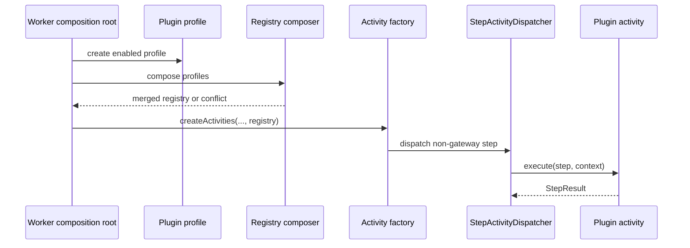
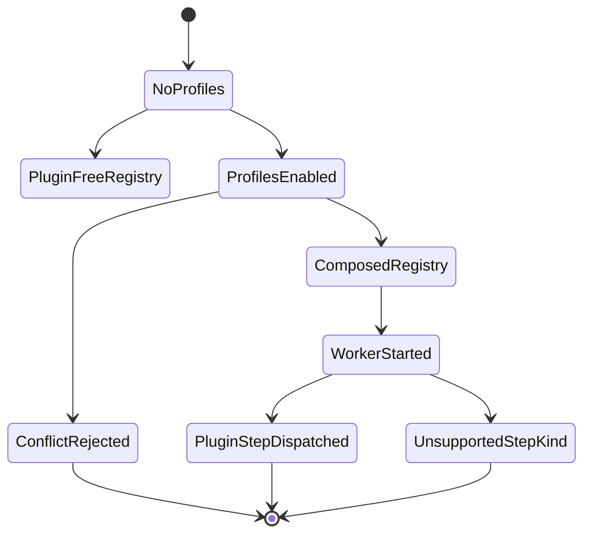

# Temporal Step Plugin Profile Component

This local component guide documents the generic Temporal step plugin profile
boundary. It is the extension point used by DBT today and by future executor
profiles such as SQL without changing the Temporal workflow core.

Use this guide with:

- [Temporal adapter specification](./temporal-adapter-spec.md)
- [Temporal DBT worker plugin profile](./temporal-dbt-worker-plugin-profile.md)
- [Temporal PlanRef workflow boundary component](./temporal-planref-workflow-boundary.md)
- [ADR-0003 execution model](../../../../../adr/ADR-0003-execution-model.md)
- [ADR-0014 run-driven adapter model](../../../../../adr/ADR-0014-run-driven-adapter-model.md)

## Owned Concern

The component owns one concern:

- compose executor-owned step activities into the Temporal worker at runtime
  while keeping the workflow, core activity dispatcher, and engine free of
  plugin-specific step-kind semantics

It does **not** own:

- engine lifecycle semantics
- plan authoring or plan validation
- DBT, SQL, Python, or other executor-specific manifests
- artifact-store admission policy for a specific plugin
- worker image packaging or dependency installation

## Public API

- `TemporalStepPluginProfile`
  Describes one plugin contribution: `pluginId` plus
  `stepActivitiesByKind`.
- `TemporalStepPluginRunner<TExecutionInput>`
  Generic executable plugin runner port implemented by concrete executor
  profiles such as DBT. The profile composes activities; the runner executes
  plugin-specific work behind those activities.
- `composeTemporalStepPluginRegistries(profiles)`
  Merges plugin-owned registries into one `StepActivityRegistry`.
- `StepActivityRegistry`
  Generic map from executable step kind to `StepActivity`.
- `StepActivityDispatcher`
  Dispatches gateway steps through core gateway activity and non-gateway steps
  through the composed plugin registry.
- `createDefaultStepActivityRegistry()`
  Returns the plugin-free core registry. It must not reserve DBT or future
  plugin step kinds.
- `createActivities(deps, stepExecutors, stepActivitiesByKind)`
  Activity factory seam that receives an optional composed plugin registry.

## Invariants

- Core Temporal dispatch is plugin-free by default.
- Plugin profiles own their executable step-kind claims.
- Plugin runners own executable plugin work behind a generic runner port; core
  dispatch must not depend on DBT, SQL, Python, or other runner-specific
  implementation types.
- Duplicate step-kind claims fail closed with
  `TEMPORAL_STEP_PLUGIN_KIND_CONFLICT:<pluginId>:<stepKind>`.
- DBT-specific code may appear under `@dvt/temporal-dbt-plugin` and worker/API
  composition roots, but not in engine source, the generic Temporal adapter
  root API, or generic plugin composition.
- Workflow artifact event payloads are emitted from generic
  `compiledCodeRef`, not from DBT step-kind allowlists.
- A future SQL plugin must be addable by providing a new
  `TemporalStepPluginProfile`; it must not require edits to
  `StepActivityDispatcher` or `RunPlanWorkflow`.

## Transitions

1. A worker composition root decides which executor profiles are enabled.
2. Each enabled executor creates a `TemporalStepPluginProfile`.
3. The worker calls `composeTemporalStepPluginRegistries(...)`.
4. Composition fails if two profiles claim the same step kind.
5. The merged registry is passed into `createActivities(...)`.
6. `StepActivityDispatcher` routes non-gateway step kinds to the registry.
7. Plugin activity code validates plugin-specific context and delegates to its
   runner.
8. Workflow code remains unaware of which plugin executed the step.

## Consumers

- `apps/temporal-worker` composes enabled plugin profiles into the worker host.
- `packages/@dvt/adapter-temporal/src/activities/activityFactory.ts` receives
  the composed registry.
- `StepActivityDispatcher` performs generic runtime dispatch.
- `@dvt/temporal-dbt-plugin` is the first concrete plugin package.
- API infrastructure may register plugin-specific admission requirements while
  keeping engine admission generic.
- Architecture tests consume this guide as a semantic fitness function.

## Component Map

| Module                                                               | Owned concern                                            |
| -------------------------------------------------------------------- | -------------------------------------------------------- |
| `src/plugins/TemporalStepPluginProfile.ts`                           | Generic profile composition and duplicate-kind rejection |
| `src/plugins/TemporalStepPluginRunner.ts`                            | Generic executable plugin runner port                    |
| `src/activities/activityTypes.ts`                                    | Plugin-free activity contracts and registry types        |
| `src/activities/stepActivityDispatcher.ts`                           | Gateway plus plugin registry dispatch                    |
| `src/activities/activityFactory.ts`                                  | Activity assembly with optional runtime registry         |
| `src/workflows/workflowArtifactHelpers.ts`                           | Plugin-agnostic artifact payload interpretation          |
| `apps/temporal-worker/src/runtime/temporalWorkerRuntimeResources.ts` | Worker resource composition and profile merge            |
| `packages/@dvt/temporal-dbt-plugin/src/index.ts`                     | First concrete DBT plugin package public API             |
| `apps/temporal-worker/src/runtime/temporalWorkerDbtProfile.ts`       | Worker-side DBT plugin profile composition               |

## Diagrams

## Drift Guards

- `packages/@dvt/adapter-temporal/test/dbt-core-decoupling.architecture.test.ts`
  verifies generic plugin composition remains free of DBT semantics.
- The same test verifies DBT implements the generic
  `TemporalStepPluginRunner` port instead of defining runner execution as a
  DBT-only architectural concept.
- The same test verifies workflow artifact emission is driven by
  `compiledCodeRef`, not DBT step-kind gates.
- `packages/@dvt/adapter-temporal/test/activities.test.ts` proves DBT and a
  SQL-shaped plugin can compose through the same registry seam, and that
  duplicate step-kind claims fail closed.
- `packages/@dvt/adapter-temporal/test/activities.test.ts` keeps
  `SetupActivitiesOptions` as the named setup options boundary for activity
  tests. This prevents positional `undefined` trains from hiding whether a test
  is changing store state, plugin activities, executors, or dependency
  overrides.
- `packages/@dvt/adapter-temporal/test/workflow-compiled-code-ref.test.ts`
  proves artifact emission works for any plugin step kind carrying a valid
  `compiledCodeRef`.
