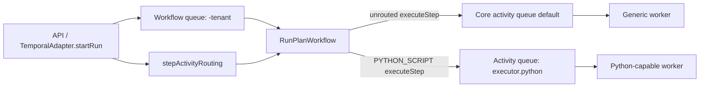
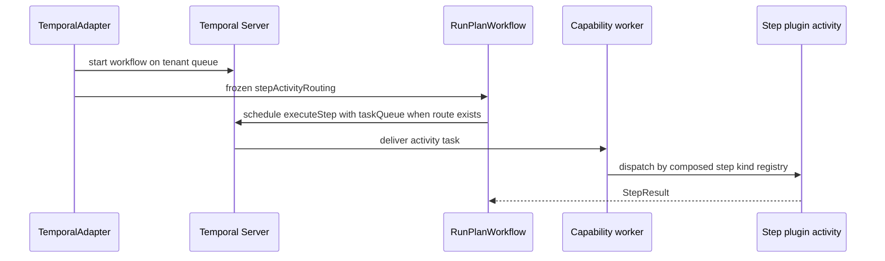
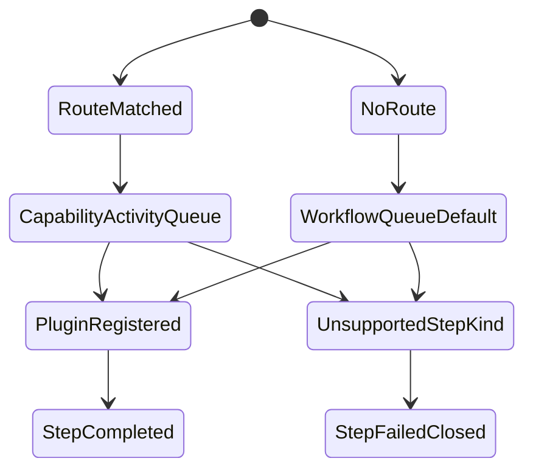

# Temporal Worker Routing By Capability

This component guide documents the provider-neutral routing seam for Temporal
step execution activities. It lets specialized worker pools execute selected
step kinds without making DBT, Python, Spark, or SQL part of workflow core.

Use this guide with:

- [Temporal step plugin profile component](./temporal-step-plugin-profile.md)
- [Temporal worker scaling strategy](./temporal-worker-scaling-strategy.md)
- [Temporal Worker Scaling Operations](../../../../../runbooks/temporal-worker-scaling-operations.md)
- [ADR-0057 Temporal Step Activity Routing By Capability](../../../../../adr/ADR-0057-temporal-step-activity-routing-by-capability.md)
- [ADR-0003 execution model](../../../../../adr/ADR-0003-execution-model.md)
- [ADR-0014 run-driven adapter model](../../../../../adr/ADR-0014-run-driven-adapter-model.md)

## Owned Concern

The component owns one concern:

- route `executeStep` Temporal activities to optional capability-specific task
  queues using adapter-owned deployment configuration

It does not own:

- engine lifecycle semantics
- plan authoring or plan validation
- step plugin implementation
- worker image build contents
- DBT-specific runtime configuration
- global tenant-to-worker placement automation

## Public API

- `TemporalAdapterConfig.activityRouting.routesByStepKind`
  maps executable step kind to `{ capability, taskQueue }`.
- `TEMPORAL_STEP_ACTIVITY_ROUTES`
  supplies the route map as JSON in API and worker composition roots.
- `RunPlanWorkflowInput.stepActivityRouting`
  is the frozen workflow input snapshot used by the workflow runtime.
- `createStepActivities(step, stepActivityRouting)`
  creates the `executeStep` activity proxy and attaches `taskQueue` only when
  the step kind has a route.
- `TemporalWorkerHostConfig.stepActivitiesByKind`
  still owns plugin activity registration. Routing never registers an activity
  by itself.

Example:

```json
{
  "PYTHON_SCRIPT": {
    "capability": "executor.python",
    "taskQueue": "dvt-temporal-python"
  }
}
```

DBT remains a plugin consumer of the same generic route shape. It is not the
generic routing model.

## Invariants

- Workflow start queue remains `toTemporalTaskQueue(ctx.tenantId, config)`.
- Only `executeStep` may be routed by step kind.
- Event emission and plan-segment resolution stay on the workflow/core queue.
- Missing route means default Temporal activity task queue behavior.
- Routes are frozen into workflow input at start-run time and survive
  continue-as-new.
- A routed queue without a matching plugin activity fails closed through the
  existing unsupported step-kind path.
- Routing helpers must not import or reference DBT plugin symbols.
- Capability names are operator-facing labels, not authorization grants.

## Transitions

1. Operator config supplies `TEMPORAL_STEP_ACTIVITY_ROUTES`.
2. API composition validates routes through `loadTemporalAdapterConfig`.
3. `TemporalAdapter.startRun()` starts the workflow on the tenant queue and
   embeds `stepActivityRouting` in the workflow input.
4. `RunPlanWorkflow` keeps that routing snapshot in workflow runtime state.
5. For each executable step, `createStepActivities` selects a route by
   `step.kind`.
6. Routed steps schedule `executeStep` on the configured activity task queue.
7. Unrouted steps schedule `executeStep` on the workflow queue default.
8. Worker-side plugin dispatch still validates whether the worker can execute
   the step kind.

## Consumers

- `apps/api` passes route JSON into Temporal adapter config.
- `apps/temporal-worker` accepts the same env for config parity while each
  process still polls exactly one `TEMPORAL_TASK_QUEUE`.
- `TemporalAdapter.startRun()` freezes route configuration.
- `RunPlanWorkflow` consumes `RunPlanWorkflowInput.stepActivityRouting`.
- `createStepActivities()` applies the activity task queue.
- Plugin profiles consume routed activity work only if composed into that
  worker's `stepActivitiesByKind` registry.

## Diagrams







## Drift Guards

- `packages/@dvt/adapter-temporal/test/workflow-step-activity-routing.test.ts`
  verifies `executeStep` task queue selection.
- `packages/@dvt/adapter-temporal/test/TemporalAdapter.startRun.test.ts`
  verifies route snapshots do not change the workflow run queue.
- `packages/@dvt/adapter-temporal/test/workflow-continue-as-new.test.ts`
  verifies continue-as-new preserves the route snapshot.
- `packages/@dvt/adapter-temporal/test/dbt-core-decoupling.architecture.test.ts`
  verifies generic routing code and this guide do not make DBT the routing
  model.
