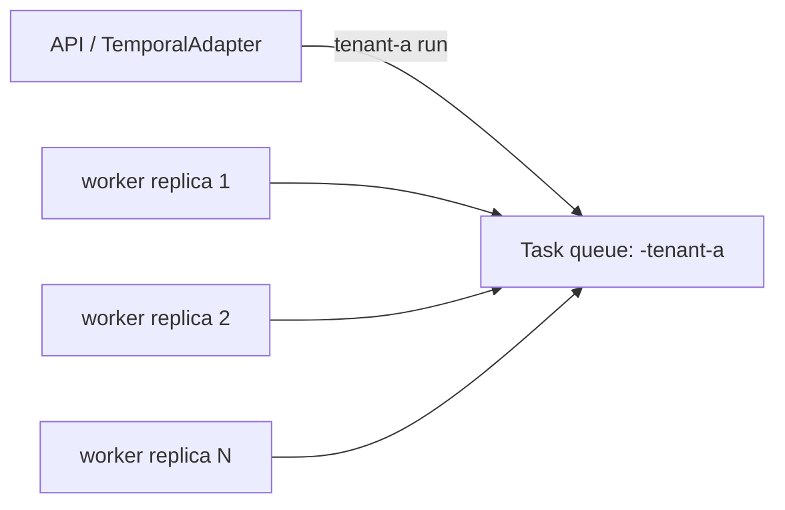

# Temporal Worker Scaling Strategy

## Purpose

Define the worker scaling model for the current `apps/temporal-worker`
runtime without claiming topology that the Temporal adapter does not implement.

This document is intentionally current-state first. It captures the scaling
paths that can be operated with the code in-repo today, then names the
production constraint that closes AR-D3 without claiming runtime topology that
does not exist.

## AR-D3 Closure Decision

AR-D3 is closed as an explicit strategy decision:

- the supported 1000+ tenant posture is many queue-local worker pools;
- the global shared worker pool is not implemented;
- tenant queue assignment is derived from `toTemporalTaskQueue()`;
- capability-specific activity queues are allowed only for routed
  `executeStep` activities;
- 1000+ tenant provisioning automation is future platform work, not an
  implicit capability of the current worker host.

This follows Temporal's worker model: task queues are lightweight, workers poll
task queues, multiple workers can poll the same queue for horizontal capacity,
and all workers on a queue must be able to process the tasks they accept.

Operational consequence: DVT can claim an architecture and runbook for 1000+
tenant scaling, but it cannot claim automated 1000+ tenant worker provisioning
or one process polling every tenant queue until those capabilities are built.

## Governing Implementation Truth

The current runtime has three hard invariants:

1. `TemporalAdapter.startRun()` dispatches each run to
   `toTemporalTaskQueue(ctx.tenantId, config)`.
2. `toTemporalTaskQueue()` maps a blank tenant to `<baseQueue>` and a non-empty
   tenant to `<baseQueue>-<tenantId>`.
3. `TemporalWorkerHost` creates one Temporal SDK `Worker` for one configured
   `TEMPORAL_TASK_QUEUE`.
4. `RunPlanWorkflow` may route only `executeStep` activities to
   capability-specific activity task queues from the frozen
   `RunPlanWorkflowInput.stepActivityRouting` snapshot.

Code references:

- `packages/@dvt/adapter-temporal/src/WorkflowMapper.ts`
- `packages/@dvt/adapter-temporal/src/TemporalAdapter.ts`
- `packages/@dvt/adapter-temporal/src/TemporalWorkerHost.ts`
- `apps/temporal-worker/src/plugins/env.ts`
- `apps/temporal-worker/src/ops/TemporalWorkerMonitor.ts`

Consequence: a worker process does not subscribe to every tenant queue. Scaling
is currently queue-local: add more worker replicas for the exact queue that
receives the workflows.

Step activity routing adds a second queue axis. Workflow tasks remain on the
tenant workflow queue, while selected `executeStep` activities can be delivered
to a capability activity queue such as `dvt-temporal-python`.

## Owned Concern

Temporal worker scaling owns:

- queue-local worker replica count
- tenant queue naming and worker assignment
- cold-start and readiness targets for worker processes
- saturation signals for queue-local capacity decisions
- operational limits that must be closed before 1000+ tenant scale is claimed

It does not own:

- tenant admission or authorization policy
- engine lifecycle semantics
- Temporal provider semantics beyond the adapter boundary
- DBT plugin packaging
- a global routing service for tenant-to-worker placement

## Current Executable Topology

### Queue-Local Worker Pool

The supported scaling unit is one Temporal task queue plus one or more worker
processes polling that queue.



Characteristics:

- all replicas in the pool use the same `TEMPORAL_TASK_QUEUE`
- Temporal distributes work across pollers for that one queue
- scaling is done by increasing or decreasing replicas for the affected queue
- a different tenant queue requires a separately configured worker pool

This model is useful. It lets operators add capacity for a hot tenant without
changing workflow code.

The mature production pattern is not a binary choice between one worker per
tenant and one global pool. The current supported model is queue-local pools
with repeatable naming and scaling rules. Low-volume tenants still receive
their deterministic queue; platform automation can later decide whether several
tenants are routed to an intentionally shared queue, but that is a future
assignment service, not current runtime behavior.

### Tenant Queue Worker Pool

For a base queue of `dvt-temporal` and tenant `tenant-a`, the adapter starts
workflows on:

```text
dvt-temporal-tenant-a
```

Workers intended to execute that tenant's workflows must therefore run with:

```text
TEMPORAL_TASK_QUEUE=dvt-temporal-tenant-a
```

That worker pool can be one replica for low traffic or multiple replicas for a
busy tenant. This is the current form of "dedicated worker" in the repository.

### Global Shared Pool Is Not Implemented

A global pool that polls all tenant queues is not available today. Implementing
that model requires one of these explicit changes:

- a worker host that creates and manages multiple Temporal SDK `Worker`
  instances, one per queue;
- a routing change that sends multiple tenants to a deliberately shared queue;
  or
- a tenant-to-queue assignment service plus worker deployment automation.

Until one of those exists, documentation and runbooks must not instruct
operators to remove a tenant queue from a shared subscription set or assume one
worker process polls all tenant queues.

## Task Queue Naming Model

The canonical queue mapping is adapter-owned:

| Input                           | Queue                    |
| ------------------------------- | ------------------------ |
| blank `tenantId`                | `<baseQueue>`            |
| non-empty `tenantId`            | `<baseQueue>-<tenantId>` |
| default `baseQueue` from config | `dvt-temporal`           |
| example tenant `tenant-a`       | `dvt-temporal-tenant-a`  |

The older shorthand `dvt_${tenantId}` is not the current repository
convention.

## Tenant Queue Assignment Policy

The assignment policy is deterministic and adapter-owned:

1. A blank tenant uses the configured base queue.
2. A non-empty tenant uses `<baseQueue>-<tenantId>`.
3. A worker pool must set `TEMPORAL_TASK_QUEUE` to the exact queue it is meant
   to poll.
4. A capability worker uses the configured activity task queue from
   `TEMPORAL_STEP_ACTIVITY_ROUTES`, not the tenant workflow queue.

The assignment policy deliberately avoids a hidden routing table. If DVT later
adds tenant classes, shard buckets, or pooled queues, that work must add a
tenant-to-queue assignment catalog and migration policy before changing the
operator runbook.

## Scaling Decision Model

| Situation                             | Supported action today                                   |
| ------------------------------------- | -------------------------------------------------------- |
| One queue has rising latency          | Add worker replicas with the same `TEMPORAL_TASK_QUEUE`. |
| One tenant is noisy                   | Scale that tenant queue's worker deployment.             |
| New active tenant appears             | Provision a worker pool for `<baseQueue>-<tenantId>`.    |
| One activity capability queue is hot  | Scale workers polling that configured activity queue.    |
| Many low-traffic tenants exist        | Provisioning automation is required before scale claim.  |
| One global pool for all tenant queues | Not implemented; keep as future architecture work.       |

The practical near-term model is therefore "many queue-local pools", not "one
pool subscribed to every tenant queue".

## Capacity Model

Capacity is calculated per task queue, not per namespace:

| Dimension             | Meaning                                            | Operational rule                                      |
| --------------------- | -------------------------------------------------- | ----------------------------------------------------- |
| queue demand          | tasks scheduled for one workflow or activity queue | scale only the affected queue-local pool              |
| replica capacity      | ready worker processes polling the same queue      | add replicas until schedule-to-start latency recovers |
| execution slot budget | concurrent workflow/activity work per worker       | tune worker options before overloading CPU or memory  |
| cold-start budget     | time for a new replica to become a useful poller   | keep minimum ready replicas for active tenants        |
| capability saturation | routed activity queue pressure                     | scale the capability queue worker profile             |

Temporal's worker tuning guidance treats schedule-to-start latency as the
signal that work is waiting for a worker to pick it up. DVT therefore treats
queue delay and ready poller count as first-class capacity signals instead of
CPU-only autoscaling.

For planning, the minimum queue-local capacity formula is:

```text
desiredReplicas(queue) =
  max(minReadyReplicas(queue),
      ceil(peakConcurrentTasks(queue) / safeConcurrentTasksPerReplica(queue)))
```

`safeConcurrentTasksPerReplica` must be derived from profiling for the worker
profile. Generic workflow workers, DBT-enabled workers, and capability activity
workers must not share one static capacity number.

## Worker Image Specialization

Temporal worker pools still run `apps/temporal-worker`, but operators may build
or deploy specialized variants of that image for capability queues. Runtime
capabilities are controlled by environment, image contents, and plugin
composition:

| Worker profile             | Required configuration                                      |
| -------------------------- | ----------------------------------------------------------- |
| Generic workflow host      | `DVT_TEMPORAL_DBT_ENABLED=false`                            |
| DBT-capable host           | `DVT_TEMPORAL_DBT_ENABLED=true` plus valid `DVT_DBT_*` vars |
| Capability activity worker | `TEMPORAL_TASK_QUEUE` equals the configured activity queue  |

Activity routing is configured by `TEMPORAL_STEP_ACTIVITY_ROUTES` in the API
composition root and frozen into workflow input at start-run time. The worker
that polls the target activity queue must still compose the matching plugin
activity registry.

Example route:

```json
{
  "PYTHON_SCRIPT": {
    "capability": "executor.python",
    "taskQueue": "dvt-temporal-python"
  }
}
```

Do not claim a working Python, Spark, SQL, or DBT split unless the route queue
has live pollers and the worker image has the required plugin/runtime
dependencies.

## Cold-Start Targets

Cold start is measured per worker process:

| Phase                           | Target |
| ------------------------------- | ------ |
| process start to `/healthz`     | < 10s  |
| process start to `/readyz`      | < 30s  |
| DBT-enabled worker readiness    | < 60s  |
| added replica visible as poller | < 30s  |

`/readyz` is the readiness gate. `/healthz` only proves the process is alive
enough to report health.

## Autoscaling Policy

Autoscaling is queue-local. A scaler may be manual, HPA-based, KEDA-based, or
environment-specific, but it must scale the deployment that polls the affected
`TEMPORAL_TASK_QUEUE`.

Recommended inputs:

- Temporal schedule-to-start latency for workflow and activity tasks;
- task backlog or equivalent queue depth for the exact task queue;
- ready worker count for the queue;
- worker CPU and memory;
- worker error counters and failing state gauges.

The KEDA Temporal Worker scaler is the preferred future Kubernetes integration
when the environment can expose Temporal task queue metrics directly. Until a
KEDA ScaledObject exists in this repository, KEDA remains an implementation
option, not a shipped manifest.

### Autoscaling Signals

### Queue-Local Worker Pool

Scale the worker pool for a queue when one or more of these stay above the
warning window for at least five minutes:

- queue schedule-to-start latency or equivalent Temporal queue delay
- queued workflow/activity task count for the queue
- worker CPU or memory pressure
- `dvt_temporal_worker_ready` below expected replica count
- `dvt_temporal_worker_error_total` increasing

Scale down only after queue latency and resource pressure remain below target
for the cooldown window.

### Tenant Queue Pool

For a tenant queue, the same signals apply. The difference is operational
ownership: the deployment name, labels, and dashboards should include the
tenant or queue identifier so the operator scales the right pool.

## Tenant Queue Lifecycle

| Event                | Required operational response                         |
| -------------------- | ----------------------------------------------------- |
| New active tenant    | Provision worker pool for `<baseQueue>-<tenantId>`.   |
| Tenant traffic grows | Increase replicas for that tenant queue.              |
| Tenant traffic drops | Scale replicas down, keeping the minimum ready count. |
| Tenant disabled      | Stop the tenant queue worker pool after drain policy. |

Existing workflow executions are tied to the task queue used at start time.
Do not assume in-flight workflows move to another queue when deployment config
changes.

## Noisy-Tenant Isolation

A tenant is noisy when its queue-local metrics or resource use persistently
exceed normal bounds:

- schedule-to-start latency is above target for the tenant queue
- queue backlog grows while other queues are stable
- DBT execution for that tenant drives CPU, memory, or disk pressure
- worker errors are concentrated on that tenant's queue

Current isolation actions:

1. increase replicas for that tenant queue;
2. move DBT-enabled execution to a larger worker profile for that queue;
3. apply admission/backpressure controls before dispatch if tenant load is not
   acceptable;
4. record remaining risk if production evidence is not available.

## Operational Failure Modes

### Worker Process Alive But Not Ready

Use `/readyz` and metrics:

1. Check `/readyz`; `503` means the worker is not ready to poll Temporal.
2. Check `dvt_temporal_worker_ready`; `0` means not ready.
3. Check `dvt_temporal_worker_state{state="failing"}` and
   `dvt_temporal_worker_error_total`.
4. Check Temporal and Postgres connectivity.
5. If DBT mode is enabled, verify `DVT_DBT_*` configuration and DBT binary
   availability.

### Queue Saturation

Symptoms:

- queue delay grows
- queued task count grows
- worker replicas are ready but CPU, memory, or DBT workdir pressure is high

Actions:

1. scale the worker deployment for the affected `TEMPORAL_TASK_QUEUE`;
2. verify new replicas reach `/readyz`;
3. confirm Temporal sees additional pollers for the same queue;
4. keep observing until latency returns below target.

### Missing Pollers For Tenant Queue

Symptoms:

- workflows are started on `<baseQueue>-<tenantId>`
- Temporal UI shows no pollers for that queue
- worker logs show a different `TEMPORAL_TASK_QUEUE`

Action: deploy or reconfigure a worker pool with the exact queue name produced
by `toTemporalTaskQueue()`.

## Rollout And Rollback

| Change                         | Rollout                                                 | Rollback                                   |
| ------------------------------ | ------------------------------------------------------- | ------------------------------------------ |
| Add replicas to one queue      | Increase deployment replicas for that queue.            | Scale back to previous replica count.      |
| Remove replicas from one queue | Gracefully drain and reduce replicas.                   | Restore previous replica count.            |
| Add new tenant queue pool      | Deploy worker pool with `<baseQueue>-<tenantId>`.       | Stop the new pool if no required work.     |
| Change worker image            | Canary one queue-local pool before broad rollout.       | Revert image for that pool.                |
| Change base queue              | Treat as routing migration; plan drained cutover first. | Restore previous config before new starts. |

## Current Limits

These limits remain explicit residual work outside AR-D3:

- no global shared worker pool across all tenant queues;
- no tenant-to-queue assignment catalog beyond deterministic suffix mapping;
- no worker deployment automation for 1000+ tenant queues;
- no production load evidence proving 1000+ tenant queue operation;
- no production proof for capability-specialized worker images beyond the
  implemented activity routing seam.

They do not block AR-D3 because AR-D3 now closes on a documented, test-guarded
strategy. They do block future claims that DVT has fully automated 1000+ tenant
worker provisioning.

## Production Readiness Contract

Before claiming production-scale readiness for a specific environment, operators
must collect evidence for:

1. queue-local scale-up and scale-down for one tenant workflow queue;
2. tenant queue provisioning for at least one `<baseQueue>-<tenantId>` queue;
3. a noisy-tenant drill showing only that tenant queue was scaled;
4. readiness and metrics dashboards using exact worker metric semantics;
5. load evidence for the target tenant count, queue count, and worker profile;
6. a decision on whether 1000+ tenant provisioning is manual, generated, or
   controlled by a tenant-to-queue assignment service.

AR-D3 supplies the strategy and operator contract. Environment-specific load
tests, provisioning automation, and KEDA manifests are separate implementation
work.

## Industry References

- Temporal workers: <https://docs.temporal.io/workers>
- Temporal task queues: <https://docs.temporal.io/task-queue>
- Temporal task queue naming: <https://docs.temporal.io/task-queue/naming>
- Temporal worker performance: <https://docs.temporal.io/develop/worker-performance>
- Temporal worker tuning reference:
  <https://docs.temporal.io/develop/worker-tuning-reference>
- Temporal KEDA worker scaler announcement:
  <https://temporal.io/change-log/keda-based-auto-scaling-for-temporal-workers>
