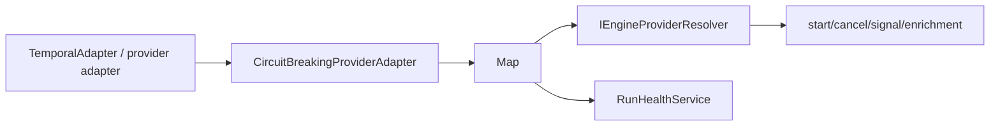
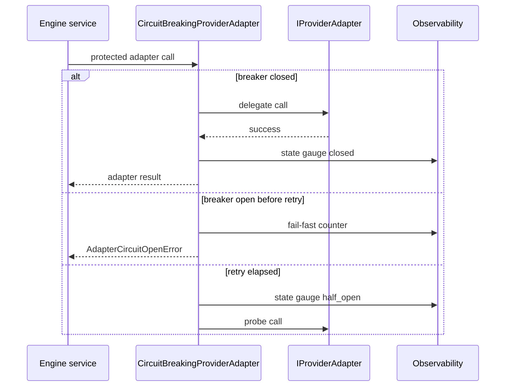
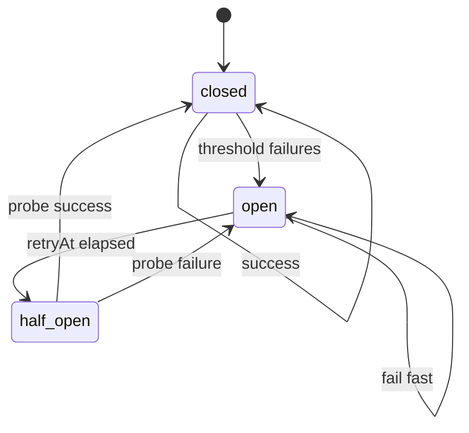

# Engine Adapter Circuit Breaker Component

## Purpose

This component owns engine-side fail-fast protection for provider adapter calls.
It closes `AR-C5` by adding a circuit breaker at the `IProviderAdapter`
boundary rather than scattering outage logic across start, cancel, signal, and
enrichment services.

## Public API

The API is local to `@dvt/engine` and production composition.

| Surface                               | Owner         | Role                                                               |
| ------------------------------------- | ------------- | ------------------------------------------------------------------ |
| `CircuitBreakingProviderAdapter`      | `@dvt/engine` | Decorates one `IProviderAdapter` with closed/open/half-open state. |
| `buildCircuitBreakingAdapterRegistry` | `@dvt/engine` | Wraps a provider registry once for composition roots.              |
| `getAdapterCircuitBreakerSnapshot`    | `@dvt/engine` | Reads breaker posture without widening `IProviderAdapter`.         |
| `AdapterCircuitOpenError`             | `@dvt/engine` | Fail-fast error raised when calls are rejected while open.         |
| `HealthStatus.components[].breaker`   | `@dvt/engine` | Health read model carrying provider breaker posture.               |

## Invariants

- The breaker decorates provider calls; it MUST NOT synthesize canonical run
  lifecycle events or statuses.
- `startRun`, `cancelRun`, `signal`, and `getProviderStatusView` are breaker
  protected.
- `signalSemanticsVersions`, `capabilities`, and `estimateRunRef` remain local
  metadata reads and do not transition breaker state.
- Open state fails fast without invoking the delegate adapter.
- Half-open state permits a probe; success closes the breaker and failure opens
  it again.
- Metrics are best-effort and never mask adapter or breaker errors.
- Health exposes breaker posture as operational state, not lifecycle truth.

## Transitions

| Transition                | From        | To          | Rule                                                               |
| ------------------------- | ----------- | ----------- | ------------------------------------------------------------------ |
| failure threshold reached | `closed`    | `open`      | Consecutive protected call failures meet the configured threshold. |
| retry window elapsed      | `open`      | `half_open` | The next protected call is allowed as a probe.                     |
| probe succeeds            | `half_open` | `closed`    | Consecutive failures reset to zero.                                |
| probe fails               | `half_open` | `open`      | Retry window is renewed.                                           |
| fail fast                 | `open`      | `open`      | Delegate is not invoked before `retryAtEpochMs`.                   |

## Consumers

- `apps/api/src/application/services/WorkflowEngineFactory.ts`
- `packages/@dvt/engine/src/services/RunHealthService.ts`
- `packages/@dvt/engine/test/adapters/CircuitBreakingProviderAdapter.test.ts`
- `packages/@dvt/engine/test/architecture/adapterCircuitBreaker.architecture.test.ts`

## Diagrams

## Drift Guards

- `adapterCircuitBreaker.architecture.test.ts` imports the breaker API and
  validates fail-fast semantics, protected registry composition, and health
  posture behavior.
- `WorkflowEngineFactory.test.ts` prevents production composition from exposing
  raw runtime adapters without breaker posture.
- Unit tests prove open-state fail-fast behavior and half-open transitions.
- Feature mechanization and docs sync validate the plan, component guide, user
  stories, mailbox analysis, evidence, and risk surfaces.

## Related Records

- [AR-C5 plan](../../../../planning/proposals/mandatory/runtime-and-contracts/ar-c5-adapter-circuit-breaker-plan-20260512.md)
- [AR-C5 user stories](./adapter-circuit-breaker-user-stories.md)
- [Fowler mailbox analysis](../../../../../buzon/20260512-codex-fowler-ar-c5-adapter-circuit-breaker-analysis-and-remediation.md)
