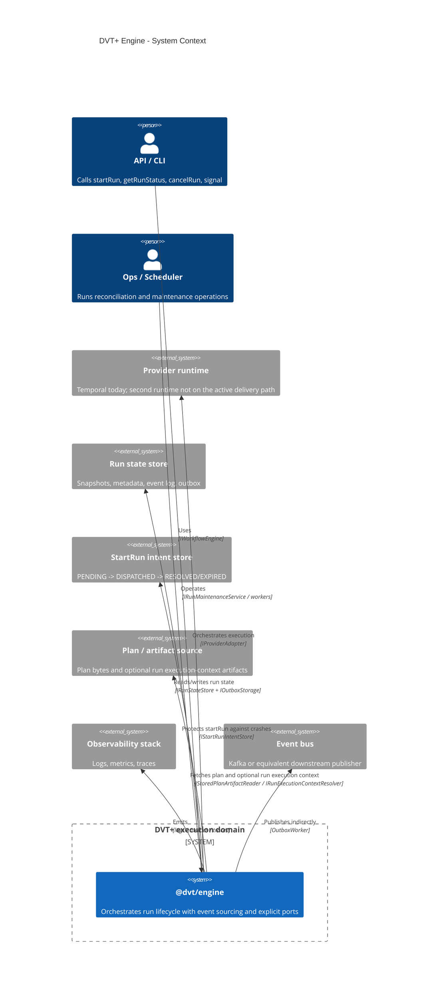
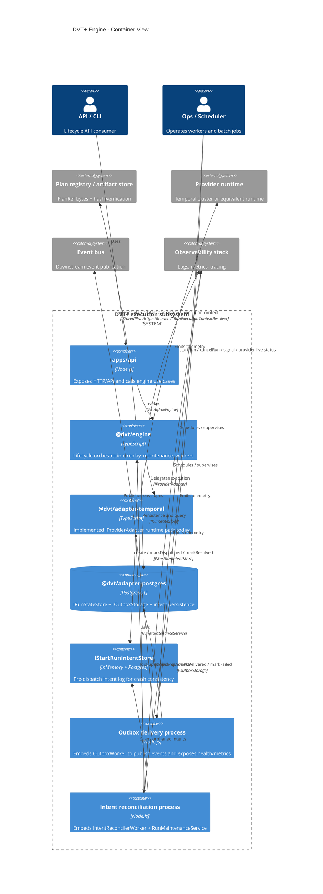
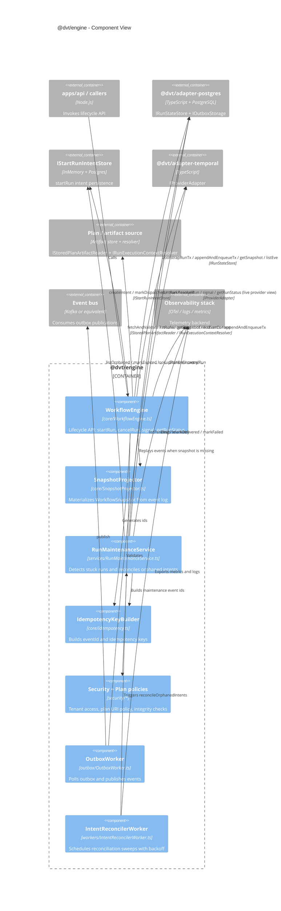
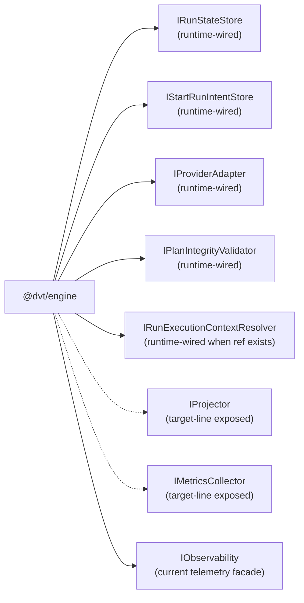
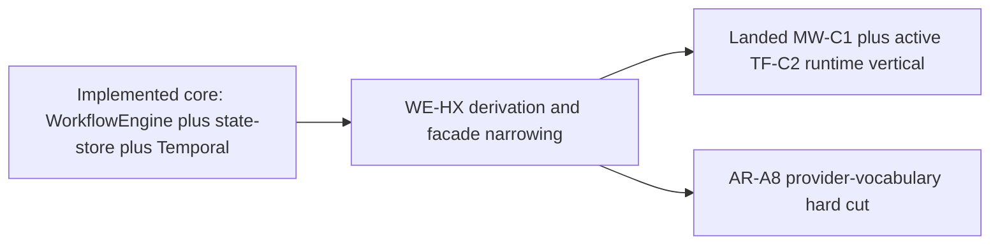

# Engine C4 Architecture

**Last reviewed**: 2026-04-10  
**Scope**: Logical architecture of `@dvt/engine` and direct collaborators.  
**Note**: C4 containers are logical/runtime boundaries. `@dvt/engine` is a TypeScript library embedded by processes such as `apps/api`, reconciler workers, and outbox workers.

**Primary sources**:

- [WorkflowEngine.ts](../../../../packages/@dvt/engine/src/core/WorkflowEngine.ts)
- [SnapshotProjector.ts](../../../../packages/@dvt/engine/src/core/SnapshotProjector.ts)
- [StartRunApplicationService.ts](../../../../packages/@dvt/engine/src/application/StartRunApplicationService.ts)
- [RunMaintenanceService.ts](../../../../packages/@dvt/engine/src/services/RunMaintenanceService.ts)
- [IntentReconcilerWorker.ts](../../../../packages/@dvt/engine/src/workers/IntentReconcilerWorker.ts)
- [IRunStateStore.ts](../../../../packages/@dvt/engine/src/ports/IRunStateStore.ts)
- [IStartRunIntentStore.ts](../../../../packages/@dvt/engine/src/ports/IStartRunIntentStore.ts)
- [IProviderAdapter.ts](../../../../packages/@dvt/engine/src/adapters/IProviderAdapter.ts)
- [IPlanIntegrityValidator.ts](../../../../packages/@dvt/engine/src/ports/IPlanIntegrityValidator.ts)
- [IRunExecutionContextResolver.ts](../../../../packages/@dvt/engine/src/ports/IRunExecutionContextResolver.ts)
- [IProjector.ts](../../../../packages/@dvt/engine/src/ports/IProjector.ts)
- [IMetricsCollector.ts](../../../../packages/@dvt/engine/src/metrics/IMetricsCollector.ts)
- [ADR-0029](../../../adr/ADR-0029-run-maintenance-service.md)
- [ADR-0030](../../../adr/ADR-0030-pre-dispatch-intent-log.md)

## 1. Context View

## 2. Container View

## 3. Component View

## 4. Declared Port Surface

The C4 runtime views above emphasize deployed interactions. The table and
diagram below capture the broader declared southbound surface: seven exposed
ports, of which five are runtime-wired in the current delivery path and two
remain intentionally exposed as target-line seams even though they do not yet
map to a dedicated deployed runtime boundary.

| Port                           | Current posture       | Notes                                                           |
| ------------------------------ | --------------------- | --------------------------------------------------------------- |
| `IRunStateStore`               | `runtime-wired`       | Canonical persistence/query seam                                |
| `IStartRunIntentStore`         | `runtime-wired`       | Crash-consistency seam                                          |
| `IProviderAdapter`             | `runtime-wired`       | Provider runtime seam                                           |
| `IPlanIntegrityValidator`      | `runtime-wired`       | Plan integrity gate using the artifacts-owned reader            |
| `IRunExecutionContextResolver` | `runtime-wired`       | Conditional start-run seam                                      |
| `IProjector`                   | `target-line exposed` | Declared seam; mainline still uses `SnapshotProjector` directly |
| `IMetricsCollector`            | `target-line exposed` | Declared seam; mainline still injects `IObservability`          |

`IObservability` is the current telemetry facade in the shipped runtime. It is
shown for runtime truthfulness, but it is not part of the seven-port inventory.

## 5. Reading Notes

- `WorkflowEngine` is the lifecycle boundary and should not own plan bytes or runtime internals.
- `SnapshotProjector` is still in-process; no standalone projector service yet.
- `RunMaintenanceService` centralizes maintenance behavior from ADR-0029 and ADR-0030.
- `@dvt/adapter-postgres` now covers state store, outbox, and persistent intent store (`PostgresStartRunIntentStore`).
- `OutboxWorker` and `IntentReconcilerWorker` are operational components that embed `@dvt/engine`.

## 6. Complementary Diagrams

For domain model, state machines, detailed sequences (signal, cancel,
reconciliation, outbox), and package dependency graphs see
[Implementation Architecture Diagrams](../../../diagrams/implementation-architecture-diagrams.md).

## 7. Current delivery posture

This C4 view is structural. For delivery sequencing, use
[Engine Roadmap](../roadmap/engine-phases.md) and the active Lane A/Lane C tasks.

| Area                                        | Current posture                    | Code evidence                                                                                                   | Current projection                                                                                              |
| ------------------------------------------- | ---------------------------------- | --------------------------------------------------------------------------------------------------------------- | --------------------------------------------------------------------------------------------------------------- |
| Engine lifecycle core                       | Implemented                        | `WorkflowEngine`, `SnapshotProjector`, `RunMaintenanceService`, broad tests                                     | Keep hardening under `WE-HX`, not a new MVP phase                                                               |
| Postgres state, outbox, and read-model path | Implemented                        | `@dvt/adapter-postgres`, delivery runtime, projector/read-model ownership in current docs                       | Already absorbed into mainline; no longer a future engine roadmap claim                                         |
| Temporal runtime adapter                    | Implemented with ongoing hardening | `@dvt/adapter-temporal`, `RunPlanWorkflow`, `StepActivityDispatcher`, baseline and DBT integration coverage     | Continue hardening via `WE-HX` and `AR-C*`                                                                      |
| Compatibility facade and ownership seams    | In progress                        | `workflow-engine-subsystem-context.md`, `workflow-engine-target-architecture.v1.md`, `StartRunProtocol.v1.md`   | Close `WE-HX-0..3`, then `WE-HX-5..6`                                                                           |
| Provider-vocabulary truthfulness            | Closed under `AR-A8`               | Provider typing, fake stubs, capability matrices, and active docs now expose only implemented runtime providers | Require an ADR-backed contract line, real adapter package, and conformance suite before adding a second runtime |
| Object-file PostgreSQL loading vertical     | Implemented                        | Object-file Temporal plugin, `PostgresObjectFileLoadingCapability`, and service-backed CI proof                 | Keep the bounded loader separate from transformation compilation                                                |

## 8. Current sequencing

1. close the remaining `WE-HX` derivation waves so the engine boundary is
   truthful and easier to evolve;
2. keep the `AR-A8` provider-vocabulary hard cut enforced while future-provider
   work stays out of active runtime typing;
3. keep object-file PostgreSQL loading on its bounded plugin/capability path;
   transformation authoring proceeds through the Substrait semantic authority.
