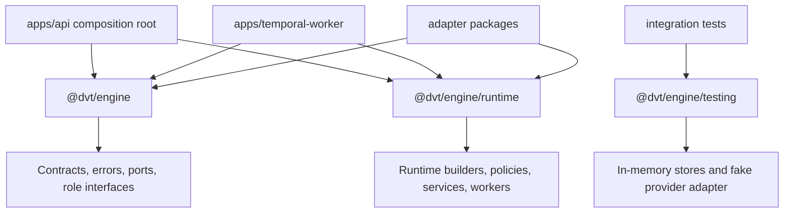
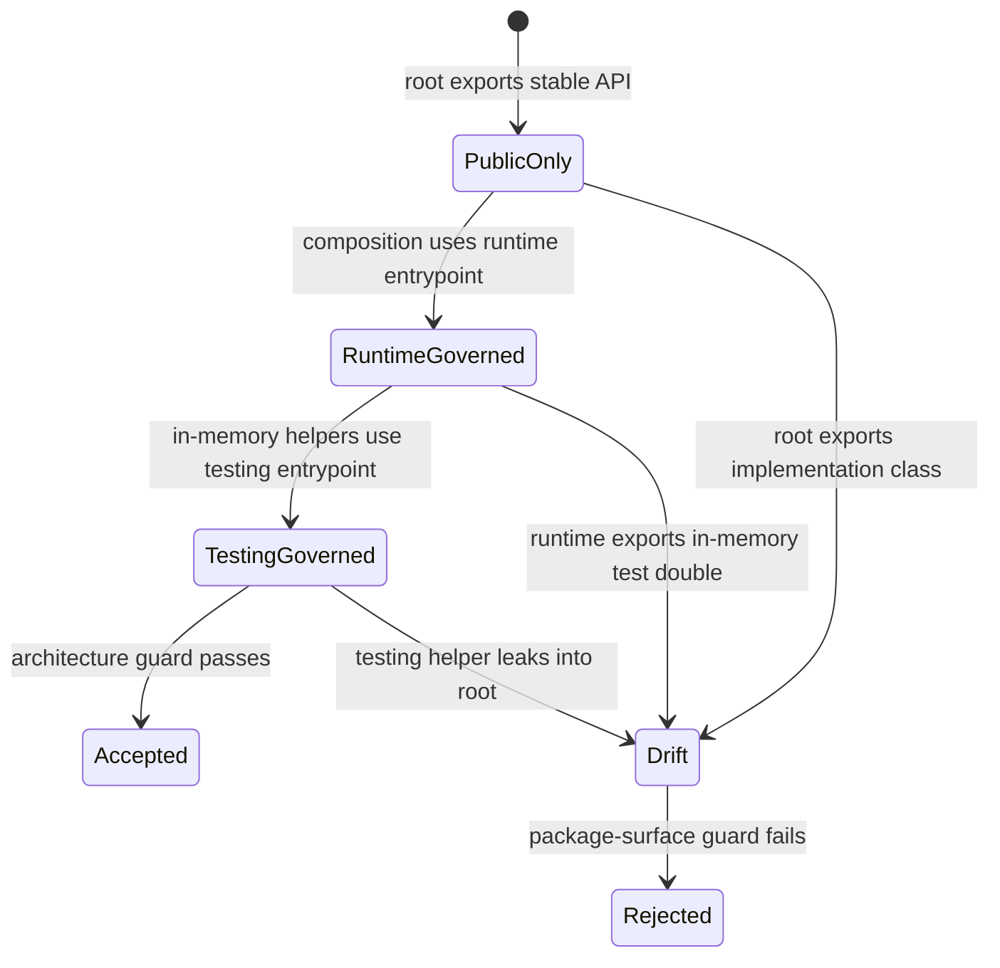

# Engine Public API Surface Component

## Purpose

This component owns the semantic package boundary for `@dvt/engine`. It keeps
the root package entrypoint stable for contracts and ports, moves runtime
composition behind a named entrypoint, and keeps in-memory test doubles behind
the testing entrypoint.

## Public API

| Surface                                       | Owner                          | Role                                                                                                       |
| --------------------------------------------- | ------------------------------ | ---------------------------------------------------------------------------------------------------------- |
| `@dvt/engine`                                 | Engine public API surface      | Stable contracts, errors, role interfaces, ports, and value types.                                         |
| `@dvt/engine/runtime`                         | Engine runtime composition API | Builders, policies, services, workers, provider registries, and runtime helpers used by composition roots. |
| `@dvt/engine/testing`                         | Engine testing API             | In-memory stores and provider test doubles for package and integration tests.                              |
| `enginePublicApiSurface.architecture.test.ts` | Engine architecture tests      | Semantic fitness function that rejects root/runtime/testing drift.                                         |

## Invariants

- The root entrypoint exports stable contracts, errors, ports, domain service
  interfaces, and role interfaces only.
- Runtime implementation classes and builders are exported from
  `@dvt/engine/runtime`, not from the root.
- Test doubles and in-memory stores are exported from `@dvt/engine/testing`,
  not from the root or runtime entrypoints.
- Consumers that compose production runtime infrastructure use
  `@dvt/engine/runtime`.
- Consumers that only need engine contracts or ports use `@dvt/engine`.
- Event contracts use canonical names from `@dvt/contracts`
  (`EventInput`, `EventEnvelope`, `RunEventInput`, `StepEventInput`) without
  engine-local alias names.
- The package `exports` map must contain exactly the governed entrypoints for
  root, runtime, and testing.
- Each entrypoint module must declare an owned-concern header near the top of
  the file.

## Transitions

| Transition                   | From                           | To                            | Rule                                                                                        |
| ---------------------------- | ------------------------------ | ----------------------------- | ------------------------------------------------------------------------------------------- |
| stable type consumption      | consumer package               | `@dvt/engine`                 | Use the root only for contracts, errors, ports, and role interfaces.                        |
| runtime assembly             | API or worker composition root | `@dvt/engine/runtime`         | Use runtime entrypoint for builders, policies, workers, and implementation services.        |
| test double setup            | integration or package test    | `@dvt/engine/testing`         | Use testing entrypoint for in-memory stores and fake provider adapters.                     |
| future implementation export | engine source module           | runtime or testing entrypoint | Root export is rejected unless the component guide and architecture test are changed first. |

## Consumers

- `apps/api/src/application/services/WorkflowEngineFactory.ts`
- `apps/api/src/runtime/intentReconcilerRuntime.ts`
- `apps/temporal-worker/src/runtime/temporalWorkerStores.ts`
- `packages/@dvt/adapter-postgres/src/PostgresStartRunIntentStore.ts`
- `packages/@dvt/adapter-temporal/src/*`
- `packages/@dvt/state-store/src/*`
- API and adapter tests that import engine errors, ports, or testing doubles.

## Diagrams

## Drift Guards

- `enginePublicApiSurface.architecture.test.ts` fails if the root barrel exports
  runtime implementation modules, workers, security implementation classes,
  in-memory stores, or provider test doubles.
- The guard fails if the package `exports` map drops `./runtime` or `./testing`.
- The guard fails if engine event contracts reintroduce compatibility aliases
  such as persisted/run-level/step-level legacy names.
- The guard fails if entrypoint modules lose owned-concern headers.
- The guard requires this component guide, the user stories, the implementation
  proposal, and the Fowler mailbox record to stay aligned.

## Related Records

- [Engine public API surface user stories](./engine-public-api-surface-user-stories.md)
- [EA-20260429-05 implementation plan](../../../planning/proposals/mandatory/runtime-and-contracts/ea-20260429-05-engine-public-api-surface-plan-20260514.md)
- [Fowler mailbox analysis](../../../../../buzon/20260514-codex-fowler-ea-20260429-05-engine-public-api-surface-analysis.md)
- [DVT engine package audit review](../../../../planning/reviews/architecture-and-governance/20260429-dvt-engine-package-audit-review.md)
