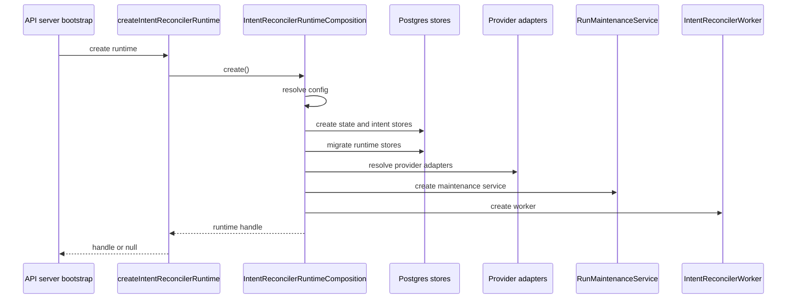

# Intent Reconciler Runtime Composition Component

## Owned Concern

The intent reconciler runtime composition component owns API-side assembly of
the background intent reconciliation runtime. It is a composition-root object,
not an engine domain service.

## Public API

`createIntentReconcilerRuntime(env, logger, observability, healthHooks)` remains
the caller-facing API. It delegates runtime assembly to
`IntentReconcilerRuntimeComposition` and returns an
`IntentReconcilerRuntimeHandle` or `null` when the runtime is disabled.

## Invariants

- Config resolution happens before any store, adapter, maintenance, or worker
  is created.
- Store creation happens before runtime store migration.
- Adapter resolution happens after store role binding and before maintenance
  service creation.
- Maintenance service creation happens before worker creation.
- Runtime handle publication happens after worker creation.
- Concrete Postgres and provider adapter binding remains in `apps/api`.
- `@dvt/engine` receives ports and services; it does not read runtime env
  values for this assembly path.

## Command Rail

The internal command rail is `IntentReconcilerRuntimeComposition`. It performs a
startup side effect by creating runtime infrastructure and a background worker.
It does not expose a public HTTP command.

## Startup Sequence

## Consumers

- `apps/api/src/server.ts` starts and stops the returned handle.
- `apps/api/src/runtime/reconcilerRuntimeLifecycle.ts` wraps runtime creation
  with health state transitions.
- Existing health routes observe the resulting reconciler health state; they do
  not own runtime assembly.

## Negative Scenarios

- Disabled runtime returns `null` and logs the disabled state.
- Missing `DATABASE_URL` returns `null` and logs a warning.
- Unsupported provider names fail closed during config parsing.
- Empty resolved adapter maps throw `INTENT_RECONCILER_NO_PROVIDER_ADAPTERS`.
