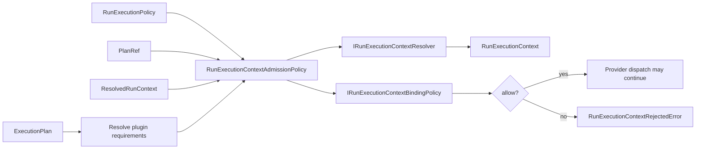
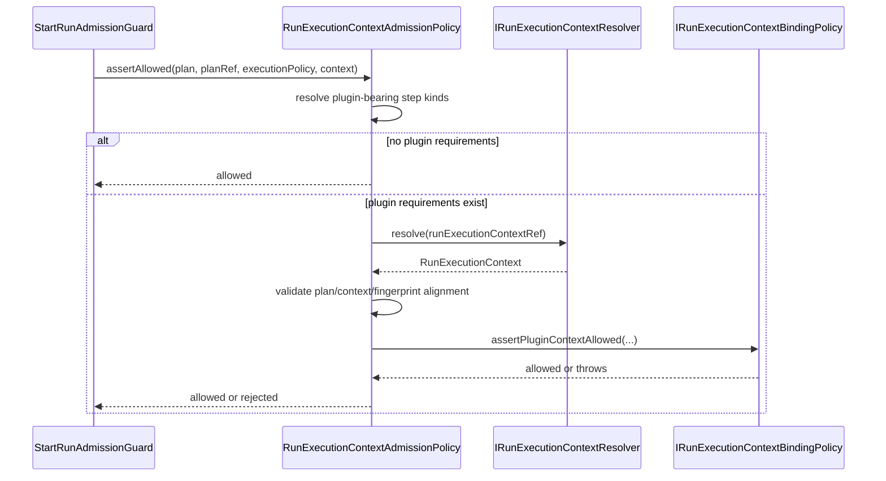
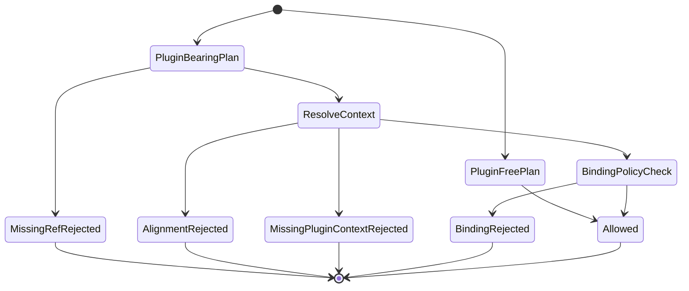

# Run Execution Context Admission Policy Component

This local component guide documents the generic run-execution-context
admission boundary used by `StartRunAdmissionGuard`. It exists to keep plugin
admission semantics explicit without letting DBT, SQL, or future executor
profiles become engine-core concepts.

Use this guide with:

- [StartRun protocol](../contracts/engine/StartRunProtocol.v1.md)
- [Run execution policy contract](../contracts/engine/RunExecutionPolicy.v1.md)
- [Temporal step plugin profile](../adapters/temporal/temporal-step-plugin-profile.md)
- [ADR-0003 execution model](../../../../adr/ADR-0003-execution-model.md)
- [ADR-0005 contract formalization](../../../../adr/ADR-0005-contract-formalization-tooling.md)
- [ADR-0014 run-driven adapter model](../../../../adr/ADR-0014-run-driven-adapter-model.md)

## Owned Concern

The component owns one concern:

- decide whether an admitted `ExecutionPlan`, `PlanRef`,
  `RunExecutionPolicy`, and `ResolvedRunContext` may use a resolved
  `RunExecutionContext`

It does **not** own:

- DBT bundle semantics
- SQL executor semantics
- artifact store implementation
- provider adapter dispatch
- plan integrity fetching
- start-run intent persistence

## Public API

- `RunExecutionContextAdmissionPolicy.assertAllowed(plan, planRef,
executionPolicy, context)` is the engine admission operation. It resolves
  plugin requirements, validates reference alignment, resolves the external run
  execution context when required, and delegates plugin-specific invariants to
  the binding policy.
- `IRunExecutionContextResolver.resolve(ref)` is the optional port for fetching
  the resolved context referenced by `context.runExecutionContextRef`.
- `IRunExecutionContextBindingPolicy.pluginRequirements` is the generic plugin
  registry for admission. Each requirement declares a `pluginId`, the plan
  `stepKinds` that require it, and `assertPluginContextAllowed(...)`.
- `RunExecutionContextRejectedError` is the fail-closed error type for
  admission failures.
- `EXAMPLE_PLUGIN_STEP_KINDS` and `SQL_TRANSFORM` in the test fixtures prove
  that admission is plugin-generic. They are not DBT aliases and must not become
  production step-kind registries.

## Invariants

- A plugin-free plan does not require `runExecutionContextRef`.
- A plugin-bearing plan requires `runExecutionContextRef` before any provider
  side effect.
- If `runExecutionContextRef` is present, an
  `IRunExecutionContextResolver` must be configured.
- The resolved context must match the admitted `PlanRef` by `planId`,
  `planVersion`, and `planSha256`.
- If both sides provide `pluginCompatibilityFingerprint`, they must match.
- The resolved context tenant, project, environment, and target adapter must
  match the admitted run context.
- Each plugin requirement owns only its plugin-specific context validation.
- Engine admission remains free of DBT-specific vocabulary; DBT bundle checks
  belong to infrastructure binding policies outside engine core.

## Transitions

```text
No plugin step kinds
  -> runExecutionContextRef optional
  -> admission allowed when generic plan/context checks pass

Plugin step kind detected
  -> require runExecutionContextRef
  -> require resolver
  -> resolve RunExecutionContext
  -> validate plan/context/fingerprint alignment
  -> require pluginContexts[pluginId]
  -> delegate plugin-specific invariant to binding policy
  -> allow or reject before provider dispatch
```

## Consumers

- `StartRunAdmissionGuard.assertExecutionPolicyAllowed(...)` invokes this
  component during start-run admission.
- `StartRunProtocol.v1.md` documents the generic plugin-bearing rejection
  contract.
- API infrastructure supplies concrete binding policies for currently enabled
  executor profiles.
- `apps/temporal-worker` consumes the already admitted context indirectly when
  a worker-composed plugin activity executes.
- Architecture tests consume this guide as a semantic fitness function.

## User Stories

| ID   | Story                                                                                                                                                                     | Acceptance scenario                                                                                                                                               |
| ---- | ------------------------------------------------------------------------------------------------------------------------------------------------------------------------- | ----------------------------------------------------------------------------------------------------------------------------------------------------------------- |
| US-1 | As an engine maintainer, I want plugin-free plans to start without external plugin context so that simple runs do not pay plugin setup cost.                              | Given a plan with no required plugin step kind, when `runExecutionContextRef` is absent, then admission does not ask the resolver for context.                    |
| US-2 | As a runtime operator, I want plugin-bearing plans to fail before dispatch when context is missing so that no provider workflow starts with incomplete plugin inputs.     | Given an `EXAMPLE_MODEL` plan, when `runExecutionContextRef` is absent, then `RunExecutionContextRejectedError` is raised before adapter dispatch.                |
| US-3 | As a plugin author, I want my plugin context validated behind a binding policy so that engine core does not learn DBT or SQL vocabulary.                                  | Given an `EXAMPLE_MODEL` plan and an example binding policy, when the artifact tenant mismatches the run tenant, then the policy rejects using its own invariant. |
| US-4 | As a platform owner, I want compatibility fingerprints checked at admission so that stale plugin contexts cannot execute newer plan shapes.                               | Given mismatched fingerprints, when admission resolves the context, then the policy rejects before dispatch.                                                      |
| US-5 | As a future SQL executor author, I want `SQL_TRANSFORM` to be admitted through the same mechanism as the example plugin so that adding SQL does not require engine edits. | Given `SQL_TRANSFORM` and a SQL binding policy, when context resolution succeeds, then admission succeeds without DBT symbols in engine source.                   |
| US-6 | As a reviewer, I want test fixtures to model invalid plugin context with explicit type errors so that negative tests do not hide type ambiguity behind generic errors.    | Given a malformed plugin context, when fixture validation runs, then it throws `TypeError` with the stable invalid-context message.                               |

## Diagrams







## Component Map

| Module                                                                                           | Owned concern                                          |
| ------------------------------------------------------------------------------------------------ | ------------------------------------------------------ |
| `packages/@dvt/engine/src/services/startRun/RunExecutionContextAdmissionPolicy.ts`               | Generic admission policy for run execution contexts    |
| `packages/@dvt/engine/src/ports/IRunExecutionContextResolver.ts`                                 | Context resolution port                                |
| `packages/@dvt/engine/src/ports/IRunExecutionContextBindingPolicy.ts`                            | Plugin requirement and plugin-context validation port  |
| `packages/@dvt/engine/test/services/runExecutionContextAdmissionPolicy.fixtures.ts`              | Canonical fixtures and semantic plugin-binding helpers |
| `packages/@dvt/engine/test/services/RunExecutionContextAdmissionPolicy.*.test.ts`                | Responsibility-specific behavior suites                |
| `packages/@dvt/engine/test/services/RunExecutionContextAdmissionPolicy.srp.architecture.test.ts` | Semantic architecture fitness function                 |

## Fowler Assessment

The current split is closer to mature hexagonal systems: the engine owns the
policy decision, the resolver is a port, and plugin-specific validation sits
behind a binding policy. The former drift was documentary: `StartRunProtocol`
still described DBT-bearing plan rejection even though the implementation had
become plugin-generic. This guide and the architecture test lock the language
to the actual boundary.

No new ADR is required for this slice. The decision is already governed by
ADR-0003, ADR-0005, and ADR-0014. A future ADR would be required only if the
plugin binding policy becomes a versioned public contract or if plugins move to
a separate sandboxed runtime package.

## Drift Guards

- `RunExecutionContextAdmissionPolicy.srp.architecture.test.ts` verifies this
  guide contains public API, invariants, transitions, consumers, user stories,
  diagrams, and drift guards.
- The same test verifies the old monolithic
  `RunExecutionContextAdmissionPolicy.test.ts` file is absent.
- The same test verifies behavior suites and fixtures declare semantic owned
  concern docblocks.
- The same test verifies `StartRunProtocol.v1.md` speaks about
  plugin-bearing plans instead of DBT-bearing plans.
