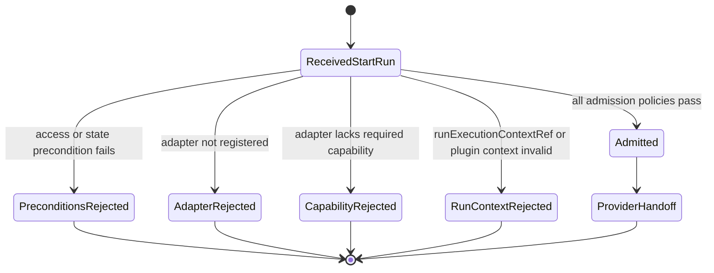
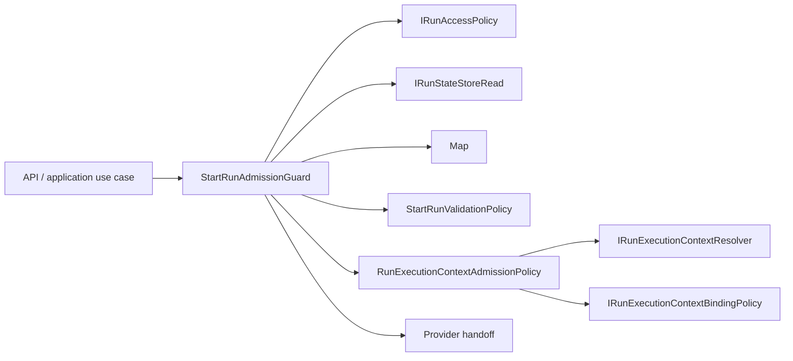
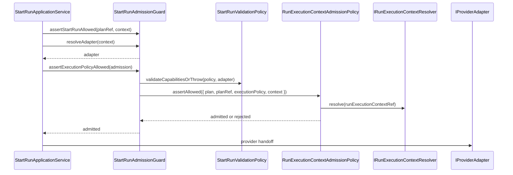

# Start-Run Admission Component

## Owned Concern

The start-run admission component owns pre-dispatch admission orchestration for
engine start-run requests. It coordinates access policy, state-store
preconditions, provider adapter resolution, capability validation, and optional
run-execution-context admission.

It does not own HTTP parsing, plan compilation, provider execution, lifecycle
event persistence, or plugin runtime execution.

## Public API

- `StartRunAdmissionGuard`
  Application guard used by start-run and recovery flows before provider
  handoff.
- `StartRunAdmissionGuardDeps`
  Dependency object for access policy, read-only state-store port, provider
  adapter registry, optional run-execution-context resolver, and optional
  binding policy.
- `assertStartRunAllowed(planRef, context)`
  Validates tenant/run preconditions and rate limits before deeper execution
  policy checks.
- `resolveAdapter(context)`
  Resolves the provider adapter selected by the run context or fails closed
  when the adapter is not registered.
- `assertExecutionPolicyAllowed(admission)`
  Validates adapter capabilities and delegates run-execution-context admission
  through a named request object.
- `RunExecutionContextAdmissionRequest`
  Named request object carrying `plan`, `planRef`, `executionPolicy`, and
  `context` into `RunExecutionContextAdmissionPolicy`.
- `RunExecutionContextAdmissionPolicy`
  Policy object that validates run-execution-context reference alignment,
  tenant/project/environment alignment, plugin context requirements, and plugin
  compatibility fingerprints.

## Invariants

- Start-run admission is pre-dispatch. It must run before provider handoff.
- The guard coordinates admission policies; it must not execute provider work.
- State-store precondition reads go through `IRunStateStoreRead`.
- Adapter resolution must fail closed with `AdapterNotRegisteredError`.
- Capability validation stays provider-port based, not plugin-specific.
- Run-execution-context validation must use
  `RunExecutionContextAdmissionRequest`; positional argument trains are not
  allowed at this boundary.
- Plugin requirements are selected by step kind, but engine source must remain
  plugin-name agnostic.
- Tenant, project, environment, plan id, plan version, plan hash, and target
  adapter must align before plugin context checks pass.
- Plugin compatibility fingerprint checks remain optional but fail closed when
  a policy expects a fingerprint and the resolved context cannot prove it.

## Transitions

## Consumers

- `StartRunApplicationService` uses the guard before starting a run.
- `RecoverRunApplicationService` uses the same admission vocabulary for
  recovery posture where applicable.
- API composition supplies configured adapters and optional
  run-execution-context infrastructure.
- `RunExecutionContextAdmissionPolicy` consumes the named admission request.
- Engine tests consume fixture builders to prove acceptance, provenance,
  plugin requirements, and compatibility paths.

## Diagrams

## Fowler Reading

- **Application Controller**:
  `StartRunAdmissionGuard` coordinates the start-run admission workflow.
- **Policy Object**:
  `RunExecutionContextAdmissionPolicy` owns context alignment and plugin
  context rules.
- **Parameter Object**:
  `RunExecutionContextAdmissionRequest` names the admission inputs and prevents
  primitive argument ordering drift.
- **Gateway**:
  `IRunExecutionContextResolver` hides the run-execution-context storage
  adapter.
- **Hexagonal Port**:
  `IProviderAdapter` and `IRunStateStoreRead` keep provider and persistence
  infrastructure outside application admission semantics.

## Drift Guards

- `tools/ci/static-analysis-followup-branch-architecture.test.mjs` checks this
  guide, the owned-concern docblocks, and the named admission request object.
- `packages/@dvt/engine/test/services/RunExecutionContextAdmissionPolicy.*.test.ts`
  validates acceptance, provenance, plugin requirements, and compatibility
  behavior.
- `packages/@dvt/engine/test/services/RunExecutionContextAdmissionPolicy.srp.architecture.test.ts`
  keeps the test suites split by responsibility.
