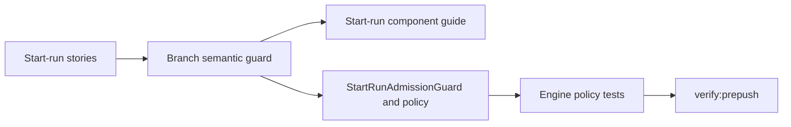

# Start-Run Admission User Stories

## Purpose

This document captures the user-facing and architecture-facing scenarios for
the start-run admission component touched by the static-analysis follow-up
branch.

It complements the component guide:

- [Start-Run Admission Component](./start-run-admission-component.md)

## User Stories

### US-START-RUN-001: admit a run only after context policy passes

As an operator starting a run, I want admission to succeed only after the
execution context policy validates the plan, plan reference, run reference, and
execution target, so unsafe runs cannot start through partial context.

Acceptance criteria:

- Given a valid `RunExecutionContextAdmissionRequest`, when
  `StartRunAdmissionGuard` evaluates the request, then start-run admission may
  proceed to the adapter.
- Given missing plan, planRef, runRef, or execution target, when admission is
  evaluated, then the policy denies the request before adapter dispatch.
- Given admission is denied, then no adapter start is invoked.

### US-START-RUN-002: keep policy input semantic

As an engine maintainer, I want `RunExecutionContextAdmissionRequest` to be a
named request object, so callers cannot silently swap positional values or
recreate the same policy with different call semantics.

Acceptance criteria:

- Given engine code calls `RunExecutionContextAdmissionPolicy.assertAllowed`,
  when arguments are supplied, then they are supplied through the named request
  object.
- Given a future change attempts positional policy arguments, then the
  branch-level architecture guard fails.
- Given the policy remains generic, then adapter-specific requirements stay in
  adapter policy and capability validation.

### US-START-RUN-003: preserve degraded capability visibility

As an operator, I want admission failures to remain explainable when capability
or provider requirements are missing, so the platform reports why the run did
not start instead of creating a hidden no-op.

Acceptance criteria:

- Given provider requirements are unavailable, when admission is evaluated,
  then the failure is represented as an admission denial.
- Given access or execution target checks fail, then the denial remains before
  adapter dispatch.
- Given health or capability state changes, then start-run admission does not
  bypass the single policy boundary.

### US-START-RUN-004: validate semantic architecture drift

As an architect, I want the branch-level architecture guard to validate start
run admission semantics, so future cleanup cannot collapse the named policy
request or remove owned-concern documentation.

Acceptance criteria:

- Given the branch architecture guard runs, when it reads engine admission
  source, then it finds the owned-concern docblock at module start.
- Given the guard reads policy source, then it finds
  `RunExecutionContextAdmissionRequest`.
- Given the guard reads docs, then public API, invariants, transitions,
  consumers, diagrams, and these user stories exist.

## Negative Scenarios

- Missing context data must fail closed before adapter start.
- Positional policy arguments are rejected by architecture tests.
- Adapter-specific checks must not be duplicated inside the generic execution
  context policy.
- Documentation drift is a test failure when the component guide or story doc
  no longer describes public API and invariants.

## Given / When / Then Coverage

- Given a complete run context, When start-run admission evaluates it, Then the
  adapter may be resolved and invoked.
- Given required context is absent, When start-run admission evaluates it, Then
  the denial happens before provider handoff.
- Given policy call shape drifts, When the branch semantic guard runs, Then it
  fails on the missing named request object.

## Scenario Coverage Matrix

- `US-START-RUN-001`: valid context admission.
  Primary implementation: `StartRunAdmissionGuard.ts`.
  Primary tests: `RunExecutionContextAdmissionPolicy.acceptance.test.ts`.
- `US-START-RUN-002`: named policy request.
  Primary implementation: `RunExecutionContextAdmissionPolicy.ts`.
  Primary tests:
  `RunExecutionContextAdmissionPolicy.srp.architecture.test.ts`.
- `US-START-RUN-003`: degraded admission denial.
  Primary implementation: `StartRunAdmissionGuard.ts`.
  Primary tests: `RunExecutionContextAdmissionPolicy.provenance.test.ts`.
- `US-START-RUN-004`: semantic drift guard.
  Primary implementation: `static-analysis-followup-branch-architecture`.
  Primary tests: `static-analysis-followup-branch-architecture.test.mjs`.

## TDD Traceability

Red case for this follow-up:

- the branch semantic guard required the start-run user-story document;
- the document did not exist;
- the guard failed before implementation.

Green case for this follow-up:

- add this story document;
- link it through component indexes and branch review material;
- rerun the guard and pre-push validation.
