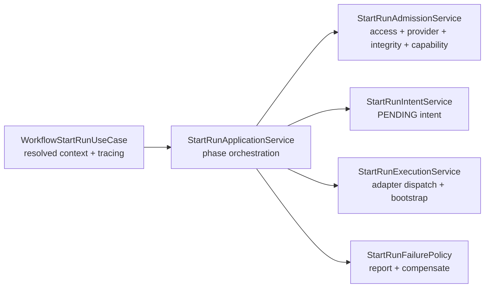
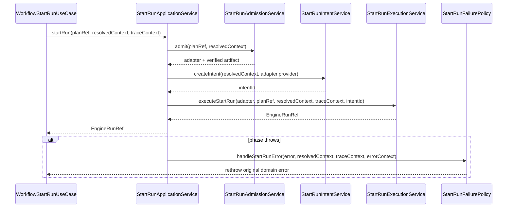
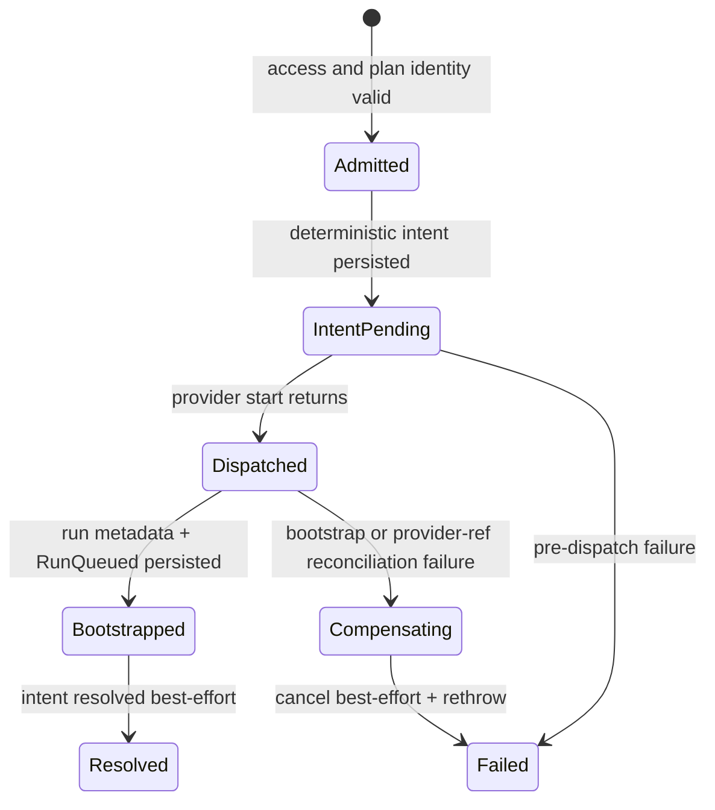

# Start-Run Application Decomposition Component

```component-doc-contract
componentId: WE-HX-3-START-RUN-DECOMPOSITION
commandRails:
  - IWorkflowEngine.startRun
publicApi:
  - StartRunApplicationService
  - StartRunAdmissionService
  - StartRunIntentService
  - StartRunExecutionService
  - StartRunFailurePolicy
requiredSemantics:
  - public-api
  - invariants
  - transitions
  - consumers
  - diagrams
diagramPack: docs/architecture/components/engine/architecture/start-run-application-decomposition-diagrams.md
```

## Purpose

This component owns the internal `@dvt/engine` start-run application flow after
the `WorkflowEngine` facade has normalized public inputs and built the
start-run trace context.

The component does not define a new public contract. It decomposes the existing
`IWorkflowEngine.startRun(planRef, context)` protocol into reviewable phase
owners for admission, provider/capability resolution, intent creation, dispatch,
and failure policy.

## Public API

The API is local to the engine package.

| Surface                      | Owner         | Role                                                                                            |
| ---------------------------- | ------------- | ----------------------------------------------------------------------------------------------- |
| `StartRunApplicationService` | `@dvt/engine` | Orchestrates the phase services and preserves caller-visible behavior.                          |
| `StartRunAdmissionService`   | `@dvt/engine` | Coordinates pre-dispatch admission, provider resolution, plan integrity, and capability checks. |
| `StartRunIntentService`      | `@dvt/engine` | Creates deterministic pre-dispatch intents before provider side effects.                        |
| `StartRunExecutionService`   | `@dvt/engine` | Dispatches to the provider adapter and bootstraps run state.                                    |
| `StartRunFailurePolicy`      | `@dvt/engine` | Reports failures, resolves intents best-effort, and emits guarded `RunFailed` events.           |
| `StartRunEventFactory`       | `@dvt/engine` | Builds deterministic run metadata and lifecycle event inputs.                                   |
| `StartRunValidationPolicy`   | `@dvt/engine` | Validates tenant, plan reference, run identity, duplicates, and capabilities.                   |

## Invariants

- `StartRunApplicationService` sequences phases but does not implement phase
  rules directly.
- Admission and integrity complete before intent creation.
- Intent creation happens before provider dispatch.
- Provider dispatch stays inside `StartRunExecutionService`.
- Failure emission is guarded by persisted run metadata and intent state.
- `StartRunIntentService` derives intent identity from canonical start-run
  idempotency inputs and never generates a fresh random intent id.
- `StartRunAdmissionService` uses `ScopedPlanRef` for artifact integrity so
  plan materialization remains tenant/project/environment scoped.
- No public `IWorkflowEngine` or `StartRunBoundary` contract changes are made by
  this decomposition.

## Transitions

| Transition             | From                         | To                           | Rule                                                                                    |
| ---------------------- | ---------------------------- | ---------------------------- | --------------------------------------------------------------------------------------- |
| normalized start       | `WorkflowStartRunUseCase`    | `StartRunApplicationService` | Facade adaptation is complete before application flow.                                  |
| pre-dispatch admission | `StartRunApplicationService` | `StartRunAdmissionService`   | Validate access, duplicate run, provider, integrity, capability, and execution context. |
| intent creation        | `StartRunApplicationService` | `StartRunIntentService`      | Persist `PENDING` intent before provider side effects.                                  |
| dispatch               | `StartRunApplicationService` | `StartRunExecutionService`   | Execute provider start and bootstrap run state.                                         |
| failure handling       | `StartRunApplicationService` | `StartRunFailurePolicy`      | Report and compensate without fabricating success.                                      |

## Consumers

- `packages/@dvt/engine/src/application/StartRunApplicationService.ts`
- `packages/@dvt/engine/src/application/workflow-engine-use-cases/WorkflowStartRunUseCase.ts`
- `packages/@dvt/engine/test/services/StartRunApplicationService.test.ts`
- `packages/@dvt/engine/test/services/StartRunApplicationDecomposition.test.ts`
- `apps/api/src/application/services/WorkflowEngineFactory.ts`, through
  `buildWorkflowEngineFacade`

## User Stories

- [Start-run application decomposition user stories](./start-run-application-decomposition-user-stories.md)
- [Fowler WE-HX-3 mailbox analysis](../../../../../buzon/20260512-codex-fowler-we-hx-3-start-run-decomposition-analysis-and-remediation.md)

## Diagrams







## Drift Guards

- `packages/@dvt/engine/test/architecture/startRunApplicationDecomposition.architecture.test.ts`
  fails if `StartRunApplicationService` regrows direct provider resolution,
  plan integrity, or intent creation implementation.
- The same guard requires every start-run phase module touched by WE-HX-3 to
  declare an `@ownedConcern` header.
- `packages/@dvt/engine/test/services/StartRunApplicationDecomposition.test.ts`
  proves the dedicated intent and admission services own behavior, not only
  file shape.
