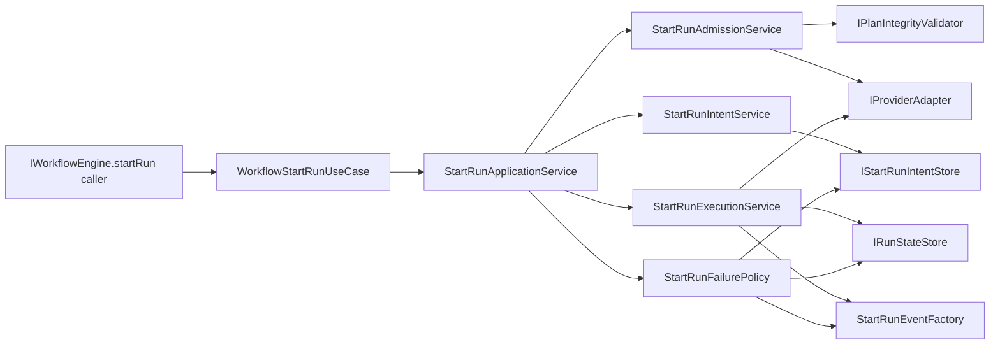
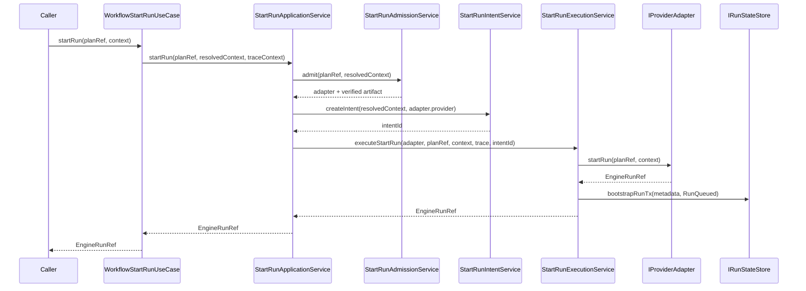
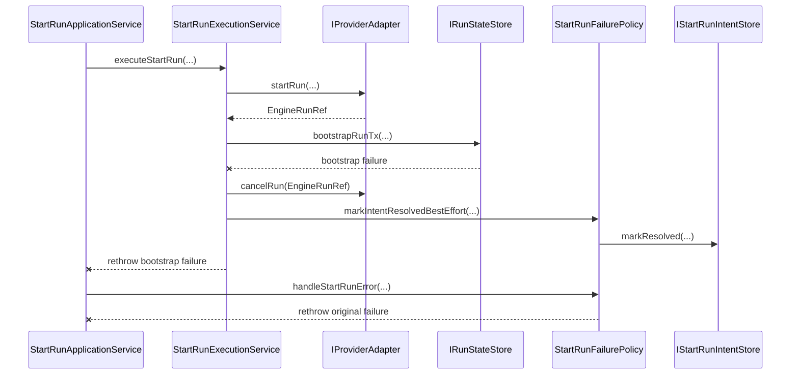
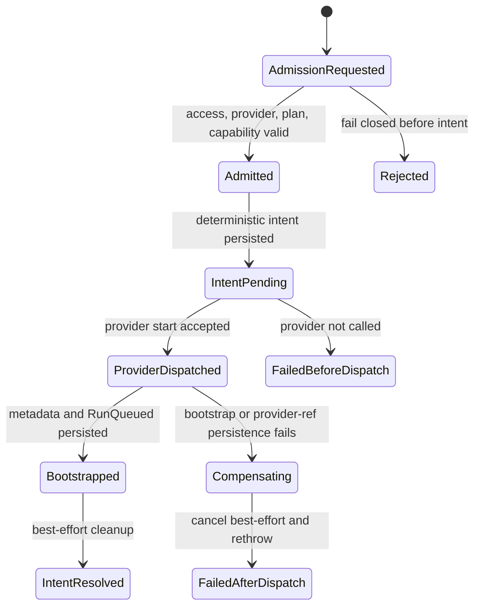

# Start-Run Application Decomposition Diagrams

## Purpose

This document is the local diagram pack for the WE-HX-3 start-run application
component. It shows the current component boundary, command sequence,
failure/compensation path, and state transitions for the existing
`IWorkflowEngine.startRun` command rail.

## Component Boundary

## Command Sequence

## Failure And Compensation

## State Transitions

## Ownership Summary

| Component                    | Owned concern                                                 |
| ---------------------------- | ------------------------------------------------------------- |
| `WorkflowStartRunUseCase`    | Facade-facing adaptation and trace context handoff            |
| `StartRunApplicationService` | Phase orchestration                                           |
| `StartRunAdmissionService`   | Pre-dispatch admission and capability checks                  |
| `StartRunIntentService`      | Deterministic pre-dispatch intent creation                    |
| `StartRunExecutionService`   | Provider dispatch, bootstrap, and compensation                |
| `StartRunFailurePolicy`      | Failure reporting, guarded event emission, and intent cleanup |
