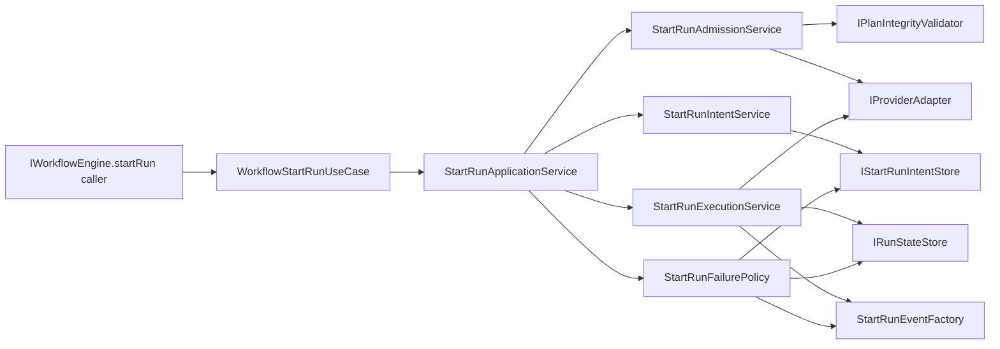
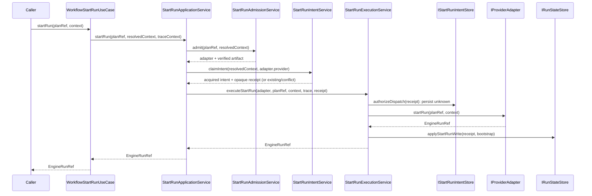
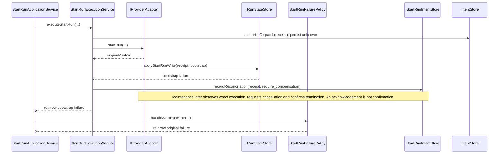
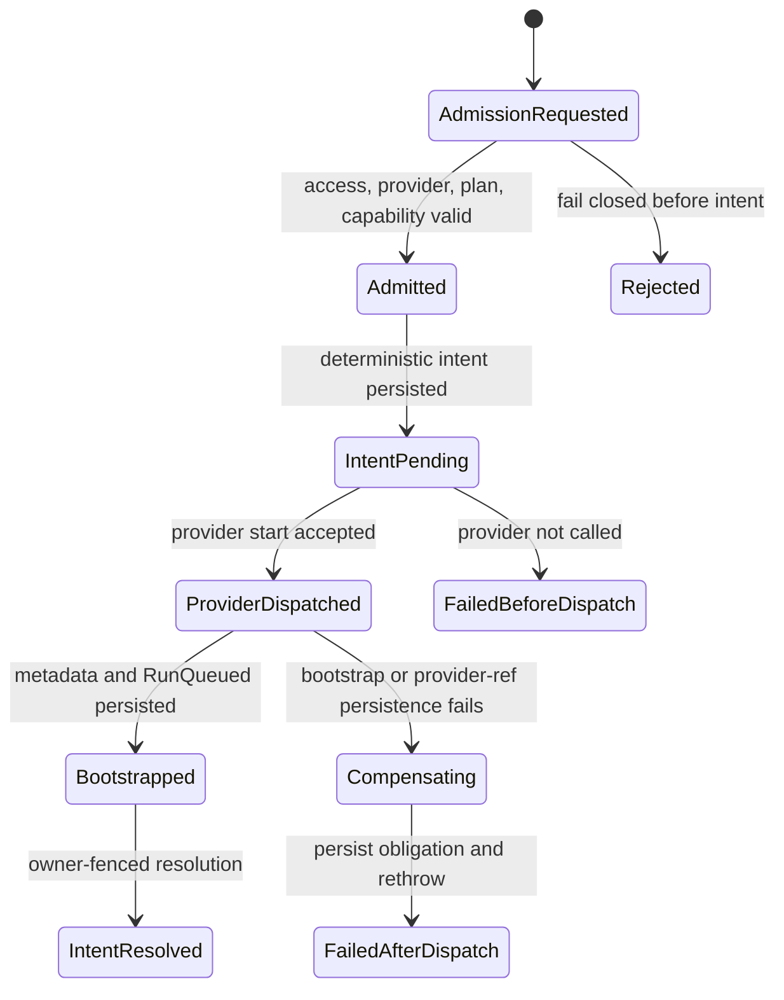

# Start-Run Application Decomposition Diagrams

## Purpose

The current ownership, observation-only recovery and hard-cut rules are normative
in [StartRunProtocol](../contracts/engine/StartRunProtocol.v1.md) and
[ADR-0030](../../../../adr/ADR-0030-pre-dispatch-intent-log.md).
No reconciliation path automatically redispatches an unknown start.

This document is the local diagram pack for the WE-HX-3 start-run application
component. It shows the current component boundary, command sequence,
failure/compensation path, and state transitions for the existing
`IWorkflowEngine.startRun` command rail.

## Component Boundary

```mermaid
flowchart LR
  Caller["IWorkflowEngine.startRun caller"]
  UseCase["WorkflowStartRunUseCase"]
  App["StartRunApplicationService"]
  Admission["StartRunAdmissionService"]
  Intent["StartRunIntentService"]
  Execution["StartRunExecutionService"]
  Failure["StartRunFailurePolicy"]
  EventFactory["StartRunEventFactory"]
  PlanIntegrity["IPlanIntegrityValidator"]
  Provider["IProviderAdapter"]
  IntentStore["IStartRunIntentStore"]
  StateStore["IRunStateStore"]

  Caller --> UseCase
  UseCase --> App
  App --> Admission
  App --> Intent
  App --> Execution
  App --> Failure
  Admission --> PlanIntegrity
  Admission --> Provider
  Intent --> IntentStore
  Execution --> Provider
  Execution --> StateStore
  Execution --> EventFactory
  Failure --> IntentStore
  Failure --> StateStore
  Failure --> EventFactory
```

## Command Sequence

```mermaid
sequenceDiagram
  participant Caller
  participant UseCase as WorkflowStartRunUseCase
  participant App as StartRunApplicationService
  participant Admission as StartRunAdmissionService
  participant Intent as StartRunIntentService
  participant Execution as StartRunExecutionService
  participant IntentStore as IStartRunIntentStore
  participant Provider as IProviderAdapter
  participant Store as IRunStateStore

  Caller->>UseCase: startRun(planRef, context)
  UseCase->>App: startRun(planRef, resolvedContext, traceContext)
  App->>Admission: admit(planRef, resolvedContext)
  Admission-->>App: adapter + verified artifact
  App->>Intent: claimIntent(resolvedContext, adapter.provider)
  Intent-->>App: acquired intent + opaque receipt (or existing/conflict)
  App->>Execution: executeStartRun(adapter, planRef, context, trace, receipt)
  Execution->>IntentStore: authorizeDispatch(receipt): persist unknown
  Execution->>Provider: startRun(planRef, context)
  Provider-->>Execution: EngineRunRef
  Execution->>Store: applyStartRunWrite(receipt, bootstrap)
  Execution-->>App: EngineRunRef
  App-->>UseCase: EngineRunRef
  UseCase-->>Caller: EngineRunRef
```

## Failure And Compensation

```mermaid
sequenceDiagram
  participant App as StartRunApplicationService
  participant Execution as StartRunExecutionService
  participant Provider as IProviderAdapter
  participant Store as IRunStateStore
  participant Failure as StartRunFailurePolicy
  participant Intent as IStartRunIntentStore

  App->>Execution: executeStartRun(...)
  Execution->>IntentStore: authorizeDispatch(receipt): persist unknown
  Execution->>Provider: startRun(...)
  Provider-->>Execution: EngineRunRef
  Execution->>Store: applyStartRunWrite(receipt, bootstrap)
  Store--xExecution: bootstrap failure
  Execution->>Intent: recordReconciliation(receipt, require_compensation)
  Note over Provider,Intent: Maintenance later observes exact execution, requests cancellation and confirms termination. An acknowledgement is not confirmation.
  Execution--xApp: rethrow bootstrap failure
  App->>Failure: handleStartRunError(...)
  Failure--xApp: rethrow original failure
```

## State Transitions

```mermaid
stateDiagram-v2
  [*] --> AdmissionRequested
  AdmissionRequested --> Admitted: access, provider, plan, capability valid
  AdmissionRequested --> Rejected: fail closed before intent
  Admitted --> IntentPending: deterministic intent persisted
  IntentPending --> ProviderDispatched: provider start accepted
  ProviderDispatched --> Bootstrapped: metadata and RunQueued persisted
  Bootstrapped --> IntentResolved: owner-fenced resolution
  IntentPending --> FailedBeforeDispatch: provider not called
  ProviderDispatched --> Compensating: bootstrap or provider-ref persistence fails
  Compensating --> FailedAfterDispatch: persist obligation and rethrow
```

## Ownership Summary

| Component                    | Owned concern                                                           |
| ---------------------------- | ----------------------------------------------------------------------- |
| `WorkflowStartRunUseCase`    | Facade-facing adaptation and trace context handoff                      |
| `StartRunApplicationService` | Phase orchestration                                                     |
| `StartRunAdmissionService`   | Pre-dispatch admission and capability checks                            |
| `StartRunIntentService`      | Deterministic identity and exclusive intent acquisition                 |
| `StartRunExecutionService`   | Owner-fenced dispatch/bootstrap; delegates durable compensation         |
| `StartRunFailurePolicy`      | Guarded failure decisions; separate diagnostics and compensation owners |
