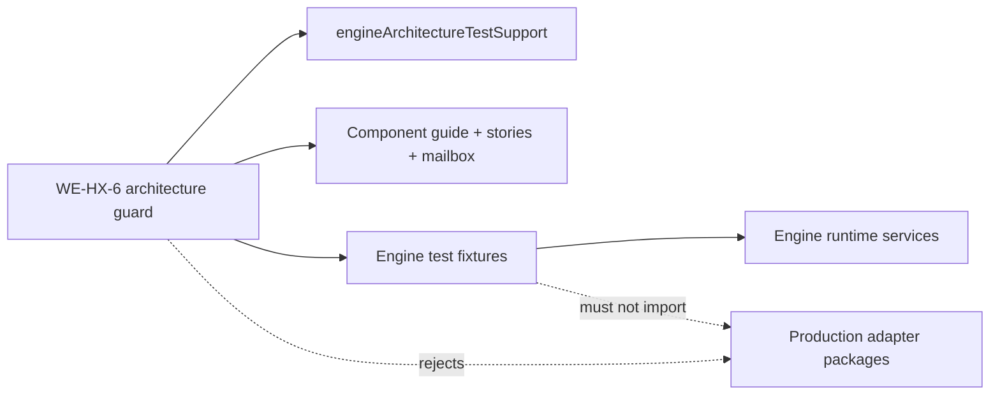
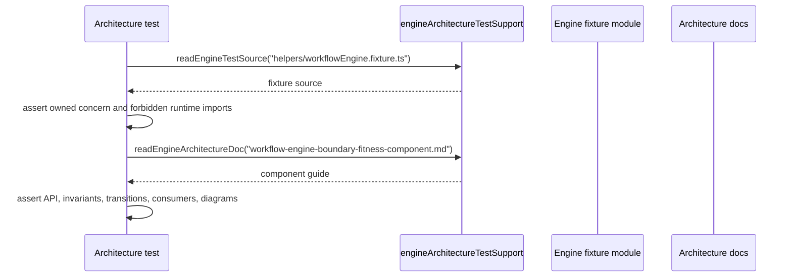
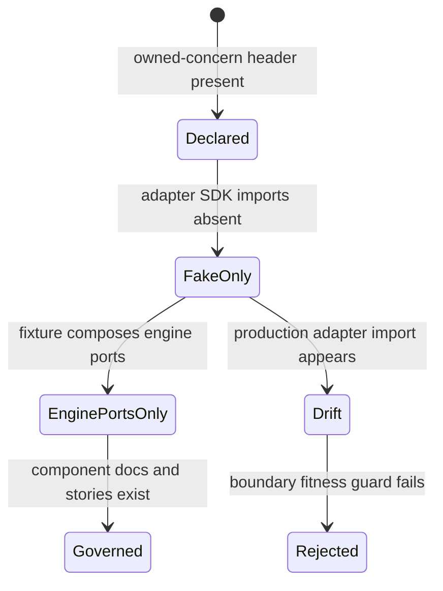

# WorkflowEngine Boundary Fitness Component

## Purpose

This component owns the `WE-HX-6` boundary-fitness model for `@dvt/engine`.
It keeps test doubles, architecture guards, and local component documentation
aligned with the runtime boundary decomposition completed by `WE-HX-3` through
`WE-HX-5`.

## Public API

The API is test-local to the engine package.

| Surface                                                  | Owner                     | Role                                                                                                    |
| -------------------------------------------------------- | ------------------------- | ------------------------------------------------------------------------------------------------------- |
| `engineArchitectureTestSupport.ts`                       | Engine architecture tests | Shared readers and semantic assertions for source, test, and architecture docs.                         |
| `workflowEngineBoundaryFitness.architecture.test.ts`     | Engine architecture tests | Fitness function that validates fixture ownership, documentation coverage, and forbidden runtime bleed. |
| `createWorkflowEngineFixture`                            | Engine test helpers       | Composes a `WorkflowEngine` with in-memory stores and fake provider adapters.                           |
| `makeTemporalAdapter`                                    | Engine test helpers       | Builds a temporal-shaped fake `IProviderAdapter`; it is not the production Temporal adapter.            |
| `bootstrapQueuedRun` / `appendRunStarted` / `makeRunRef` | Engine test helpers       | Creates persisted run lifecycle setup for engine tests.                                                 |
| `WorkflowEngine.helpers.ts`                              | Engine facade tests       | Provides facade-level helper vocabulary for plan refs, contexts, observability, clocks, and events.     |

## Invariants

- Test doubles may satisfy engine-owned ports, but must not import production
  adapter packages or provider SDKs.
- Engine fixtures must not call DB migration, API composition root, Temporal
  worker, or environment-provider selection code.
- Fake provider adapters must preserve `IProviderAdapter` semantics without
  becoming an adapter implementation.
- Architecture tests must use shared support for source and documentation
  discovery when the support covers the needed behavior.
- Each fixture module must declare an owned-concern header near the top of the
  file.
- Boundary-fitness docs, user stories, mailbox analysis, proposal
  mechanization, evidence, and risk records must stay in the same slice.

## Transitions

| Transition                      | From                     | To                                             | Rule                                                                                  |
| ------------------------------- | ------------------------ | ---------------------------------------------- | ------------------------------------------------------------------------------------- |
| architecture guard reads source | Architecture test        | `readEngineSource` / `readEngineTestSource`    | Use shared test support instead of local path readers.                                |
| architecture guard reads docs   | Architecture test        | `readEngineArchitectureDoc` / `readRepoSource` | Use shared test support so docs paths remain consistent.                              |
| test creates engine facade      | Unit or integration test | `createWorkflowEngineFixture`                  | Compose engine-owned ports and in-memory stores only.                                 |
| test needs provider behavior    | Unit or integration test | `makeTemporalAdapter` fake                     | Implement `IProviderAdapter` without importing production Temporal adapter code.      |
| future fixture expands          | Test helper module       | Owned-concern header and WE-HX-6 guard         | New runtime or adapter imports are rejected unless the component guide changes first. |

## Consumers

- `packages/@dvt/engine/test/architecture/workflowEngineBoundaryFitness.architecture.test.ts`
- `packages/@dvt/engine/test/architecture/workflowEngineProviderTelemetrySeams.architecture.test.ts`
- `packages/@dvt/engine/test/architecture/workflowEngineSemanticClosure.architecture.test.ts`
- `packages/@dvt/engine/test/core/*.test.ts`
- `packages/@dvt/engine/test/services/*.test.ts`
- Engine reviewers validating boundary-drift and duplicate-semantics risks.

## Diagrams

## Drift Guards

- `workflowEngineBoundaryFitness.architecture.test.ts` fails if fixture modules
  lose their owned-concern headers.
- The same guard fails if engine test doubles import production adapter packages,
  Temporal SDKs, DB migration code, API composition roots, or environment
  provider selection code.
- The guard fails if recent WE-HX architecture tests reintroduce local
  source/doc reader duplication instead of shared support.
- The guard requires this component guide, the user stories, and the Fowler
  mailbox analysis to keep code and documentation aligned.

## Related Records

- [WE-HX-6 user stories](./workflow-engine-boundary-fitness-user-stories.md)
- [WE-HX-5 provider and telemetry seams](./workflow-engine-provider-telemetry-seams-component.md)
- [WorkflowEngine target architecture](./workflow-engine-target-architecture.v1.md)
- [Fowler mailbox analysis](../../../../../buzon/20260512-codex-fowler-we-hx-6-boundary-fitness-analysis-and-remediation.md)
