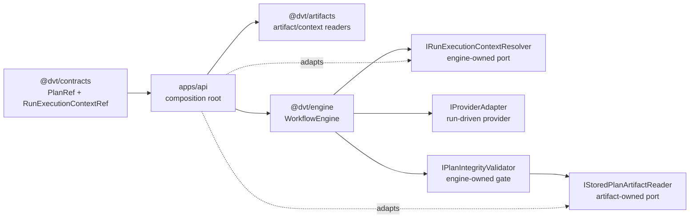
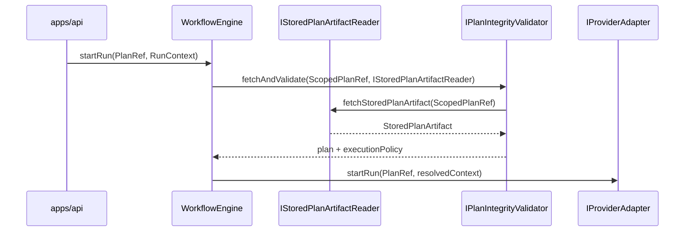

# WorkflowEngine Boundary Ownership Component

## Purpose

This component freezes the external ownership map for the `WorkflowEngine`
subsystem. It defines which package owns the shared reference shapes, which
package owns engine use-case ports, and where composition roots adapt artifact
readers into engine needs.

## Public API

| Surface                        | Canonical owner                                         | Public role                                                                       |
| ------------------------------ | ------------------------------------------------------- | --------------------------------------------------------------------------------- |
| `PlanRef`                      | `@dvt/contracts`                                        | Shared immutable plan reference and integrity metadata.                           |
| `RunExecutionContextRef`       | `@dvt/contracts`                                        | Shared immutable reference to plugin/runtime execution context.                   |
| `IStoredPlanArtifactReader`    | `@dvt/artifacts/src/ports/IStoredPlanArtifactStore.ts`  | Artifact-owned port that materializes executable plan bytes from `ScopedPlanRef`. |
| `IPlanIntegrityValidator`      | `@dvt/engine/src/ports/IPlanIntegrityValidator.ts`      | Engine-owned integrity gate abstraction for start-run and recovery preflight.     |
| `IRunExecutionContextResolver` | `@dvt/engine/src/ports/IRunExecutionContextResolver.ts` | Engine-owned resolver need for admission-time context materialization.            |
| `IRunExecutionContextReader`   | `@dvt/artifacts`                                        | Artifact-owned reader implementation seam for context payloads.                   |

`@dvt/artifacts` exports `StoredPlanArtifact` and
`IStoredPlanArtifactReader`. `@dvt/engine` exports only
`IPlanIntegrityValidator` for the integrity gate it owns.

## Invariants

- `PlanRef` and `RunExecutionContextRef` are shared serializable contracts, not
  engine behavior ports.
- `IStoredPlanArtifactReader` belongs to `@dvt/artifacts` because executable
  plan bytes are artifact materialization behavior, not engine lifecycle
  behavior.
- `IPlanIntegrityValidator` belongs to `@dvt/engine` because it owns the
  dispatch-time invariant that fetched bytes and metadata match the scoped
  `PlanRef`.
- Artifact storage and context reading behavior belongs to `@dvt/artifacts`.
- `IRunStateStore` must not publish plan-fetching or artifact-reader
  responsibilities.
- Provider adapters receive an engine-approved `PlanRef`; they do not decide
  start-run integrity admission.
- `@dvt/engine` must not import concrete artifact adapters, planner services, or
  provider runtime implementations.

## Transitions

| Transition            | From                                       | To                           | Rule                                                                   |
| --------------------- | ------------------------------------------ | ---------------------------- | ---------------------------------------------------------------------- |
| `PlanRef` admitted    | API/composition root                       | `WorkflowEngine.startRun`    | Engine normalizes and validates the shared reference.                  |
| plan artifact fetched | `IStoredPlanArtifactReader` implementation | `PlanIntegrityValidator`     | Engine-owned integrity validator receives bytes plus execution policy. |
| adapter dispatch      | engine start-run service                   | `IProviderAdapter.startRun`  | Dispatch occurs only after plan bytes and metadata match `PlanRef`.    |
| context resolved      | `IRunExecutionContextResolver`             | run-context admission policy | Required only when the plan declares plugin/runtime context needs.     |

## Consumers

- `packages/@dvt/engine/src/application/StartRunApplicationService.ts`
- `packages/@dvt/engine/src/application/RecoverRunApplicationService.ts`
- `packages/@dvt/engine/src/security/planIntegrity.ts`
- `apps/api/src/application/services/WorkflowEngineFactory.ts`
- `apps/api/src/application/services/StoredExecutablePlanResolver.ts`
- `packages/@dvt/artifacts/src/ports/IStoredPlanArtifactStore.ts`
- `packages/@dvt/artifacts/src/ports/IRunExecutionContextReader.ts`

## User Stories

Executable user stories for this component live in
[WorkflowEngine boundary ownership user stories](./workflow-engine-boundary-ownership-user-stories.md).
They cover the engine-owned plan artifact reader, state-store separation,
API artifact-shape reuse, documentation invariants, and negative drift
scenarios.

## Diagrams

## Drift Guards

- `packages/@dvt/engine/test/architecture/workflowEngineBoundaryOwnership.architecture.test.ts`
  fails if plan artifact reading returns to `IRunStateStore`.
- The same test fails if a duplicate adapter-local or engine-local
  `IPlanFetcher` file returns.
- The test requires this guide to keep public API, invariants, transitions,
  consumers, diagrams, and drift guards visible together.
