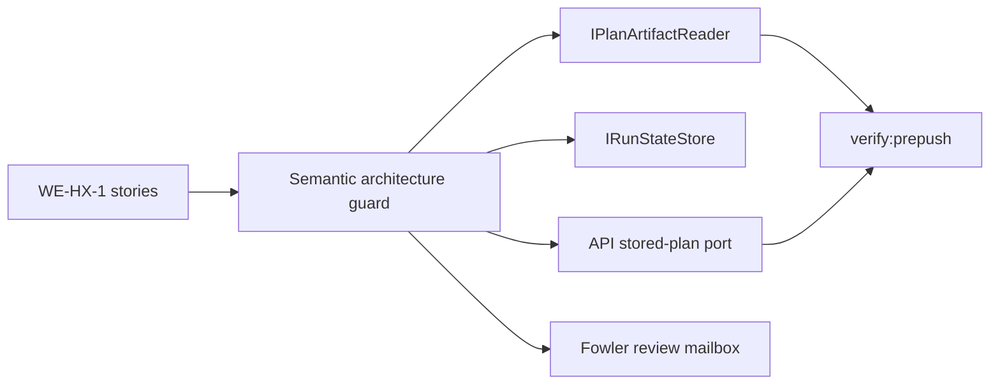

# WorkflowEngine Boundary Ownership User Stories

## Purpose

These stories make the `WE-HX-1` boundary executable. They cover the vertical
scenarios where contracts, engine, artifacts, and API composition roots meet
around `PlanRef`, `RunExecutionContextRef`, plan artifact reading, and run-state
persistence.

## User Stories

### US-WE-HX-1-001: fetch plan artifacts through an engine-owned port

As an engine maintainer, I want start-run and recovery to depend on an
engine-owned `IPlanFetcher`, so the engine describes its execution need without
owning artifact storage implementation.

Acceptance criteria:

- `IPlanFetcher`, `StoredPlanArtifact`, and `IPlanIntegrityValidator` live in
  `packages/@dvt/engine/src/ports/IPlanArtifactReader.ts`.
- `StartRunApplicationService` and `RecoverRunApplicationService` import the
  plan artifact reader port from that module.
- The API composition root can still wire a concrete reader through the public
  `@dvt/engine` export.
- Artifact storage behavior remains outside the engine package.

### US-WE-HX-1-002: keep run-state persistence free of plan artifact concerns

As an architect, I want `IRunStateStore` to own only run-state persistence and
lifecycle event payloads, so plan bytes cannot drift back into the state-store
boundary.

Acceptance criteria:

- `IRunStateStore.ts` does not declare `IPlanFetcher`,
  `IPlanIntegrityValidator`, or `StoredPlanArtifact`.
- State-store read, write, and maintenance ports remain focused on run
  metadata, events, snapshots, retries, and maintenance.
- A semantic architecture test fails when plan artifact reader symbols return
  to the state-store module.

### US-WE-HX-1-003: reuse one stored plan artifact shape across API validation

As an API maintainer, I want stored-plan validation to reuse the engine-owned
`StoredPlanArtifact` shape, so the API does not create a second equivalent
artifact DTO for the same plan-integrity seam.

Acceptance criteria:

- `apps/api/src/application/ports/storedPlan.ts` imports
  `StoredPlanArtifact` from `@dvt/engine`.
- The API port owns only the API validation method name,
  `fetchForValidation`.
- The API file does not redeclare `StoredPlanArtifact`.

### US-WE-HX-1-004: keep boundary documentation and module concerns aligned

As a reviewer, I want every boundary module touched by `WE-HX-1` to state its
owned concern and link to local component docs, so future refactors preserve
semantic encapsulation instead of relying on file placement alone.

Acceptance criteria:

- The component guide lists public API, invariants, transitions, consumers,
  user stories, diagrams, and drift guards.
- The Fowler review records the system-level analysis, mature-system
  comparison, antipatterns, repetitions, drift, and future lessons.
- Touched engine modules start with a short `@ownedConcern` docblock.
- The architecture guard validates docs and module concern ownership together.

## Negative Scenarios

- A future change that adds `IPlanFetcher` back to `IRunStateStore.ts` fails the
  architecture guard.
- A future change that recreates `packages/@dvt/engine/src/adapters/IPlanFetcher.ts`
  fails the architecture guard.
- A future change that redeclares `StoredPlanArtifact` in `apps/api` fails the
  architecture guard.
- A future change that removes the local user-story document or Fowler review
  fails the architecture guard.
- A future change that removes the `@ownedConcern` header from a touched
  boundary module fails the architecture guard.

## Scenario Coverage Matrix

| Story            | Primary code                                                 | Primary guard                                          |
| ---------------- | ------------------------------------------------------------ | ------------------------------------------------------ |
| `US-WE-HX-1-001` | `packages/@dvt/engine/src/ports/IPlanArtifactReader.ts`      | `workflowEngineBoundaryOwnership.architecture.test.ts` |
| `US-WE-HX-1-002` | `packages/@dvt/engine/src/ports/IRunStateStore.ts`           | `workflowEngineBoundaryOwnership.architecture.test.ts` |
| `US-WE-HX-1-003` | `apps/api/src/application/ports/storedPlan.ts`               | `workflowEngineBoundaryOwnership.architecture.test.ts` |
| `US-WE-HX-1-004` | local docs and touched engine module owned-concern docblocks | `workflowEngineBoundaryOwnership.architecture.test.ts` |

## TDD Traceability

Red case:

- the guard failed while this story document, the Fowler review, module
  docblocks, and API artifact-shape reuse were missing.

Green case:

- add the stories and review;
- add module-owned concern headers;
- reuse the engine-owned `StoredPlanArtifact` shape from API validation;
- rerun the guard and affected package validation.
