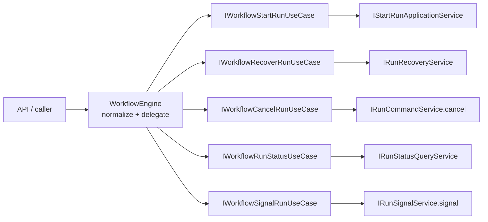
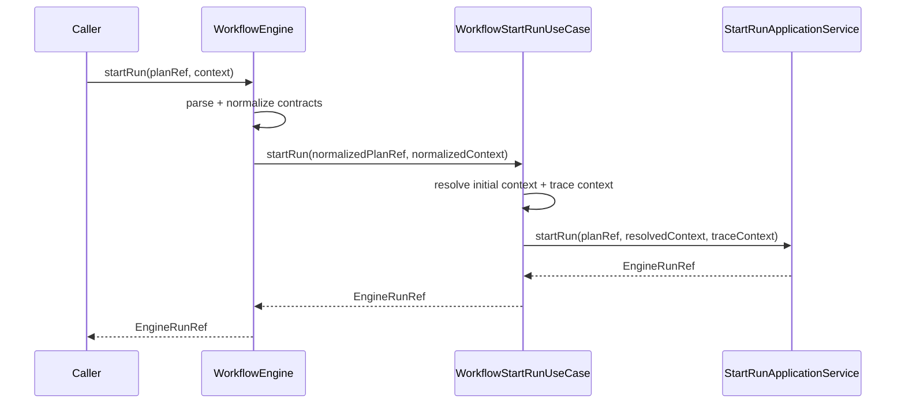

# WorkflowEngine Facade Use-Cases Component

## Purpose

This component owns the hardcut delegation seam between the public
`IWorkflowEngine` command/query boundary and the internal application services
that perform execution behavior.

## Public API

| Surface                       | Owner         | Role                                                                   |
| ----------------------------- | ------------- | ---------------------------------------------------------------------- |
| `IWorkflowStartRunUseCase`    | `@dvt/engine` | Receives normalized `PlanRef` and `RunContext`, then runs start logic. |
| `IWorkflowRecoverRunUseCase`  | `@dvt/engine` | Delegates governed recovery to the recovery application service.       |
| `IWorkflowCancelRunUseCase`   | `@dvt/engine` | Delegates cancellation to the run command service.                     |
| `IWorkflowRunStatusUseCase`   | `@dvt/engine` | Delegates canonical status reads to the query service.                 |
| `IWorkflowSignalRunUseCase`   | `@dvt/engine` | Delegates runtime signals to the run signal service.                   |
| `buildWorkflowEngineUseCases` | `@dvt/engine` | Composition helper for wiring facade-facing use cases.                 |

## Local Modules

| Module                           | Owned concern                                   |
| -------------------------------- | ----------------------------------------------- |
| `types.ts`                       | facade-facing use-case contracts and shape      |
| `WorkflowStartRunUseCase.ts`     | resolved context, tracing, and start delegation |
| `WorkflowRecoverRunUseCase.ts`   | recovery command delegation                     |
| `WorkflowCancelRunUseCase.ts`    | cancellation command delegation                 |
| `WorkflowSignalRunUseCase.ts`    | canonical signal command delegation             |
| `WorkflowRunStatusUseCase.ts`    | canonical status read delegation                |
| `buildWorkflowEngineUseCases.ts` | internal-service to use-case composition        |
| `index.ts`                       | local component API export                      |

## Invariants

- `WorkflowEngine` owns public contract parsing and normalization only.
- `WorkflowEngine` delegates to facade-facing use cases, not low-level
  application or control service names.
- `WorkflowStartRunUseCase` owns resolved-context construction and start-run
  tracing because those are execution-use-case concerns, not facade concerns.
- `IWorkflowEngine` is the current command plus canonical status read boundary.
- Enrichment and health remain outside `IWorkflowEngine`.

## Transitions

| Transition       | From             | To                            | Rule                                              |
| ---------------- | ---------------- | ----------------------------- | ------------------------------------------------- |
| `startRun` input | `WorkflowEngine` | `IWorkflowStartRunUseCase`    | Input is parsed and normalized before delegation. |
| start tracing    | start use case   | `IStartRunApplicationService` | Trace/span behavior stays outside the facade.     |
| recovery input   | `WorkflowEngine` | `IWorkflowRecoverRunUseCase`  | Recovery command is parsed before delegation.     |
| cancel command   | `WorkflowEngine` | cancel use case               | Cancel behavior stays in the run command service. |
| signal command   | `WorkflowEngine` | signal use case               | Signal behavior stays in the run signal service.  |
| status query     | `WorkflowEngine` | `IWorkflowRunStatusUseCase`   | Canonical read remains separate from enrichment.  |

## Consumers

- `packages/@dvt/engine/src/core/WorkflowEngine.ts`
- `packages/@dvt/engine/src/core/buildWorkflowEngineFacade.ts`
- `apps/api/src/application/services/WorkflowEngineFactory.ts`
- `packages/@dvt/engine/test/helpers/workflowEngine.fixture.ts`
- direct integration tests that construct `buildWorkflowEngineFacade`

## Scenarios And Review

- [Workflow engine facade use-case user stories](./workflow-engine-facade-use-cases-user-stories.md)
- [Fowler WE-HX-2 mailbox analysis](../../../../../buzon/20260430-codex-fowler-we-hx-2-facade-use-cases-analysis-and-remediation.md)

## Diagrams

## Drift Guards

- `packages/@dvt/engine/test/architecture/workflowEngineFacadeUseCases.architecture.test.ts`
  fails if `WorkflowEngine` regrows direct tracing, observability span handling,
  direct application-service dependencies, or direct control-service
  dependencies.
- The same guard requires this component guide to keep API, invariants,
  transitions, consumers, user stories, mailbox analysis, diagrams, and drift
  guards together.
