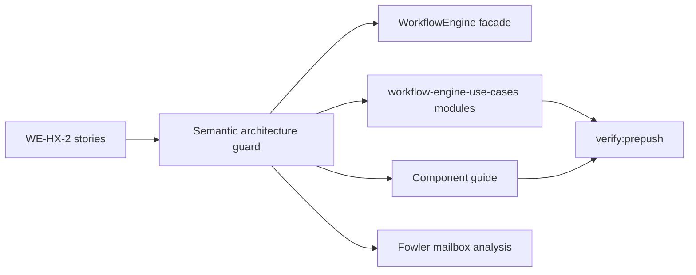

# WorkflowEngine Facade Use-Case User Stories

## Purpose

These stories make `WE-HX-2` executable. They cover the vertical scenarios where
API callers, the public `IWorkflowEngine` facade, facade-facing use cases, and
internal engine services meet.

## User Stories

### US-WE-HX-2-001: start a verified run through a thin facade

As an API caller, I want `WorkflowEngine.startRun()` to parse public inputs and
delegate to a start-run use case, so tracing, resolved-context construction, and
application-service execution do not live in the public facade.

Acceptance criteria:

- `WorkflowEngine` parses and normalizes `PlanRef` plus `RunContext`.
- `WorkflowEngine` delegates to `IWorkflowStartRunUseCase`.
- `WorkflowStartRunUseCase` owns `ResolvedRunContext` creation, trace context,
  span status, exception recording, and `IStartRunApplicationService.startRun`.
- The facade does not import `IObservability`, `buildTraceContext`, or
  `IStartRunApplicationService`.

### US-WE-HX-2-002: recover a run through a recovery use case

As an operator, I want `recoverRun()` to remain part of the public engine
contract while delegating recovery behavior to a focused recovery use case, so
recovery orchestration can evolve without changing the facade.

Acceptance criteria:

- `WorkflowEngine` parses the recovery command before delegation.
- `WorkflowEngine` delegates to `IWorkflowRecoverRunUseCase`.
- `WorkflowRecoverRunUseCase` calls `IRunRecoveryService.recoverRun`.
- Recovery service imports do not return to `WorkflowEngine`.

### US-WE-HX-2-003: control a run through command-specific use cases

As a runtime maintainer, I want `cancelRun()` and `signal()` to route through
separate facade-facing use cases, so control-service behavior remains isolated
from contract parsing.

Acceptance criteria:

- `cancelRun()` delegates to `IWorkflowCancelRunUseCase`.
- `signal()` delegates to `IWorkflowSignalRunUseCase`.
- `WorkflowCancelRunUseCase` and `WorkflowSignalRunUseCase` are separate
  modules with separate owned concerns.
- `WorkflowEngine` does not import `IRunControlService`.

### US-WE-HX-2-004: read canonical run status through a query use case

As a product surface, I want `getRunStatus()` to remain a canonical read while
delegating query behavior to a focused use case, so provider enrichment cannot
leak back into `IWorkflowEngine`.

Acceptance criteria:

- `getRunStatus()` delegates to `IWorkflowRunStatusUseCase`.
- `WorkflowRunStatusUseCase` calls `IRunStatusQueryService.getStatus`.
- `IWorkflowEngine` does not expose enrichment.
- `WorkflowEngine` does not import `IRunStatusQueryService`.

### US-WE-HX-2-005: review semantic encapsulation mechanically

As a reviewer, I want the facade-use-case component to carry local docs,
stories, mailbox analysis, and module-owned concern headers, so future changes
cannot pass by keeping only a thin barrel while semantics drift.

Acceptance criteria:

- The component guide lists public API, invariants, transitions, consumers,
  diagrams, and drift guards.
- The Fowler mailbox analysis records mature-system comparison, improved
  patterns, antipatterns, grouping, repetitions, opportunities, lessons, and
  doc/code drift.
- Every module in `workflow-engine-use-cases/` starts with `@ownedConcern`.
- The semantic architecture test fails when docs, stories, mailbox review, or
  module owned-concern headers disappear.

## Negative Scenarios

- A future change that reintroduces `IObservability`, `buildTraceContext`, span
  handling, or `IStartRunApplicationService` into `WorkflowEngine` fails the
  architecture guard.
- A future change that reintroduces `IRunRecoveryService`,
  `IRunControlService`, or `IRunStatusQueryService` into `WorkflowEngine` fails
  the architecture guard.
- A future change that collapses the component back into
  `application/WorkflowEngineUseCases.ts` fails the architecture guard.
- A future change that removes the local user-story document or Fowler mailbox
  analysis fails the architecture guard.
- A future change that removes a module `@ownedConcern` header from the facade
  or use-case component fails the architecture guard.

## Scenario Coverage Matrix

| Story            | Primary code                                                                | Primary guard                                       |
| ---------------- | --------------------------------------------------------------------------- | --------------------------------------------------- |
| `US-WE-HX-2-001` | `WorkflowEngine.ts`, `WorkflowStartRunUseCase.ts`                           | `workflowEngineFacadeUseCases.architecture.test.ts` |
| `US-WE-HX-2-002` | `WorkflowEngine.ts`, `WorkflowRecoverRunUseCase.ts`                         | `workflowEngineFacadeUseCases.architecture.test.ts` |
| `US-WE-HX-2-003` | `WorkflowCancelRunUseCase.ts`, `WorkflowSignalRunUseCase.ts`                | `workflowEngineFacadeUseCases.architecture.test.ts` |
| `US-WE-HX-2-004` | `WorkflowRunStatusUseCase.ts`                                               | `workflowEngineFacadeUseCases.architecture.test.ts` |
| `US-WE-HX-2-005` | component guide, user stories, mailbox review, owned-concern module headers | `workflowEngineFacadeUseCases.architecture.test.ts` |

## TDD Traceability

Red case:

- the guard failed while the component was still a monolithic
  `WorkflowEngineUseCases.ts`, the facade lacked an `@ownedConcern` line, and
  local user stories plus mailbox review were missing.

Green case:

- split facade use cases into a local component folder;
- add module-owned concern headers;
- add the stories and Fowler mailbox analysis;
- rerun the guard and affected package validation.
