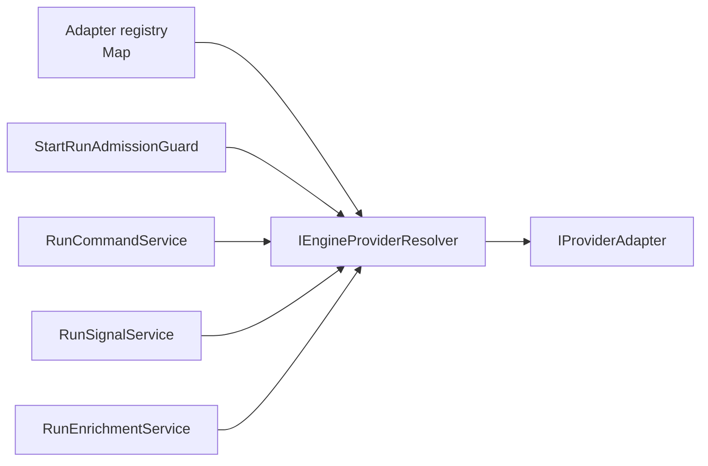
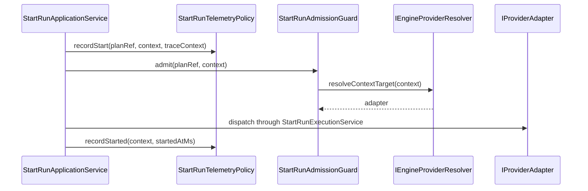
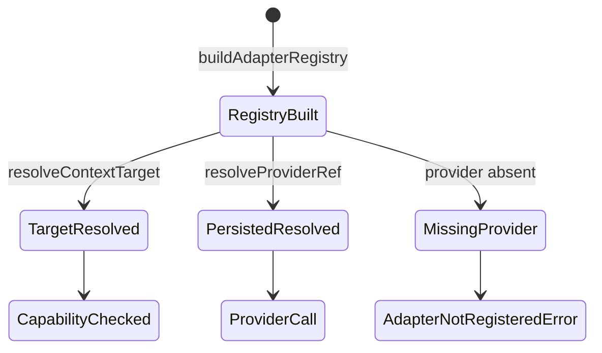

# WorkflowEngine Provider And Telemetry Seams Component

## Purpose

This component owns the internal provider-resolution seam and the start-run
telemetry policy seam for `@dvt/engine`. It closes `WE-HX-5` by removing raw
provider lookup and coordinator-owned start-run telemetry from the recently
decomposed engine paths.

## Public API

The API is local to the engine package.

| Surface                           | Owner         | Role                                                                        |
| --------------------------------- | ------------- | --------------------------------------------------------------------------- |
| `IEngineProviderResolver`         | `@dvt/engine` | Resolves target and persisted provider ids to registered provider adapters. |
| `MapBackedEngineProviderResolver` | `@dvt/engine` | Adapter-map implementation used by current composition roots.               |
| `buildAdapterRegistry`            | `@dvt/engine` | Builds the provider adapter registry and rejects duplicate providers.       |
| `pickDefaultAdapter`              | `@dvt/engine` | Applies current startup provider selection rules.                           |
| `StartRunTelemetryPolicy`         | `@dvt/engine` | Emits start-run start/success telemetry and builds canonical metric tags.   |

## Invariants

- Provider lookup is performed through `IEngineProviderResolver`, not repeated
  raw `Map.get` calls in runtime command, signal, enrichment, or admission
  services.
- Provider resolution maps missing providers to `AdapterNotRegisteredError`.
- Provider resolver inputs distinguish target provider resolution from
  persisted provider-ref resolution.
- Start-run telemetry failures never change start-run behavior.
- `StartRunApplicationService` orchestrates start-run phases but does not own
  metric names, metric tags, or start/success telemetry emission.
- Failure telemetry remains in `StartRunFailurePolicy` because it is coupled to
  failure compensation and guarded `RunFailed` emission.

## Transitions

| Transition                | From                               | To                        | Rule                                                                 |
| ------------------------- | ---------------------------------- | ------------------------- | -------------------------------------------------------------------- |
| target provider lookup    | `StartRunAdmissionGuard`           | `IEngineProviderResolver` | Resolve `ResolvedRunContext.targetAdapter` before capability checks. |
| persisted provider lookup | command/signal/enrichment services | `IEngineProviderResolver` | Resolve `RunMetadata.providerRef.provider` before provider calls.    |
| start telemetry           | `StartRunApplicationService`       | `StartRunTelemetryPolicy` | Emit non-blocking start log before phase execution.                  |
| success telemetry         | `StartRunApplicationService`       | `StartRunTelemetryPolicy` | Emit non-blocking counter and latency after successful dispatch.     |

## Consumers

- `packages/@dvt/engine/src/application/StartRunAdmissionGuard.ts`
- `packages/@dvt/engine/src/application/StartRunApplicationService.ts`
- `packages/@dvt/engine/src/services/runControl/RunCommandService.ts`
- `packages/@dvt/engine/src/services/runControl/RunSignalService.ts`
- `packages/@dvt/engine/src/services/RunEnrichmentService.ts`
- `packages/@dvt/engine/test/architecture/workflowEngineProviderTelemetrySeams.architecture.test.ts`

## Diagrams

## Drift Guards

- `workflowEngineProviderTelemetrySeams.architecture.test.ts` fails if command,
  signal, enrichment, or admission services regain raw adapter-map lookup.
- The same guard fails if `StartRunApplicationService` regains direct start-run
  start/success telemetry emission.
- The guard also requires this guide, the user stories, mailbox analysis, and
  owned-concern module headers.

## Related Records

- [WE-HX-5 user stories](./workflow-engine-provider-telemetry-seams-user-stories.md)
- [Fowler mailbox analysis](../../../../../buzon/20260512-codex-fowler-we-hx-5-provider-telemetry-seams-analysis-and-remediation.md)
