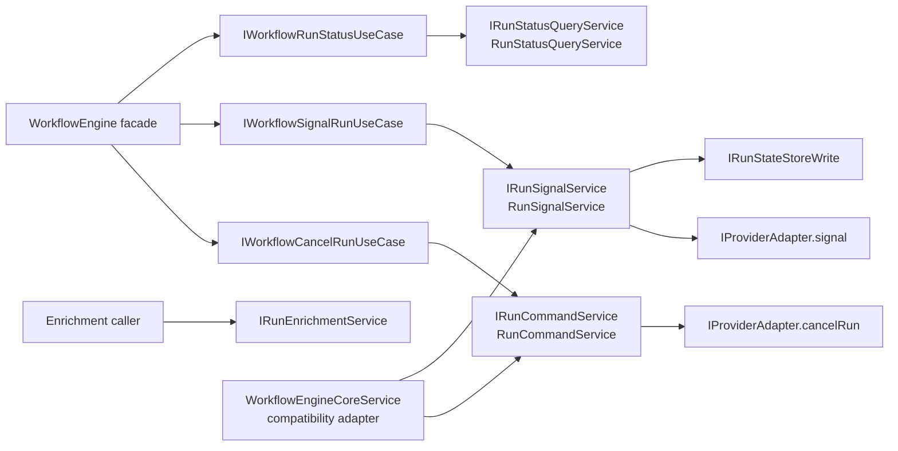
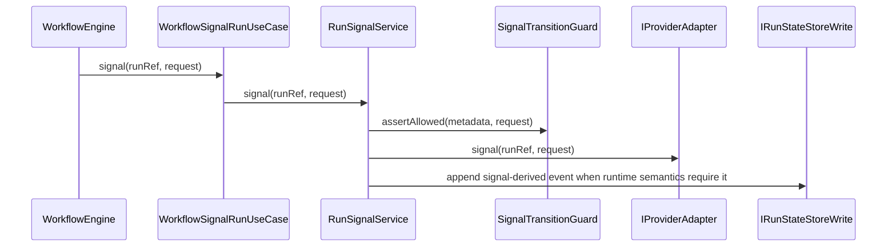

# WorkflowEngine Runtime Path Decomposition Component

## Purpose

This component owns the internal runtime-control split for the engine facade.
It keeps the public `IWorkflowEngine` surface stable while separating cancel
commands, runtime signals, canonical status queries, and provider-backed
enrichment into dedicated paths.

## Public API

| Surface                     | Owner         | Role                                                                 |
| --------------------------- | ------------- | -------------------------------------------------------------------- |
| `IRunCommandService`        | `@dvt/engine` | Runs cancel-command behavior for a validated `EngineRunRef`.         |
| `IRunSignalService`         | `@dvt/engine` | Runs canonical runtime signal behavior and signal-derived events.    |
| `RunCommandService`         | `@dvt/engine` | Authorizes, resolves metadata, dispatches cancel, and records spans. |
| `RunSignalService`          | `@dvt/engine` | Authorizes, validates transition, dispatches signal, emits events.   |
| `WorkflowEngineCoreService` | `@dvt/engine` | Compatibility adapter over command and signal services.              |
| `buildRunControlService`    | `@dvt/engine` | Compatibility assembler for callers that still need one control API. |
| `buildRunCommandService`    | `@dvt/engine` | Composition helper for cancel-command wiring.                        |
| `buildRunSignalService`     | `@dvt/engine` | Composition helper for runtime-signal wiring.                        |
| `RunStatusQueryService`     | `@dvt/engine` | Canonical run-status query path.                                     |
| `IRunEnrichmentService`     | `@dvt/engine` | Provider-backed enrichment path outside `IWorkflowEngine`.           |

## Invariants

- `RunCommandService` must not own signal transition rules or emit
  signal-derived lifecycle events.
- `RunSignalService` must not own cancel-command dispatch.
- `WorkflowEngineCoreService` is a compatibility adapter only; it delegates to
  command and signal services and does not own adapter dispatch or transition
  mapping.
- Facade-facing cancel and signal use cases depend on separate command and
  signal ports.
- Query and enrichment paths remain outside the runtime-control compatibility
  adapter.

## Transitions

<!-- markdownlint-disable MD060 -->

| Transition     | From                           | To                       | Rule                                              |
| -------------- | ------------------------------ | ------------------------ | ------------------------------------------------- |
| cancel command | `IWorkflowCancelRunUseCase`    | `IRunCommandService`     | Parse at facade, execute through command service. |
| signal command | `IWorkflowSignalRunUseCase`    | `IRunSignalService`      | Parse at facade, execute through signal service.  |
| status query   | `IWorkflowRunStatusUseCase`    | `IRunStatusQueryService` | Query path remains status-read only.              |
| enrichment     | API or caller-specific surface | `IRunEnrichmentService`  | Provider enrichment remains outside facade.       |

<!-- markdownlint-enable MD060 -->

## Consumers

- `apps/api/src/application/services/WorkflowEngineFactory.ts`
- `apps/api/test/integration/plannerEngineContract.test.ts`
- `packages/@dvt/engine/src/application/workflow-engine-use-cases/*`
- `packages/@dvt/engine/src/core/WorkflowEngineCoreService.ts`
- `packages/@dvt/engine/test/helpers/workflowEngine.fixture.ts`

## Diagrams

## Drift Guards

- `workflowEngineRuntimePathDecomposition.architecture.test.ts` fails if
  `WorkflowEngineCoreService` regrows adapter dispatch, signal transition
  mapping, or signal-derived event emission.
- `WorkflowEngineCoreService.test.ts` keeps cancel and signal runtime behavior
  green while the implementation moves behind dedicated services.
