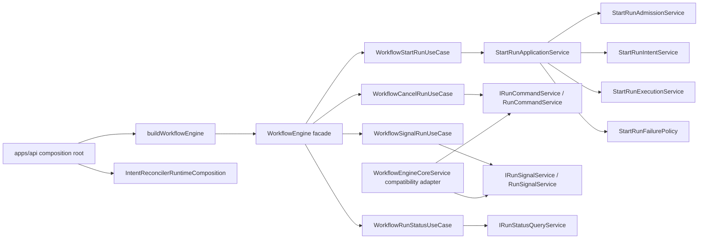
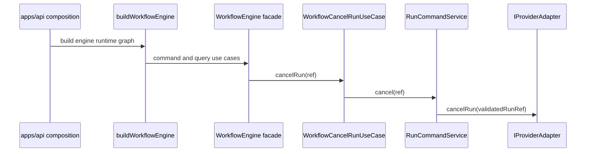
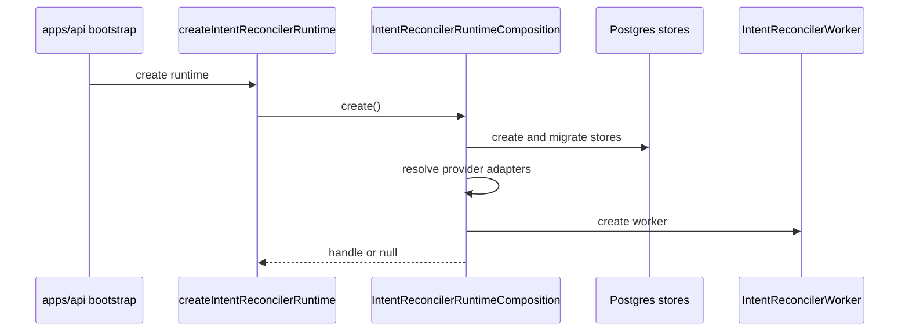

# WorkflowEngine Semantic Closure Component

## Purpose

This component record closes the DHM modularization stream for the current
`WorkflowEngine` runtime architecture. It does not add a public product API.
It explains the owned concerns that now exist across API composition, engine
facade use cases, start-run phases, runtime command/signal services, and the
remaining compatibility adapter.

The record exists so a maintainer can answer why each seam exists, which public
or local contract it satisfies, which transitions it owns, which consumers use
it, and which tests prove the shape has not drifted.

## Public API

| Surface                                                             | Package       | Role                                                                   |
| ------------------------------------------------------------------- | ------------- | ---------------------------------------------------------------------- |
| `buildWorkflowEngine(config)`                                       | `apps/api`    | Production composition root for the engine runtime graph.              |
| `createWorkflowEngine(deps, buildEngine?)`                          | `apps/api`    | Test seam for injecting a facade builder without production wiring.    |
| `createIntentReconcilerRuntime(env, logger, observability, hooks?)` | `apps/api`    | API-side background reconciler runtime factory.                        |
| `IWorkflowEngine.startRun`                                          | `@dvt/engine` | Public facade command for start-run.                                   |
| `IWorkflowEngine.cancelRun`                                         | `@dvt/engine` | Public facade command for cancel.                                      |
| `IWorkflowEngine.signal`                                            | `@dvt/engine` | Public facade command for canonical runtime signals.                   |
| `IWorkflowEngine.getRunStatus`                                      | `@dvt/engine` | Public facade query for canonical status reads.                        |
| `IRunCommandService.cancel`                                         | `@dvt/engine` | Internal role-interface command for cancel dispatch.                   |
| `IRunSignalService.signal`                                          | `@dvt/engine` | Internal role-interface command for signal dispatch and derived facts. |
| `buildRunControlService`                                            | `@dvt/engine` | Compatibility assembler for the legacy combined run-control surface.   |

## Invariants

- `apps/api` owns concrete runtime composition for Postgres stores, provider
  adapters, background worker lifecycle, and engine graph assembly.
- `@dvt/engine` owns runtime semantics through ports and application/domain
  services, not through environment parsing or direct infrastructure creation.
- `WorkflowEngineCoreService` is a compatibility adapter only.
- Cancel behavior stays in `RunCommandService`.
- Signal transition validation, adapter dispatch, idempotency, and
  signal-derived lifecycle facts stay in `RunSignalService`.
- Start-run admission, intent creation, execution dispatch, and failure policy
  stay in named start-run phase owners.
- Documentation and architecture tests must name the same owners.

## Transitions

| Transition                | From                         | To                                   | Rule                                                                                                      |
| ------------------------- | ---------------------------- | ------------------------------------ | --------------------------------------------------------------------------------------------------------- |
| runtime construction      | API bootstrap                | `buildWorkflowEngine`                | API composition binds concrete stores, policies, services, and facade use cases.                          |
| reconciler startup        | API bootstrap                | `IntentReconcilerRuntimeComposition` | Resolve config, create stores, migrate stores, resolve adapters, create maintenance, then publish handle. |
| start-run command         | `WorkflowStartRunUseCase`    | `StartRunApplicationService`         | Facade normalizes context and tracing, then delegates the application command.                            |
| start-run phase           | `StartRunApplicationService` | start-run phase services             | Admission precedes intent, intent precedes provider dispatch, failure policy handles errors.              |
| cancel command            | `WorkflowCancelRunUseCase`   | `IRunCommandService`                 | Use case delegates cancel semantics to the command role interface.                                        |
| signal command            | `WorkflowSignalRunUseCase`   | `IRunSignalService`                  | Use case delegates signal semantics to the signal role interface.                                         |
| compatibility run-control | `WorkflowEngineCoreService`  | command/signal services              | Combined callers are preserved but behavior is delegated.                                                 |
| status query              | `WorkflowRunStatusUseCase`   | `IRunStatusQueryService`             | Read path stays separate from command lifecycle mutation.                                                 |

## Consumers

- `apps/api/src/server.ts`
- `apps/api/src/runtime/intentReconcilerRuntime.ts`
- `apps/api/src/application/services/WorkflowEngineFactory.ts`
- `apps/api/test/integration/plannerEngineContract.test.ts`
- `packages/@dvt/engine/src/application/workflow-engine-use-cases/*`
- `packages/@dvt/engine/src/application/StartRunApplicationService.ts`
- `packages/@dvt/engine/src/services/startRun/*`
- `packages/@dvt/engine/src/services/runControl/*`
- `packages/@dvt/engine/src/core/WorkflowEngineCoreService.ts`
- `packages/@dvt/engine/test/architecture/workflowEngineSemanticClosure.architecture.test.ts`

## Component Grouping

| Component group          | Owned concern                                             | Main files                                                                             |
| ------------------------ | --------------------------------------------------------- | -------------------------------------------------------------------------------------- |
| API runtime composition  | Concrete runtime graph assembly                           | `WorkflowEngineFactory.ts`, `intentReconcilerRuntime.ts`                               |
| Facade adaptation        | Translate public facade calls into use-case ports         | `workflow-engine-use-cases/*`                                                          |
| Start-run command phases | Admission, deterministic intent, dispatch, failure policy | `services/startRun/*`                                                                  |
| Runtime control commands | Cancel and signal role-interface implementations          | `services/runControl/*`, `domain/IRunCommandService.ts`, `domain/IRunSignalService.ts` |
| Compatibility            | Retained combined control adapter                         | `WorkflowEngineCoreService.ts`, `buildRunControlService`                               |
| Governance guard         | Semantic ownership and documentation drift detection      | `workflowEngineSemanticClosure.architecture.test.ts`                                   |

## Current-State Diagram

## Runtime Sequence

## Drift Guards

- `workflowEngineSemanticClosure.architecture.test.ts` checks owned concern
  headers on the API composition, compatibility, command, signal, and facade
  composition seams.
- The same guard checks that runtime semantics have not moved back into
  `WorkflowEngineCoreService`.
- The guard checks this component guide, the DHM-WS6 user stories, the Fowler
  mailbox analysis, and the closeout record.
- Existing WS2, WS3, and WS4 architecture tests remain the focused guards for
  their local seams.
