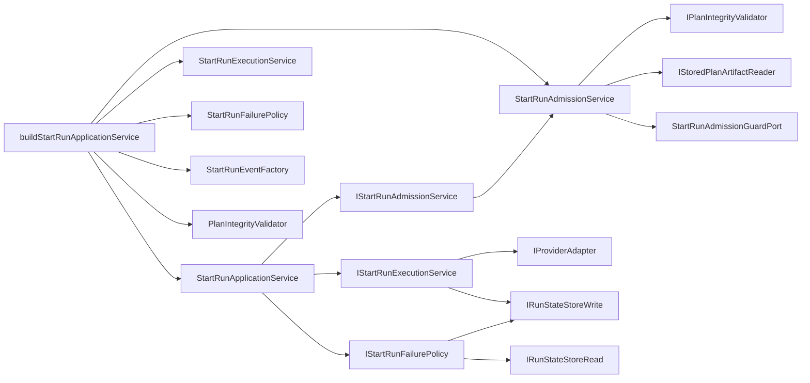

# WorkflowEngine Start-Run Decomposition Component

## Public API

The component keeps the existing `IWorkflowEngine.startRun` public command
surface unchanged. Internally, `StartRunApplicationService` coordinates the
start-run command through injected seams:

- `IStartRunAdmissionService`
- `IStartRunExecutionService`
- `IStartRunFailurePolicy`
- `buildStartRunApplicationService`

`buildStartRunApplicationService` is the engine-owned composition helper for
the default service graph. It receives the already configured
`StartRunAdmissionGuard`; access-policy authority does not pass through the
start-run application-service builder separately.

## Invariants

- `StartRunApplicationService` receives its admission phase through
  `IStartRunAdmissionService`; it does not construct
  `StartRunAdmissionService` inside the coordinator.
- `StartRunApplicationService` does not construct
  `StartRunExecutionService`, `StartRunFailurePolicy`, `StartRunEventFactory`,
  or `PlanIntegrityValidator` inside its class body.
- `StartRunApplicationService` owns command orchestration, not collaborator
  selection.
- `buildStartRunApplicationService` does not accept a separate
  `IRunAccessPolicy`; the guard is the semantic owner of access-policy
  admission.
- `StartRunAdmissionService` owns plan integrity fetching, provider adapter
  resolution, capability checks, and run-execution-context admission.
- Start-run admission DTOs and guard ports are declared once in
  `StartRunTypes`; `StartRunAdmissionGuard` consumes those contracts instead
  of redeclaring them.
- `StartRunExecutionService` owns adapter dispatch, intent dispatch marking,
  bootstrap persistence, and provider-ref reconciliation.
- `StartRunFailurePolicy` owns failed-start reporting, pending-intent checks,
  and best-effort `RunFailed` emission.
- The existing start-run command rail remains unchanged.

## Transitions

Before the first DHM-WS3 cut, the application service constructed its concrete
execution and failure collaborators in the constructor. Before the residual
admission-semantics cut, it still constructed its admission phase internally.

After this component, the class receives admission, execution, and failure seams
through constructor injection, while `buildStartRunApplicationService` creates
the default collaborators for production and integration test composition.

## Consumers

- `apps/api/src/application/services/WorkflowEngineFactory.ts`
- `packages/@dvt/engine/test/helpers/workflowEngine.fixture.ts`
- `apps/api/test/integration/plannerEngineContract.test.ts`
- `RecoverRunApplicationService`, through the existing
  `IStartRunApplicationService` dependency

## User Stories

Detailed stories are maintained in
`workflow-engine-start-run-decomposition-user-stories.md`.

## Diagrams

## Drift Guards

- `workflowEngineStartRunDecomposition.architecture.test.ts` prevents concrete
  collaborator construction from returning to `StartRunApplicationService` and
  requires semantic admission injection.
- `StartRunApplicationService.test.ts` proves adapter dispatch goes through the
  injected admission and execution seams.
