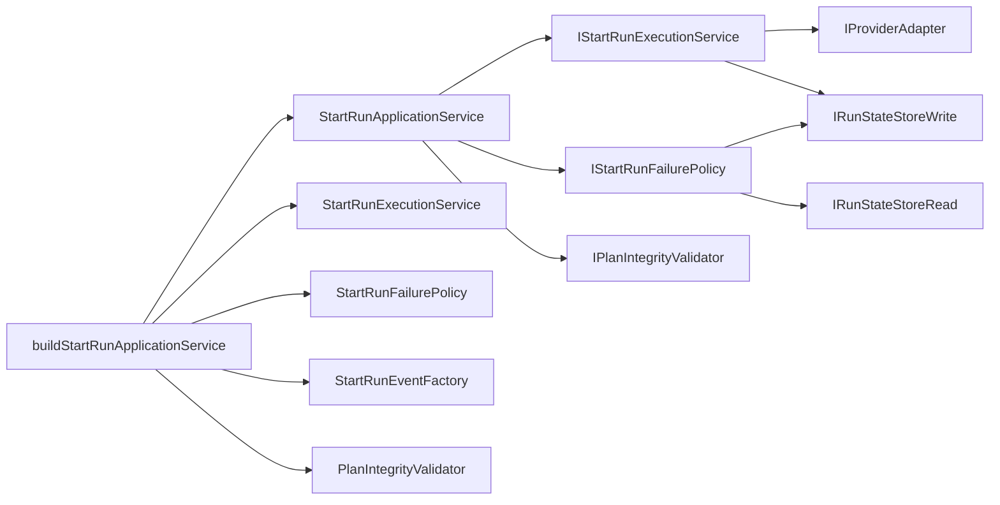

# WorkflowEngine Start-Run Decomposition Component

## Public API

The component keeps the existing `IWorkflowEngine.startRun` public command
surface unchanged. Internally, `StartRunApplicationService` coordinates the
start-run command through injected seams:

- `IStartRunExecutionService`
- `IStartRunFailurePolicy`
- `IPlanIntegrityValidator`
- `buildStartRunApplicationService`

`buildStartRunApplicationService` is the engine-owned composition helper for
the default service graph.

## Invariants

- `StartRunApplicationService` does not construct
  `StartRunExecutionService`, `StartRunFailurePolicy`, `StartRunEventFactory`,
  or `PlanIntegrityValidator` inside its class body.
- `StartRunApplicationService` owns command orchestration, not collaborator
  selection.
- `StartRunExecutionService` owns adapter dispatch, intent dispatch marking,
  bootstrap persistence, and provider-ref reconciliation.
- `StartRunFailurePolicy` owns failed-start reporting, pending-intent checks,
  and best-effort `RunFailed` emission.
- The existing start-run command rail remains unchanged.

## Transitions

Before this component, the application service constructed its concrete
execution and failure collaborators in the constructor.

After this component, the class receives the execution and failure seams through
constructor injection, while `buildStartRunApplicationService` creates the
default collaborators for production and integration test composition.

## Consumers

- `apps/api/src/application/services/WorkflowEngineFactory.ts`
- `packages/@dvt/engine/test/helpers/workflowEngine.fixture.ts`
- `apps/api/test/integration/plannerEngineContract.test.ts`
- `RecoverRunApplicationService`, through the existing
  `IStartRunApplicationService` dependency

## User Stories

Detailed stories are maintained in
`workflow-engine-start-run-decomposition-user-stories.md`.

## Diagrams

## Drift Guards

- `workflowEngineStartRunDecomposition.architecture.test.ts` prevents concrete
  collaborator construction from returning to `StartRunApplicationService`.
- `StartRunApplicationService.test.ts` proves adapter dispatch goes through the
  injected execution seam.
