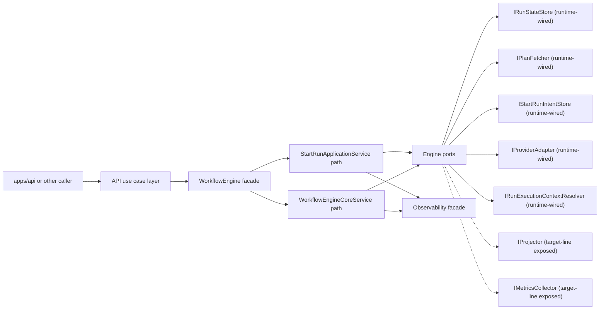
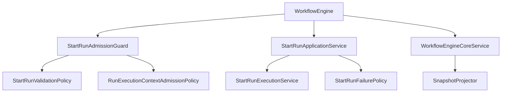
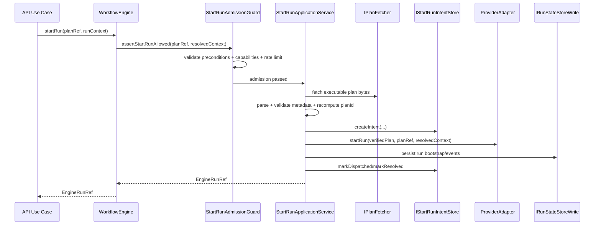
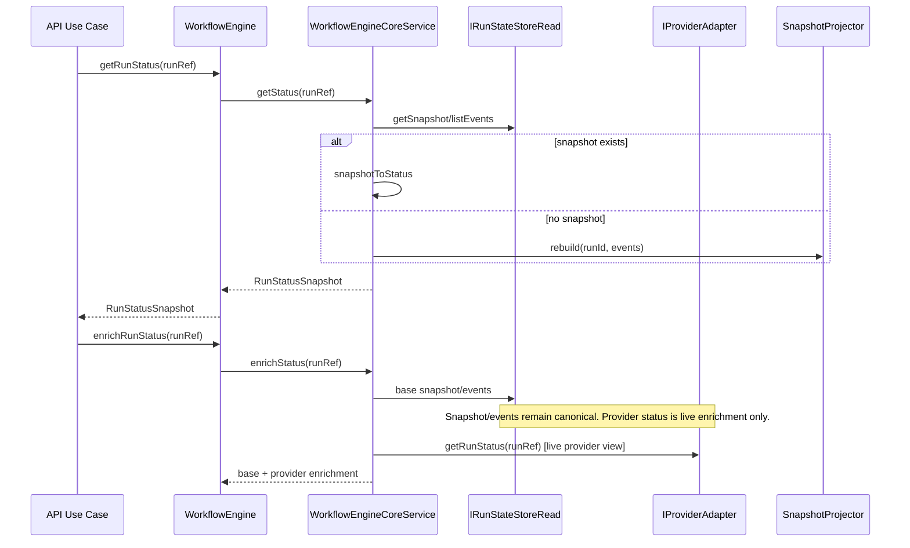
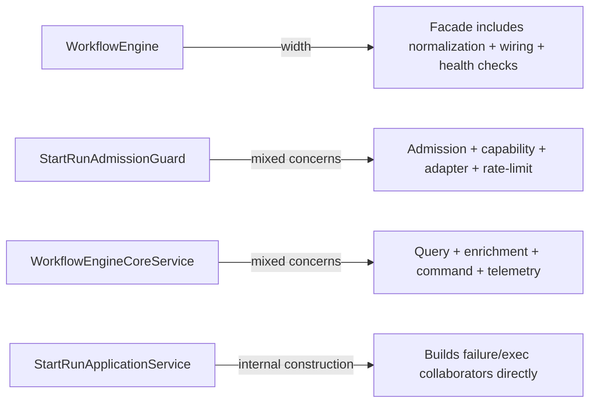

# WorkflowEngine subsystem context

## Goal

Provide one canonical as-is map of the full `WorkflowEngine` subsystem inside
DVT execution so architecture, planning, and implementation no longer depend on
fragmented or stale engine notes.

## In-system placement

`WorkflowEngine` sits in the DVT **Execution** bounded context (`@dvt/engine`).
It is consumed northbound by application entrypoints such as `apps/api`, and it
uses southbound ports for state, intent durability, provider runtime, plan and
execution-context resolution, and a declared projector/metrics seam.

Key governing boundaries:

- execution semantics are engine-owned (`ADR-0003`, `ADR-0004`)
- plan identity trust boundary is `PlanRef` (`ADR-0012`, `ADR-0042`)
- query/read separation is explicit (`ADR-0015`)
- cross-context ownership follows bounded-context rules (`ADR-0034`)

## Current ownership and communication rules

- `@dvt/contracts` owns shared serialized surfaces (`PlanRef`, `RunContext`,
  `RunExecutionContextRef`, `RunStatusSnapshot`, etc.).
- `@dvt/engine` owns lifecycle use-case orchestration and execution invariants.
- `@dvt/artifacts` owns artifact retrieval behavior; engine consumes an
  engine-owned resolver port where needed.
- `apps/api` and other composition roots wire concrete adapters and pass them to
  engine-owned ports.
- `@dvt/engine/src/**` must not import `@dvt/planner` or concrete provider
  adapters such as `@dvt/adapter-temporal`; that boundary is enforced in lint so
  it does not remain convention-only.

## Current inbound and outbound flows

Inbound flow (primary):

`caller -> api route/use case -> IWorkflowEngine.startRun/cancelRun/getRunStatus/signal`

Outbound flow (primary):

`WorkflowEngine -> StartRunAdmissionGuard/StartRunApplicationService/WorkflowEngineCoreService -> ports/adapters`

Declared southbound port surface:

- `IRunStateStore` (`runtime-wired`)
- `IStartRunIntentStore` (`runtime-wired`)
- `IProviderAdapter` (`runtime-wired`)
- `IPlanFetcher` (`runtime-wired`)
- `IRunExecutionContextResolver` (`runtime-wired`)
- `IProjector` (`target-line exposed`)
- `IMetricsCollector` (`target-line exposed`)

Current runtime telemetry still flows through `IObservability`; that facade is
not counted inside the seven-port southbound surface.

## Current ports and adapters inventory

Declared southbound ports:

| Port                           | Code anchor                                                                                                                                 | Current posture       |
| ------------------------------ | ------------------------------------------------------------------------------------------------------------------------------------------- | --------------------- |
| `IRunStateStore`               | `packages/@dvt/engine/src/ports/IRunStateStore.ts`                                                                                          | `runtime-wired`       |
| `IStartRunIntentStore`         | `packages/@dvt/engine/src/ports/IStartRunIntentStore.ts`                                                                                    | `runtime-wired`       |
| `IProviderAdapter`             | `packages/@dvt/engine/src/adapters/IProviderAdapter.ts`                                                                                     | `runtime-wired`       |
| `IPlanFetcher`                 | `packages/@dvt/engine/src/adapters/IPlanFetcher.ts` (`packages/@dvt/engine/src/ports/IRunStateStore.ts` still carries a legacy alias today) | `runtime-wired`       |
| `IRunExecutionContextResolver` | `packages/@dvt/engine/src/ports/IRunExecutionContextResolver.ts`                                                                            | `runtime-wired`       |
| `IProjector`                   | `packages/@dvt/engine/src/ports/IProjector.ts`                                                                                              | `target-line exposed` |
| `IMetricsCollector`            | `packages/@dvt/engine/src/metrics/IMetricsCollector.ts`                                                                                     | `target-line exposed` |

Other engine-owned interfaces such as `IRunSnapshotStalenessQuery` and
`IRunMaintenanceService` remain important local seams, but they are not part of
the exposed seven-port southbound inventory.

Known concrete adapter families:

- `@dvt/adapter-temporal`
- conductor stub path
- mock adapter for tests
- postgres adapters for persistence/intents

## Current component map

Main components in the subsystem:

- `WorkflowEngine` (public compatibility facade + dependency assembly)
- `StartRunAdmissionGuard` (admission/capability/adapter gate)
- `StartRunApplicationService` (start-run application orchestration)
- `StartRunExecutionService` and `StartRunFailurePolicy`
- `WorkflowEngineCoreService` (cancel/status/enrich/signal runtime path)
- `SnapshotProjector` (event-to-status read model projection)

## Current startRun sequence (as-is)

## Current read/status sequence (as-is)

## What the subsystem already gets right

- event-sourced execution authority and replayable status model
- explicit CQRS split (`getRunStatus` vs `enrichRunStatus`)
- crash-consistency intent-log model around `startRun`
- single engine-side proof that fetched bytes match `planId` before dispatch
- provider runtimes remain behind adapter contract
- policy-object direction already exists on start-run path
- `runExecutionContextRef` admission hardening is now explicit

## Active drifts and architecture debt

- facade width still too broad in `WorkflowEngine`
- start-run application path and guard still construct and mix collaborator concerns
- query/runtime behavior still concentrated in one core service
- provider-resolution and telemetry policy logic remains repeated
- ownership seams between engine resolver and artifacts reader need one explicit
  canonical mapping in docs/planning

## Fowler/SOLID/hexagonal assessment (as-is)

- Fowler-style use-case decomposition is present but incomplete.
- SOLID posture is partially aligned:
  - SRP improved vs earlier monolith, but key classes remain wide.
  - DIP is mostly aligned through ports, but composition boundaries are not yet
    consistently narrow.
- Hexagonal shape exists, but application-policy and infrastructure-selection
  concerns still overlap in some orchestration classes.

## Canonical references

- `packages/@dvt/engine/src/core/WorkflowEngine.ts`
- `packages/@dvt/engine/src/application/StartRunAdmissionGuard.ts`
- `packages/@dvt/engine/src/application/StartRunApplicationService.ts`
- `packages/@dvt/engine/src/services/startRun/StartRunExecutionService.ts`
- `packages/@dvt/engine/src/core/WorkflowEngineCoreService.ts`
- `packages/@dvt/engine/src/core/SnapshotProjector.ts`
- `packages/@dvt/engine/src/adapters/IProviderAdapter.ts`
- `packages/@dvt/engine/src/adapters/IPlanFetcher.ts`
- `packages/@dvt/engine/src/ports/IRunExecutionContextResolver.ts`
- `packages/@dvt/engine/src/ports/IProjector.ts`
- `packages/@dvt/engine/src/metrics/IMetricsCollector.ts`
- `packages/@dvt/artifacts/src/ports/IRunExecutionContextReader.ts`
