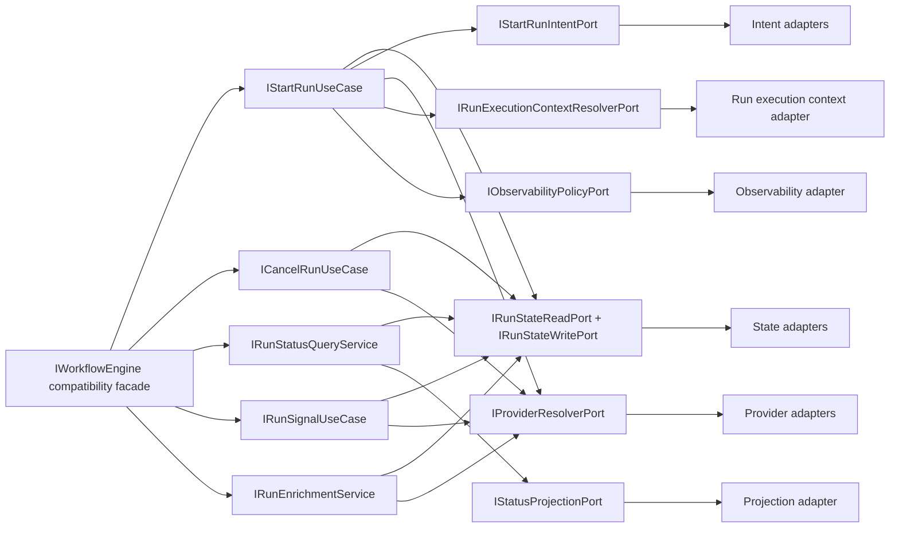
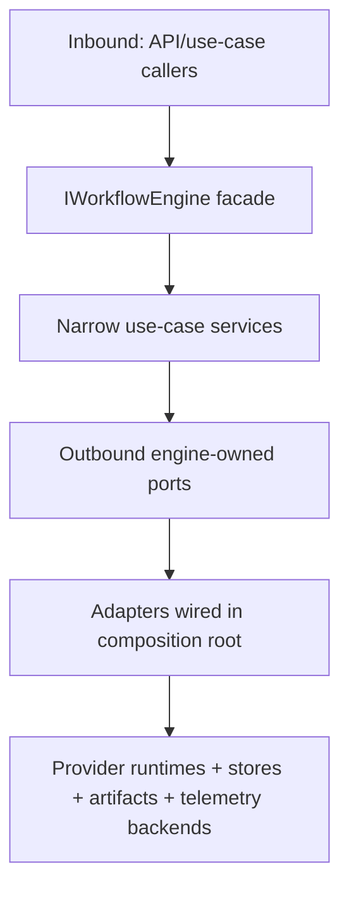
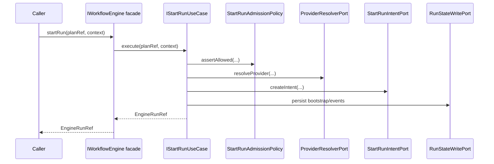
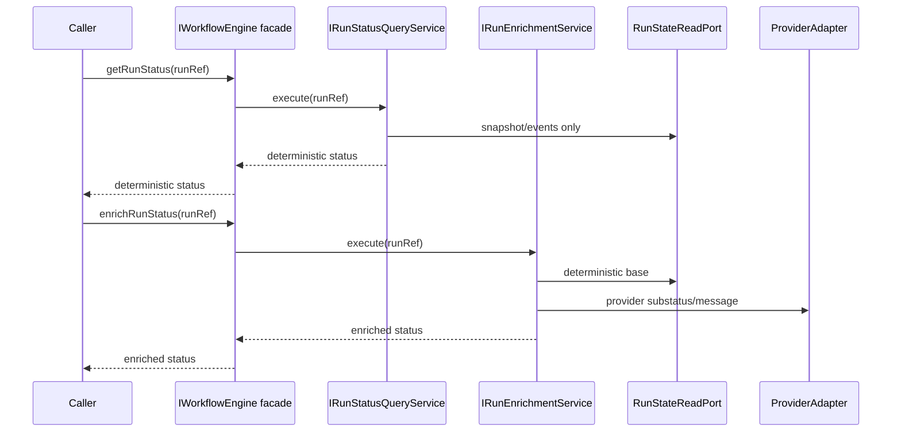
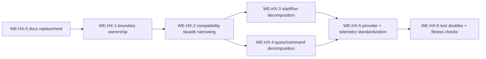

# WorkflowEngine target architecture v1

## Purpose

Define the target architecture for the full `WorkflowEngine` subsystem as a
hexagonal, compatibility-first derivation path that keeps the public contract
stable while narrowing responsibilities internally.

## Target shape

The target keeps `IWorkflowEngine` as a transitional compatibility facade, and
moves actual behavior into narrow application services.

Target inbound use-case services:

- `IStartRunUseCase`
- `ICancelRunUseCase`
- `IRunStatusQueryService`
- `IRunSignalUseCase`
- `IRunEnrichmentService`

Target outbound engine-owned ports:

- run state read
- run state write
- intent log
- provider adapter resolution
- run execution context resolution
- status projection
- observability/telemetry policy

## Boundary and ownership rule

Boundary rule to lock:

- `@dvt/artifacts` owns artifact-reading behavior and reader contracts.
- `@dvt/engine` owns execution use-case needs and may define an engine-facing
  resolver port.
- composition root adapts artifacts-owned reader to engine-owned resolver.
- peer-domain runtime logic must not leak into engine internals.

## Inbound/outbound port model

## Compatibility strategy

1. Keep `IWorkflowEngine` method surface stable.
2. Move method internals to dedicated use-case services.
3. Keep current tests green with facade delegation checks.
4. Deprecate internal wide services only after functional parity and
   architecture fitness checks pass.

## Class responsibility rules (target)

- `WorkflowEngine`: only public contract normalization + delegation.
- use-case services: one lifecycle operation family each.
- admission policies: one policy concern per class.
- failure policies: isolated from admission and execution dispatch.
- telemetry decorators: outside core business decisions.

## Policy decomposition rules

- separate admission policy from adapter resolution policy
- separate capability policy from rate-limit policy
- separate run execution context provenance policy from generic start-run guards
- separate query policy from enrichment policy

## Composition-root rules

- concrete adapters are created only in app/runtime composition roots
- no domain service creates concrete infrastructure clients
- no use-case service constructs other concrete use-case services internally
- dependency graphs are explicit at wiring boundary

## Patterns used and why

- Compatibility Facade: preserve public API while refactoring internals.
- Use Case Interactor: keep orchestration explicit and testable per behavior.
- Policy Objects: isolate rules and keep logic composable.
- Adapter + Port: enforce hexagonal boundary and replaceability.
- Projection/Reducer: preserve event-sourced read determinism.
- Decorator for telemetry: keep instrumentation out of business decisions.

## Anti-patterns to avoid

- god facade with policy + orchestration + runtime concerns
- peer-domain direct imports to bypass composition roots
- mixing persisted read model and provider enrichment by default
- infrastructure selection inside domain policies
- hidden collaborator construction inside orchestration classes

## Current vs target gap table

| Area                      | Current                                    | Target                                      | Gap signal           |
| ------------------------- | ------------------------------------------ | ------------------------------------------- | -------------------- |
| Public boundary           | `WorkflowEngine` does more than delegation | facade-only delegation                      | width still high     |
| startRun application flow | coordinator/guard mix concerns             | split into narrow use cases + policies      | SRP drift            |
| status/read path          | core service mixes query + enrichment      | dedicated query vs enrichment services      | ADR-0015 clarity gap |
| provider resolution       | repeated in multiple paths                 | single resolver seam                        | duplication          |
| telemetry handling        | spread across core services                | decorator/policy boundary                   | cross-cutting noise  |
| artifacts/engine seam     | partially explicit                         | documented adapter seam in composition root | ownership ambiguity  |

## Retain vs improve

Retain:

- event-sourced execution authority
- CQRS split between stored status and enrichment
- intent-log crash consistency
- provider adapter boundary
- `PlanRef` trust boundary
- existing policy-object direction

Improve:

- reduce facade width
- remove internal collaborator construction
- split mixed admission concerns
- split mixed query/enrichment concerns
- formalize engine/artifacts seam
- replace stale docs with one canonical reading path

## Target sequences

### Target `startRun` sequence

### Target status/enrichment split

## Derivation roadmap

## Governing references

- `ADR-0003`
- `ADR-0004`
- `ADR-0012`
- `ADR-0015`
- `ADR-0030`
- `ADR-0034`
- `ADR-0042`
