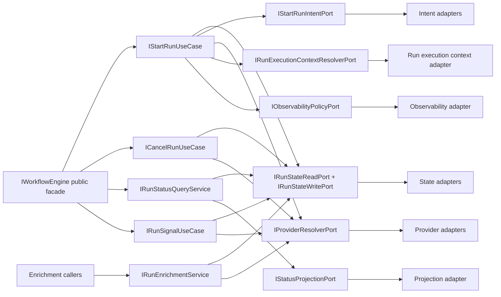
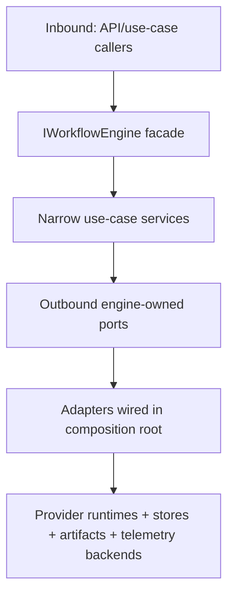
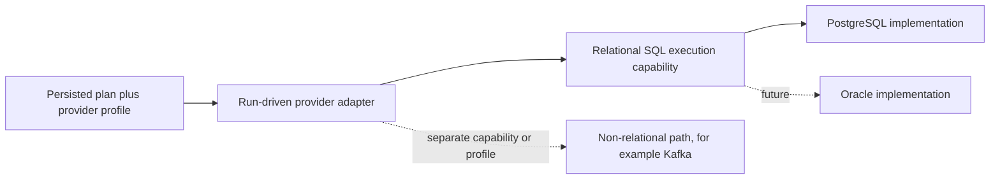
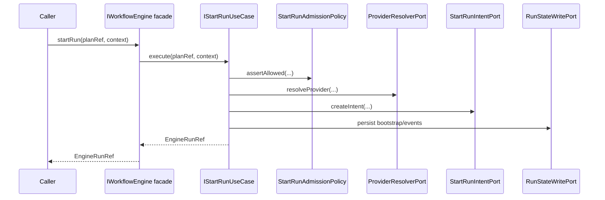
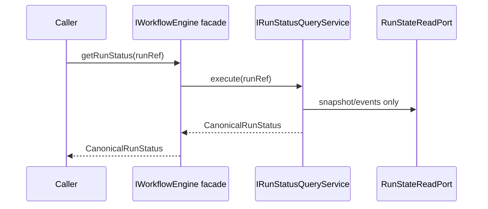
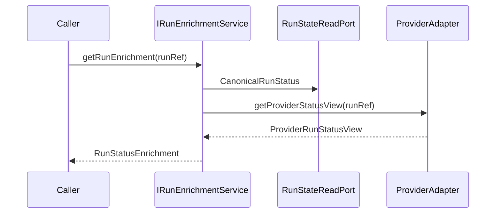
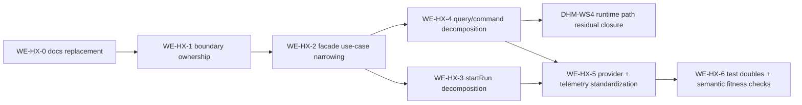

# WorkflowEngine target architecture v1

## Purpose

Define the target architecture for the full `WorkflowEngine` subsystem as a
hexagonal derivation path that narrows the engine facade to commands plus
canonical read while moving optional enrichment behind a separate service
boundary.

## Target shape

The target treats `IWorkflowEngine` as the hardcut command plus canonical-read
facade and moves actual behavior into narrow application services.

Target inbound use-case services:

- `IStartRunUseCase`
- `ICancelRunUseCase`
- `IRunStatusQueryService`
- `IRunSignalUseCase`
- `IRunEnrichmentService`

Target outbound engine-owned ports:

- run state read
- run state write
- intent log
- provider adapter resolution
- run execution context resolution
- status projection
- observability/telemetry policy
- execution capability dispatch inside provider-owned runtime internals

## Boundary and ownership rule

Boundary rule to lock:

- `@dvt/artifacts` owns artifact-reading behavior and reader contracts.
- `@dvt/engine` owns execution use-case needs and may define an engine-facing
  resolver or plan artifact reader port.
- composition root adapts artifacts-owned readers to engine-owned ports.
- peer-domain runtime logic must not leak into engine internals.

Additional target rule for the first transformation runtime vertical:

- the core runtime must depend on execution capability, not on a vendor name
- a whole-plan provider or executor profile may select a capability and then a
  concrete implementation
- PostgreSQL is the first implementation of the relational SQL execution
  capability
- future relational implementations such as Oracle may fit the same capability
- non-relational systems such as Kafka do not automatically fit the same
  contract and must be introduced as a different capability or provider
  profile

## Inbound/outbound port model

## Target execution capability seam

This target architecture keeps the run-driven adapter model from `ADR-0014`,
but it narrows the runtime internals so execution semantics are capability-led
instead of vendor-led.

That means:

- the engine still starts a run by `PlanRef`
- the provider-owned runtime still owns step dispatch
- executor selection inside that runtime should be modeled by capability first
- vendor implementations sit behind that capability boundary

Mainline now partially realizes this seam:

- `@dvt/adapter-temporal` dispatches runtime task steps through
  `StepActivityDispatcher`
- provider-owned plugins can register bounded non-DBT step activity
  implementations
- the object-file plugin uses `PostgresObjectFileLoadingCapability` without
  exposing a general SQL transformation runtime

What remains target-state rather than normative public contract is the broader
promotion of this seam into a repository-wide adapter policy or ADR-backed
contract.

If a future slice promotes this distinction into a normative public contract or
repo-wide adapter policy, that change should be captured in an ADR. At this
stage, the architecture document is enough because it is refining target shape
under already accepted principles from `ADR-0003` and `ADR-0014`.

## Cutover strategy

1. Narrow `IWorkflowEngine` to commands plus canonical read.
2. Move enrichment to `IRunEnrichmentService`.
3. Move method internals to dedicated use-case services.
4. Keep current tests green with facade delegation checks and service-level
   query coverage.
5. Remove internal wide-service authority from the active architecture narrative
   once fitness checks prove command/query delegation.

Current DHM-WS4 state: cancel and signal behavior now run through dedicated
`RunCommandService` and `RunSignalService` implementations behind
`IRunCommandService` and `IRunSignalService`. `WorkflowEngineCoreService`
remains only as the combined run-control delegator over those role services.

## Class responsibility rules (target)

- `WorkflowEngine`: only public contract normalization + delegation.
- use-case services: one lifecycle operation family each.
- admission policies: one policy concern per class.
- failure policies: isolated from admission and execution dispatch.
- telemetry decorators: outside core business decisions.

## Policy decomposition rules

- separate admission policy from adapter resolution policy
- separate capability policy from rate-limit policy
- separate run execution context provenance policy from generic start-run guards
- separate query policy from enrichment policy

## Composition-root rules

- concrete adapters are created only in app/runtime composition roots
- no domain service creates concrete infrastructure clients
- no use-case service constructs other concrete use-case services internally
- dependency graphs are explicit at wiring boundary

## Patterns used and why

- Narrow Facade: keep the public engine surface small while behavior moves into
  dedicated services.
- Use Case Interactor: keep orchestration explicit and testable per behavior.
- Policy Objects: isolate rules and keep logic composable.
- Adapter + Port: enforce hexagonal boundary and replaceability.
- Projection/Reducer: preserve event-sourced read determinism.
- Decorator for telemetry: keep instrumentation out of business decisions.

## Anti-patterns to avoid

- god facade with policy + orchestration + runtime concerns
- peer-domain direct imports to bypass composition roots
- mixing persisted read model and provider enrichment by default
- infrastructure selection inside domain policies
- hidden collaborator construction inside orchestration classes

## Current vs target gaps

- Public boundary
  Current: `WorkflowEngine` now exposes commands plus canonical read only and
  delegates to explicit facade-facing use cases through
  [WorkflowEngine Facade Use-Cases Component](./workflow-engine-facade-use-cases-component.md).
  Target: facade-only delegation plus separate enrichment/query services with no
  residual mixed responsibility in current docs.
  Gap signal: deeper start-run/control decomposition convergence.
- `startRun` application flow
  Current: `StartRunApplicationService` now sequences explicit phase services:
  [Start-run application decomposition component](./start-run-application-decomposition-component.md)
  covers admission and intent creation, and
  [Start-run application decomposition component](./start-run-application-decomposition-component.md)
  covers start-run phase ownership, admission, intent, execution, and failure seams.
  `WE-HX-5` adds
  [WorkflowEngine Provider And Telemetry Seams Component](./workflow-engine-provider-telemetry-seams-component.md)
  for provider lookup and start/success telemetry ownership.
  Target: keep phase services narrow and route provider lookup and start/success
  telemetry through named seams.
  Gap signal: remaining runtime telemetry policy breadth outside start/success
  events should be handled by a later cross-cutting observability slice.
- status/read path
  Current: dedicated canonical query and enrichment services are now shipped,
  and the facade reaches the canonical query path through a named
  `IWorkflowRunStatusUseCase`; cancel and signal now route through dedicated
  `IRunCommandService` and `IRunSignalService` boundaries documented in
  [WorkflowEngine Runtime Path Decomposition Component](./workflow-engine-runtime-path-decomposition-component.md).
  Target: dedicated query vs enrichment services plus narrower control and
  telemetry seams.
  Gap signal: residual telemetry-policy breadth.
- provider resolution
  Current: start-run admission, run control, signal, and enrichment use
  `IEngineProviderResolver` / `MapBackedEngineProviderResolver` instead of raw
  adapter-map lookup.
  Target: keep new provider consumers on the resolver seam.
  Gap signal: any new `.adapters.get(...)` or private adapter lookup helper in
  engine runtime paths is drift.
- telemetry handling
  Current: start-run start and success telemetry is owned by
  `StartRunTelemetryPolicy`; failure telemetry remains in
  `StartRunFailurePolicy`.
  Target: policy/decorator boundaries for cross-cutting instrumentation.
  Gap signal: business coordinators directly constructing metric names or
  duplicated metric tags.
- boundary fitness and test doubles
  Current: `WE-HX-6` adds
  [WorkflowEngine Boundary Fitness Component](./workflow-engine-boundary-fitness-component.md)
  to make fixture ownership, architecture-test support, and forbidden
  adapter/runtime bleed mechanically visible.
  Target: tests remain engine-owned fake/in-memory collaborators and
  architecture guards validate semantic ownership instead of only barrel
  thinness.
  Gap signal: fixtures importing production adapters, provider SDKs, DB
  migration, API runtime composition, environment provider selection, or copied
  source/doc readers in new WE-HX architecture guards.
- artifacts/engine seam
  Current: explicit for plan artifact reading and run execution context
  resolution through
  [WorkflowEngine boundary ownership component](./workflow-engine-boundary-ownership-component.md).
  Target: documented adapter seam in composition root.
  Gap signal: future work should preserve this map while narrowing
  start-run/control services.

## Retain vs improve

Retain:

- event-sourced execution authority
- CQRS split between stored status and enrichment
- intent-log crash consistency
- provider adapter boundary
- `PlanRef` trust boundary
- existing policy-object direction

Improve:

- reduce facade width
- remove internal collaborator construction
- split mixed admission concerns
- split mixed query/enrichment concerns
- formalize engine/artifacts seam
- replace stale docs with one canonical reading path

## Target sequences

### Target `startRun` sequence

### Target status/enrichment split

Target model note:

- `CanonicalRunStatus` is the only canonical caller-visible lifecycle object
- `ProviderRunStatusView` remains diagnostic-only
- `RunStatusEnrichment` is engine-owned composition, not a second canonical
  status source
- `IRunEnrichmentService` is the only target boundary that may return
  `RunStatusEnrichment`

## Derivation roadmap

## Governing references

- `ADR-0003`
- `ADR-0004`
- `ADR-0012`
- `ADR-0015`
- `ADR-0030`
- `ADR-0034`
- `ADR-0042`
