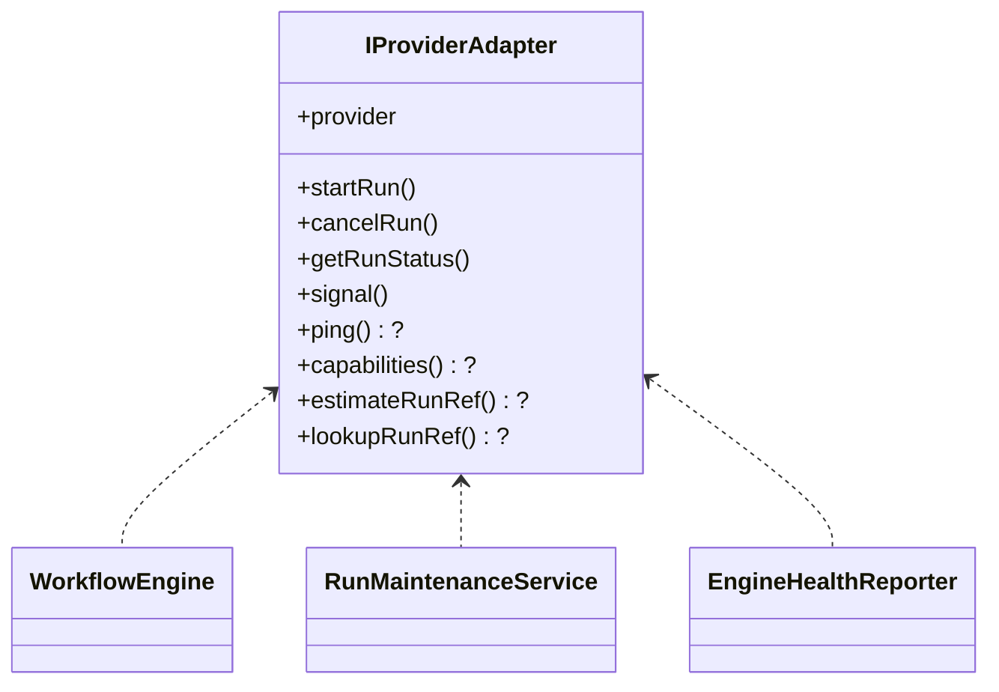

# IProviderAdapter Contract (Normative v1.1)

[<- Back to Contracts Registry](../README.md)

**Status**: NORMATIVE - current version
**Version**: 1.1
**Stability**: Boundary contract - breaking changes require version bump
**Scope**: Provider adapter boundary between engine core and execution backends
**Consumers**: Engine core, adapter implementations (Temporal, Conductor, Mock),
tests
**References**: [IWorkflowEngine.v1.md](./IWorkflowEngine.v1.md),
[RunEvents.v1.md](./RunEvents.v1.md),
[ExecutionSemantics.v1.md](./ExecutionSemantics.v1.md)
**Related Contracts**: [SignalsAndAuth.v1.md](./SignalsAndAuth.v1.md),
[IRunStateStore.v2.0.md](../state-store/IRunStateStore.v2.0.md)
**Supersedes**: [IProviderAdapter.v1.0.md](./IProviderAdapter.v1.0.md)
**Phase**: US-1.1 baseline
**Parent Contract**: [IWorkflowEngine.v1.md](./IWorkflowEngine.v1.md)

---

## 1) Purpose

Define the minimum provider adapter interface and responsibilities used by
engine core to execute and control runs against backend runtimes.

In scope:

- provider identity and adapter selection compatibility,
- lifecycle operations (`startRun`, `cancelRun`, `getRunStatus`, `signal`),
- optional capability declaration, deterministic ref estimation, and run
  lookup,
- minimum error and traceability expectations.

Out of scope:

- runtime-specific SDK details (Temporal/Conductor internals),
- persistence internals,
- planner policy decisions.

---

## 2) Normative Rules (MUST / MUST NOT)

### MUST

- Expose a stable `provider` identifier compatible with
  `EngineRunRef.provider`.
- Implement `startRun(planRef, ctx)` returning `EngineRunRef`.
- Implement `cancelRun(runRef)` as idempotent cancellation request.
- Implement `getRunStatus(runRef)` returning `RunStatusSnapshot`.
- Implement `signal(runRef, request)` with contract-level signal validation
  delegated to engine/auth layers as appropriate.
- Preserve correlation inputs coming from `RunContext` and `EngineRunRef`
  through downstream runtime calls.
- Surface runtime failures with actionable adapter-level errors.

### MUST NOT

- Perform planner decisions or mutate plan semantics.
- Become source of truth for run state (state authority remains state
  store/event log boundary).
- Drop provider identity from returned run references.
- Emit non-canonical status values outside `RunStatusSnapshot` contract.

---

## 3) Contract Surface

```ts
export interface IProviderAdapter {
  readonly provider: EngineRunRef['provider'];

  startRun(planRef: PlanRef, ctx: RunContext): Promise<EngineRunRef>;
  cancelRun(runRef: EngineRunRef): Promise<void>;
  getRunStatus(runRef: EngineRunRef): Promise<RunStatusSnapshot>;
  signal(runRef: EngineRunRef, request: SignalRequest): Promise<void>;

  // Optional - health probe
  ping?(): Promise<void>;

  // Optional - capability declaration (v1.1)
  // If absent, engine skips capability gate validation (graceful degradation).
  capabilities?(): readonly string[];

  // Optional - deterministic ref estimation without a network call (v1.1)
  // Enables pre-bootstrap path (ADR-0030): engine commits run_metadata + RunQueued
  // before adapter.startRun(), eliminating the dual-producer ordering race.
  estimateRunRef?(ctx: RunContext): EngineRunRef;

  // Optional - reverse lookup by runId (v1.1)
  // Used by RunMaintenanceService intent reconciler to verify if a workflow started.
  // Not all runtimes support reverse lookup.
  lookupRunRef?(runId: string, tenantId: string): Promise<EngineRunRef | null>;
}
```

### 3.1 Lifecycle operations

- `startRun`: submit execution request to provider runtime and return
  provider-qualified reference.
- `cancelRun`: request stop/cancel semantics according to provider constraints.
- `getRunStatus`: map provider runtime state into canonical `RunStatusSnapshot`.
- `signal`: deliver control signal within authorization and lifecycle
  boundaries.

### 3.2 Optional extensions (v1.1)

| Method              | Who consumes it                           | Behaviour when absent                             |
| ------------------- | ----------------------------------------- | ------------------------------------------------- |
| `capabilities?()`   | Engine `startRun` capability gate         | Gate skipped (graceful degradation)               |
| `estimateRunRef?()` | Engine `startRun` pre-bootstrap path      | Legacy path used (startRun first, then bootstrap) |
| `lookupRunRef?()`   | `RunMaintenanceService` intent reconciler | Reconciler skips provider verification            |



---

## 4) Invariants

- **INV-PA-1**: `provider` is immutable per adapter instance.
- **INV-PA-2**: `startRun` returns `EngineRunRef.provider === adapter.provider`.
- **INV-PA-3**: status mapping is deterministic for same provider state input.
- **INV-PA-4**: lifecycle methods are safe under retries (idempotent or
  retry-tolerant at boundary).
- **INV-PA-5** _(v1.1)_: `estimateRunRef` is pure - no network calls, no side
  effects.
- **INV-PA-6** _(v1.1)_: `capabilities()` is stable for the lifetime of the
  adapter instance.

---

## 5) Validation / Error Model

- Unknown/unsupported provider operation MUST reject with adapter-specific error
  code/message.
- Invalid provider run reference MUST reject with traceable error.
- Provider transport/runtime errors MUST preserve enough context for debugging
  (`provider`, operation, runRef when present).
- Contract validation failures at engine boundary MUST be surfaced before
  adapter side-effects where feasible.

Recommended adapter error code families:

- `ADAPTER_NOT_IMPLEMENTED`
- `ADAPTER_INVALID_RUN_REF`
- `ADAPTER_SIGNAL_UNSUPPORTED`
- `ADAPTER_PROVIDER_ERROR`

---

## 6) Compatibility

- Additive optional methods are MINOR-compatible.
- Changing existing method signatures or return contracts is MAJOR-breaking.
- New providers are additive if they comply with `EngineRunRef.provider`
  compatibility rules.

---

## 7) Cross-References

- [IWorkflowEngine.v1.md](./IWorkflowEngine.v1.md)
- [RunEvents.v1.md](./RunEvents.v1.md)
- [SignalsAndAuth.v1.md](./SignalsAndAuth.v1.md)
- [ExecutionSemantics.v1.md](./ExecutionSemantics.v1.md)
- [State Store Contract](../state-store/README.md)

---

## 8) Change Log

| Version | Date       | Author      | Summary                                                                                                                                 |
| ------- | ---------- | ----------- | --------------------------------------------------------------------------------------------------------------------------------------- |
| 1.0     | 2026-03-15 | Engineering | Initial normative baseline - required lifecycle operations                                                                              |
| 1.1     | 2026-03-15 | Engineering | Added optional `capabilities()`, `estimateRunRef()`, `lookupRunRef()`; formalized consumers (engine + maintenance); added INV-PA-5/PA-6 |
