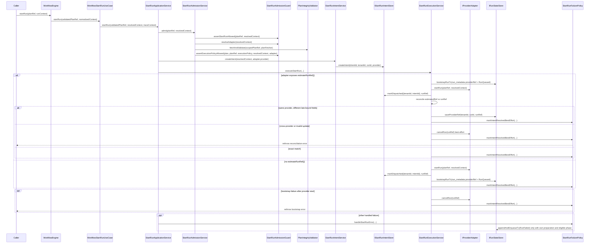

# StartRun Protocol (Normative v1)

[<- Back to Contracts Registry](../README.md)

**Status**: ACTIVE  
**Version**: v1  
**Stability**: Contracts - breaking changes require version bump  
**Consumers**: Engine reviewers, API orchestration, adapter implementers, state-store reviewers  
**References**:
[ADR-0012-plan-integrity-ownership.md](../../../../../adr/ADR-0012-plan-integrity-ownership.md),
[ADR-0013-run-state-store-bootstrapRunTx.md](../../../../../adr/ADR-0013-run-state-store-bootstrapRunTx.md),
[ADR-0014-run-driven-adapter-model.md](../../../../../adr/ADR-0014-run-driven-adapter-model.md),
[ADR-0030-pre-dispatch-intent-log.md](../../../../../adr/ADR-0030-pre-dispatch-intent-log.md)

---

## 1) Purpose

This artifact codifies the `startRun()` protocol already implemented in the
repository.

It does not introduce a new execution path.

The shared API orchestration boundary that feeds this protocol is now governed
separately in [StartRunBoundary.v1.md](./StartRunBoundary.v1.md). This document
starts at the narrower engine-facing `IWorkflowEngine.startRun(planRef,
context)` handoff after API orchestration has already classified planner-backed
or persisted-plan ingress.

Its job is to make the existing protocol reviewable without forcing readers to
reconstruct it from `WorkflowEngine`, `WorkflowStartRunUseCase`,
`StartRunApplicationService`, `StartRunAdmissionService`,
`StartRunIntentService`, `StartRunExecutionService`, and
`StartRunFailurePolicy`.

---

## 2) Entry Point And Owning Units

The public entry point remains:

```ts
interface IWorkflowEngine {
  startRun(planRef: PlanRef, context: RunContext): Promise<EngineRunRef>;
}
```

The current implementation units are:

| Role                    | Unit                                                                                                                                       | Responsibility                                                                                                                |
| ----------------------- | ------------------------------------------------------------------------------------------------------------------------------------------ | ----------------------------------------------------------------------------------------------------------------------------- |
| Public facade           | [`WorkflowEngine`](../../../../../../packages/@dvt/engine/src/core/WorkflowEngine.ts)                                                      | Parses `PlanRef` and `RunContext`, then delegates to facade-facing use cases                                                  |
| Facade start use case   | [`WorkflowStartRunUseCase`](../../../../../../packages/@dvt/engine/src/application/workflow-engine-use-cases/WorkflowStartRunUseCase.ts)   | Resolves initial run lineage, builds trace context, and delegates to the start-run application service                        |
| Application coordinator | [`StartRunApplicationService`](../../../../../../packages/@dvt/engine/src/application/StartRunApplicationService.ts)                       | Sequences admission, intent creation, dispatch, success metrics, and failure policy                                           |
| Admission service       | [`StartRunAdmissionService`](../../../../../../packages/@dvt/engine/src/services/startRun/StartRunAdmissionService.ts)                     | Coordinates admission, provider resolution, scoped integrity verification, and capability/run-execution-context checks        |
| Admission boundary      | [`StartRunAdmissionGuard`](../../../../../../packages/@dvt/engine/src/application/StartRunAdmissionGuard.ts)                               | Runs preconditions, adapter resolution, capability checks, and runExecutionContext admission                                  |
| Validation policy       | [`StartRunValidationPolicy`](../../../../../../packages/@dvt/engine/src/services/startRun/StartRunValidationPolicy.ts)                     | Tenant access, `PlanRef` policy, schema/version validation, run-id validation, duplicate-run rejection, capability validation |
| Context admission       | [`RunExecutionContextAdmissionPolicy`](../../../../../../packages/@dvt/engine/src/services/startRun/RunExecutionContextAdmissionPolicy.ts) | Validates `runExecutionContextRef` alignment and compatibility fingerprints                                                   |
| Intent creation         | [`StartRunIntentService`](../../../../../../packages/@dvt/engine/src/services/startRun/StartRunIntentService.ts)                           | Derives deterministic pre-dispatch intent ids and persists `PENDING` intents                                                  |
| Dispatch + bootstrap    | [`StartRunExecutionService`](../../../../../../packages/@dvt/engine/src/services/startRun/StartRunExecutionService.ts)                     | Calls provider adapter, marks intent dispatched, bootstraps run state, compensates on bootstrap failure                       |
| Failure handling        | [`StartRunFailurePolicy`](../../../../../../packages/@dvt/engine/src/services/startRun/StartRunFailurePolicy.ts)                           | Logs/metrics, best-effort intent resolution, guarded `RunFailed` emission after this invocation prepared the run              |
| Metadata/event factory  | [`StartRunEventFactory`](../../../../../../packages/@dvt/engine/src/services/startRun/StartRunEventFactory.ts)                             | Constructs `RunMetadata`, `RunQueued`, provider-ref updates, and failure events                                               |

---

## 3) End-To-End Protocol



---

## 4) Phase-By-Phase Specification

### 4.1 Admission

The admission phase is already implemented by:

- [`WorkflowEngine.startRun()`](../../../../../../packages/@dvt/engine/src/core/WorkflowEngine.ts)
- [`WorkflowStartRunUseCase.startRun()`](../../../../../../packages/@dvt/engine/src/application/workflow-engine-use-cases/WorkflowStartRunUseCase.ts)
- [`StartRunApplicationService.startRunCore()`](../../../../../../packages/@dvt/engine/src/application/StartRunApplicationService.ts)
- [`StartRunAdmissionService.admit()`](../../../../../../packages/@dvt/engine/src/services/startRun/StartRunAdmissionService.ts)
- [`StartRunAdmissionGuard.assertStartRunAllowed()`](../../../../../../packages/@dvt/engine/src/application/StartRunAdmissionGuard.ts)
- [`StartRunValidationPolicy.validateStartRunPreconditions()`](../../../../../../packages/@dvt/engine/src/services/startRun/StartRunValidationPolicy.ts)
- [`StartRunAdmissionGuard.resolveAdapter()`](../../../../../../packages/@dvt/engine/src/application/StartRunAdmissionGuard.ts)
- [`StartRunAdmissionGuard.assertExecutionPolicyAllowed()`](../../../../../../packages/@dvt/engine/src/application/StartRunAdmissionGuard.ts)
- [`RunExecutionContextAdmissionPolicy.assertAllowed()`](../../../../../../packages/@dvt/engine/src/services/startRun/RunExecutionContextAdmissionPolicy.ts)

The admission phase currently performs:

1. parse and normalize `PlanRef`
2. parse and normalize `RunContext`
3. resolve initial lineage fields in `WorkflowStartRunUseCase`:
   - `logicalAttemptId = 1`
   - `originRunId = runId`
4. tenant access check
5. `PlanRef` policy validation
6. `schemaVersion` validation
7. supported `planVersion` validation
8. `runId` format validation
9. duplicate-run rejection through `getRunMetadataByRunId()`
10. rate-limit check
11. adapter lookup in `StartRunAdmissionService`
12. scoped plan artifact integrity verification in `StartRunAdmissionService`
13. execution-policy capability checks
14. `runExecutionContextRef` alignment and compatibility checks when present
15. plugin-bearing plans reject before queueing when:

- `runExecutionContextRef` is missing
- the engine resolver is not configured for a supplied
  `runExecutionContextRef`
- the resolved context omits `pluginContexts`
- resolved plugin context is missing for a required plugin
- the resolved context metadata mismatches the admitted `PlanRef`,
  `RunExecutionPolicy`, or run tenant
- the plugin binding policy rejects a plugin-specific invariant such as
  artifact tenant ownership or canonical locator shape

This phase rejects before any provider side effect.

### 4.2 Integrity Verification

The integrity phase is already implemented by:

- [`PlanIntegrityValidator.fetchAndValidate()`](../../../../../../packages/@dvt/engine/src/security/planIntegrity.ts)
- invoked from [`StartRunAdmissionService.admit()`](../../../../../../packages/@dvt/engine/src/services/startRun/StartRunAdmissionService.ts)

The integrity phase currently performs:

1. fetch executable plan material from the configured `planFetcher`
2. parse the executable `ExecutionPlan`
3. validate plan metadata against `PlanRef`
4. recompute plan identity from plan core
5. reject before adapter dispatch if integrity fails

This is the authoritative integrity gate mandated by ADR-0012.

### 4.3 Intent Creation

The intent phase is already implemented by:

- [`StartRunIntentService.createIntent()`](../../../../../../packages/@dvt/engine/src/services/startRun/StartRunIntentService.ts)
- [`IStartRunIntentStore.createIntent()`](../../../../../../packages/@dvt/engine/src/ports/IStartRunIntentStore.ts)
- [`IdempotencyKeyBuilder.startRunIntentId()`](../../../../../../packages/@dvt/engine/src/core/idempotency.ts)

The intent phase currently performs:

1. derive a deterministic `intentId`
2. persist a `PENDING` intent before provider dispatch
3. attach:
   - `tenantId`
   - `runId`
   - `provider`
   - `createdAt`

This is the crash-consistency entry point mandated by ADR-0030.
All post-create intent command/query operations use the tenant-scoped
`StartRunIntentRef { tenantId, intentId }`; only maintenance scanning uses the
unscoped `listOrphaned(...)` service-context path.

### 4.4 Dispatch

The dispatch phase is already implemented by:

- [`StartRunExecutionService.executeStartRun()`](../../../../../../packages/@dvt/engine/src/services/startRun/StartRunExecutionService.ts)
- [`StartRunExecutionService.startAdapterAndMarkDispatched()`](../../../../../../packages/@dvt/engine/src/services/startRun/StartRunExecutionService.ts)

The dispatch phase currently performs:

1. choose between:
   - `startRunWithEstimatedRef()`
   - `startRunWithoutEstimatedRef()`
2. call `adapter.startRun(planRef, resolvedContext)`
3. enforce adapter-start timeout through `withTimeout(...)`
4. persist `DISPATCHED` intent state via `markDispatched({ tenantId, intentId }, runRef)`
5. treat post-start intent persistence failure as a first-class error
   (`PostStartIntentPersistenceError`)

The adapter receives the engine-approved immutable `PlanRef` plus the resolved
run context. Provider runtimes that fetch plan material at runtime MUST
revalidate `PlanRef.sha256` before execution.

### 4.5 Bootstrap Behavior

Bootstrap behavior is already implemented by:

- [`StartRunExecutionService.startRunWithEstimatedRef()`](../../../../../../packages/@dvt/engine/src/services/startRun/StartRunExecutionService.ts)
- [`StartRunExecutionService.startRunWithoutEstimatedRef()`](../../../../../../packages/@dvt/engine/src/services/startRun/StartRunExecutionService.ts)
- [`StartRunExecutionService.bootstrapRunTxWithCompensation()`](../../../../../../packages/@dvt/engine/src/services/startRun/StartRunExecutionService.ts)
- [`StartRunEventFactory.buildRunMetadata()`](../../../../../../packages/@dvt/engine/src/services/startRun/StartRunEventFactory.ts)
- [`StartRunEventFactory.buildRunEvent()`](../../../../../../packages/@dvt/engine/src/services/startRun/StartRunEventFactory.ts)

There are two current bootstrap branches.

In both branches, `RunMetadata.providerRef` persists one canonical
discriminated `EngineRunRef`. There is no flat provider bag in the current
protocol. The only provider-ref update seam is `saveProviderRef(...)`, which
accepts a discriminated update and MUST reject provider discriminator changes.

#### Branch A: adapter provides `estimateRunRef()`

Implemented by `startRunWithEstimatedRef()`.

Current order:

1. derive estimated provider ref
2. build `RunMetadata` from the estimated ref
3. atomically call `bootstrapRunTx(...)` with:
   - `run_metadata`
   - first event: `RunQueued`
4. call `adapter.startRun(...)`
5. mark the intent `DISPATCHED`
6. if the refs are equal, mark the intent resolved best-effort
7. if the refs differ but keep the same provider:
   - reconcile persisted metadata through `saveProviderRef(...)`
   - mark the intent resolved best-effort
8. if reconciliation rejects the update:
   - cancel the provider run best-effort
   - mark the intent resolved best-effort
   - rethrow the reconciliation error

#### Branch B: adapter does not provide `estimateRunRef()`

Implemented by `startRunWithoutEstimatedRef()`.

Current order:

1. call `adapter.startRun(...)`
2. mark the intent `DISPATCHED`
3. build `RunMetadata` from the actual provider ref
4. atomically call `bootstrapRunTx(...)` with:
   - `run_metadata`
   - first event: `RunQueued`
5. best-effort resolve the intent

In both branches:

- `bootstrapRunTx` is the only write path for initial run metadata
- the first persisted lifecycle fact is `RunQueued`
- `RunMetadata` and `RunQueued` are built by `StartRunEventFactory`

### 4.6 Failure Handling And Compensation

Failure handling is already implemented by:

- [`StartRunExecutionService.bootstrapRunTxWithCompensation()`](../../../../../../packages/@dvt/engine/src/services/startRun/StartRunExecutionService.ts)
- [`StartRunFailurePolicy.handleStartRunError()`](../../../../../../packages/@dvt/engine/src/services/startRun/StartRunFailurePolicy.ts)
- [`StartRunFailurePolicy.markIntentResolvedBestEffort()`](../../../../../../packages/@dvt/engine/src/services/startRun/StartRunFailurePolicy.ts)

Current failure behavior:

1. if bootstrap fails after provider start in the non-estimated branch:
   - call `adapter.cancelRun(runRef)` as compensation
   - best-effort resolve the intent
   - rethrow the bootstrap error
2. if `estimateRunRef()` is implemented and `startRun()` returns a different
   `EngineRunRef`:
   - attempt `saveProviderRef(...)` reconciliation using the actual
     discriminated provider ref
   - if the update changes provider discriminator or fails validation,
     log the reconciliation error
   - call `adapter.cancelRun(runRef)` best-effort
   - best-effort resolve the intent
   - rethrow the reconciliation error
3. if `markDispatched(...)` fails after `adapter.startRun(...)` succeeded:
   - raise `PostStartIntentPersistenceError`
   - log/report the failure
   - do not fabricate a synthetic success path
4. if a start-run error reaches `StartRunFailurePolicy.handleStartRunError(...)`:
   - report metrics/logging and preserve `PostStartIntentPersistenceError`
   - require a typed preparation receipt with disposition `created`, returned
     from this invocation's successful bootstrap; `reused` grants no failure authority
   - reject admission/intent-phase failures without canonical mutation, including
     recovery whose child was prepared but whose intent could not be persisted
   - perform these authority/phase checks before reading metadata or intent for
     failure emission; neither metadata existence nor error text grants authority
   - if metadata does not exist yet, rethrow without emitting `RunFailed`
   - if the tracked intent is still `PENDING`, rethrow without emitting `RunFailed`
   - otherwise append `RunFailed` best-effort through `appendAndEnqueueTx(...)`

Fresh execution acquires preparation authority only after its own `bootstrapRunTx`
succeeds. Recovery preserves a readonly `created | reused` result from its
preparation boundary: an existing child and a child found after a bootstrap
collision are both `reused`. A failed bootstrap cannot fail the winner's run.
The coordinator transports that result and the current phase through the existing
execution and failure services.

This protects common failure reporting. It does not establish exclusive ownership
of a deterministic start intent: non-estimated dispatch and reused recovery can
perform intent/reconciliation/compensation effects before reaching this handler.
Those pre-existing concurrent-dispatch limitations remain tracked by
[#2678](https://github.com/dunay2/dvt/issues/2678) and provider-outcome work in
[#2679](https://github.com/dunay2/dvt/issues/2679). The global invariant in
[#2676](https://github.com/dunay2/dvt/issues/2676) remains open until those paths
are also proven.

### 4.7 Start Failure Authority Conformance

The [mutation-authority regressions](../../../../../../packages/@dvt/engine/test/core/WorkflowEngine.startMutationAuthority.test.ts)
exercise this protocol through the actual Engine application services and
in-memory transactional stores. They MUST compare complete metadata, ordered
events, snapshot and intent after duplicate/admission rejection. Deterministic
barriers MUST cover a dispatched winner with a losing bootstrap, both recovery
reuse paths, and a run appearing during capability/context admission. An owned
reconciliation failure MUST retain its legitimate failure event and compensation.

Run these proofs with
`pnpm --filter @dvt/engine exec vitest run test/core/WorkflowEngine.startMutationAuthority.test.ts`.
The [ARC evidence](../../../../../evidence/ed-20260906-eng1-start-mutation-authority.md)
records the local observations and remaining boundaries. A Planning DB execution
evidence record using this protocol as its governed source MUST bind the actual
CI job, the tested commit, and this document's exact committed content hash.
The protocol declares the obligation; the authenticated job supplies its result.

---

## 5) Existing ADR-Governed Invariants

### 5.1 ADR-0012: Plan Integrity Ownership

This protocol MUST preserve:

- engine-side fetch and verification before adapter dispatch
- centralized `planId` verification from plan core
- adapter execution from the engine-approved immutable `PlanRef`, with runtime
  plan-material fetches revalidating `PlanRef.sha256`
- fail-closed rejection before any adapter execution if integrity fails

Implemented today by:

- [`StartRunApplicationService.startRunCore()`](../../../../../../packages/@dvt/engine/src/application/StartRunApplicationService.ts)
- [`PlanIntegrityValidator.fetchAndValidate()`](../../../../../../packages/@dvt/engine/src/security/planIntegrity.ts)

### 5.2 ADR-0013: `bootstrapRunTx` Atomicity

This protocol MUST preserve:

- atomic persistence of:
  - `run_metadata`
  - first events
  - outbox rows
- use of `bootstrapRunTx(...)` for the first run write
- no mid-run metadata creation via non-bootstrap paths

Implemented today by:

- [`StartRunExecutionService.startRunWithEstimatedRef()`](../../../../../../packages/@dvt/engine/src/services/startRun/StartRunExecutionService.ts)
- [`StartRunExecutionService.bootstrapRunTxWithCompensation()`](../../../../../../packages/@dvt/engine/src/services/startRun/StartRunExecutionService.ts)
- [`IRunStateStore.bootstrapRunTx`](../../../../../../packages/@dvt/engine/src/ports/IRunStateStore.ts)

### 5.3 ADR-0030: Pre-Dispatch Intent Log

This protocol MUST preserve:

- intent creation before provider dispatch
- `markDispatched(...)` after provider dispatch returns
- `markResolved(...)` on success and best-effort resolution on cleanup
- intent-store dependency as mandatory engine wiring
- reconciliation-compatible intent lifecycle:
  - `PENDING`
  - `DISPATCHED`
  - `RESOLVED`
  - `EXPIRED`

Implemented today by:

- [`StartRunIntentService.createIntent()`](../../../../../../packages/@dvt/engine/src/services/startRun/StartRunIntentService.ts)
- [`StartRunExecutionService.startAdapterAndMarkDispatched()`](../../../../../../packages/@dvt/engine/src/services/startRun/StartRunExecutionService.ts)
- [`StartRunFailurePolicy.markIntentResolvedBestEffort()`](../../../../../../packages/@dvt/engine/src/services/startRun/StartRunFailurePolicy.ts)
- mandatory dependency checks in [`WorkflowEngine.validateDependencies()`](../../../../../../packages/@dvt/engine/src/core/WorkflowEngine.ts)

---

## 6) Review Checklist

Reviewers can verify the protocol by checking:

1. `WorkflowEngine.startRun()` delegates only to the facade start-run use case
   after parsing public input
2. admission happens before integrity and before any provider side effect
3. integrity verification happens before adapter dispatch
4. an intent is created before provider dispatch
5. provider dispatch marks the intent `DISPATCHED`
6. in the estimated branch, `estimateRunRef()` and `startRun()` either return
   the same `EngineRunRef` or reconcile through a same-provider
   `saveProviderRef(...)` update; cross-provider drift fails closed
7. one of the two documented bootstrap branches executes
8. `RunQueued` is the first persisted lifecycle event
9. bootstrap failure in the non-estimated branch compensates with `cancelRun`
10. common start failure emission requires this invocation's created preparation, an eligible phase, persisted metadata and the existing intent guards

No new protocol is defined by this artifact.

It documents the current protocol already implemented in code.
