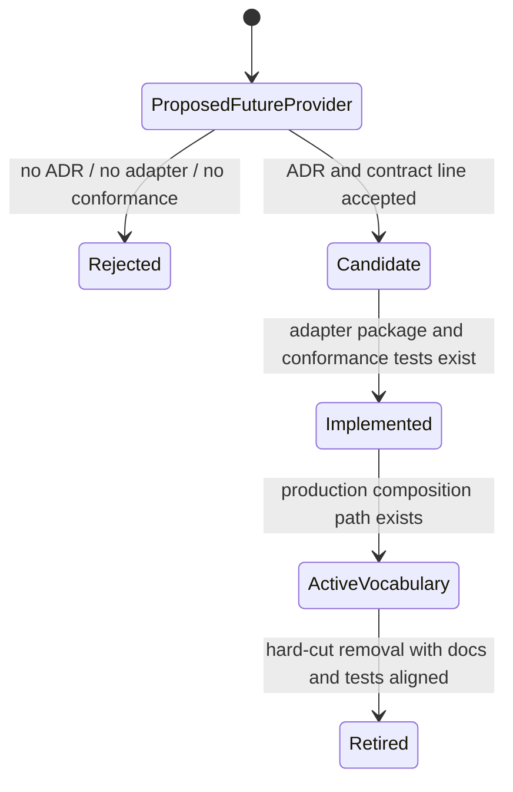
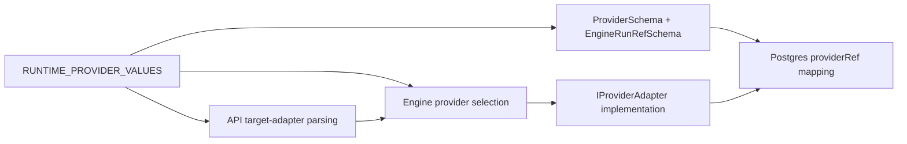

# Runtime Provider Vocabulary Component

## Owned Concern

This component owns the active serialized provider vocabulary used by runtime
contracts, engine admission, provider references, API target-adapter parsing,
capability matrices, and storage hydration.

It does not own provider implementation. Provider implementation remains behind
`IProviderAdapter` and concrete adapter packages.

## Public API

| Surface                    | Public contract                                                          | Owner                   |
| -------------------------- | ------------------------------------------------------------------------ | ----------------------- |
| Runtime provider values    | `RUNTIME_PROVIDER`, `RUNTIME_PROVIDER_VALUES`, `Provider`                | `@dvt/contracts`        |
| Provider ref validation    | `ProviderSchema`, `EngineRunRefSchema`, `parseEngineRunRef`              | `@dvt/contracts`        |
| Run context validation     | `RunContext.targetAdapter`, `RunExecutionContext.targetAdapter`          | `@dvt/contracts`        |
| Engine provider selection  | `resolveEngineProvider`, `buildAdapterOrder`                             | `@dvt/engine`           |
| API runtime target adapter | `SUPPORTED_RECOVER_RUN_TARGET_ADAPTERS`, `StartRunTargetAdapterRegistry` | `apps/api`              |
| Provider ref persistence   | `run_metadata.providerRef` JSON mapping                                  | `@dvt/adapter-postgres` |

## Invariants

- Active provider vocabulary exposes only implemented runtime providers.
- Test doubles may exist, but they must model active provider ids and must not
  create synthetic runtime provider variants.
- Capability matrices and event schemas must use the same provider vocabulary
  as TypeScript types and Zod schemas.
- Storage must reject unsupported provider references before persisting or
  hydrating run metadata.
- Future providers require ADR-backed contract ownership, a real adapter
  package, capability conformance, production composition, and docs evidence
  before entering active vocabulary.

## State Transitions

## Runtime Flow

## Consumers

- `@dvt/engine` consumes the vocabulary for provider selection, adapter
  ordering, runtime admission, provider-ref reconciliation, and lifecycle
  maintenance.
- `apps/api` consumes the vocabulary for protected runtime parsing,
  recover-run target validation, and start-run adapter registry filtering.
- `@dvt/adapter-postgres` consumes the vocabulary to validate persisted
  provider references.
- `apps/web` consumes the vocabulary indirectly through contract fixtures and
  run DTOs.

## Regression Guard

`packages/@dvt/contracts/test/provider-vocabulary.architecture.test.ts` is the
semantic guard for this component. It validates active contracts, composition
surfaces, capability docs, event schemas, current architecture diagrams, and
engine testing exports. The guard is intentionally broader than a barrel test:
it protects the claim that active provider vocabulary means executable runtime
support.
