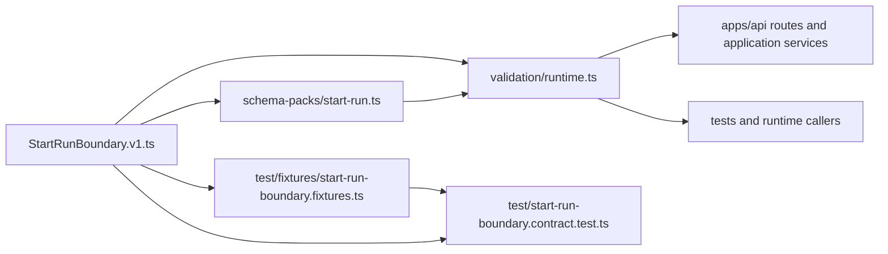
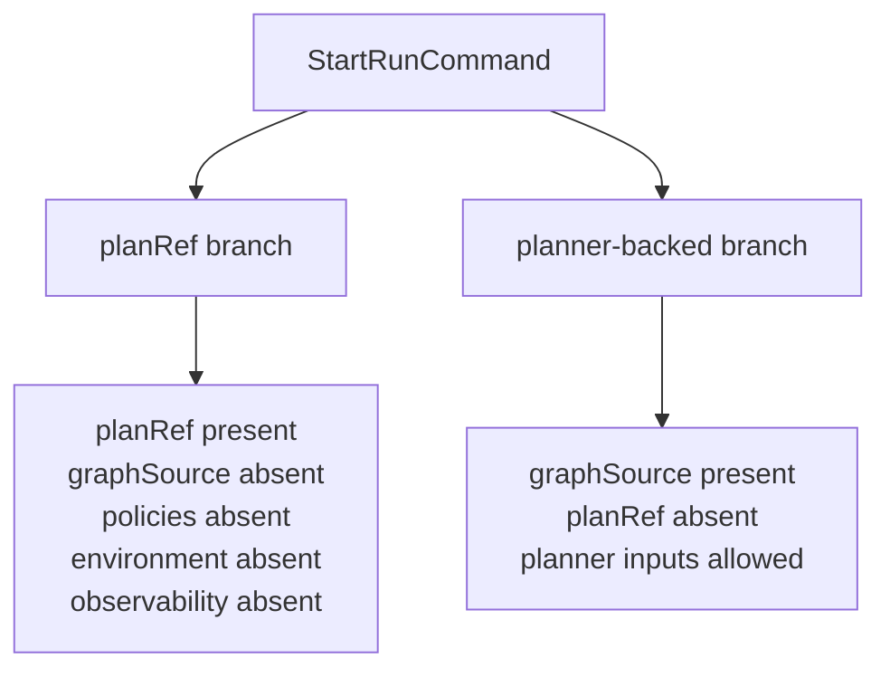
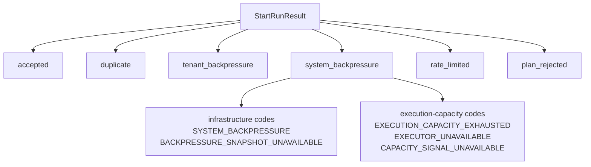

# Start-run boundary component

This local guide documents the `@dvt/contracts` component that owns the shared
API-to-engine `start-run` command/result boundary.

This is a **local component guide**, not a second normative contract. The
canonical normative source remains:
`docs/architecture/components/engine/contracts/engine/start-run-boundary.v1.md`.

## Owned concern

The component owns exactly one concern:

- publish and validate the canonical `start-run` command/result vocabulary used
  between API orchestration and engine-facing dispatch

It does **not** own:

- HTTP route parsing
- admission orchestration ordering
- adapter-specific capacity bindings
- engine lifecycle execution after handoff

## Public API

- `StartRunBoundary.v1.ts`
  Canonical command/result vocabulary:
  `StartRunCommand`,
  `StartRunResult`,
  `START_RUN_TARGET_ADAPTER`,
  `SUPPORTED_START_RUN_TARGET_ADAPTERS`,
  `START_RUN_RESULT_KIND`,
  `START_RUN_BACKPRESSURE_CODE`,
  `START_RUN_INFRASTRUCTURE_SYSTEM_BACKPRESSURE_CODES`,
  `START_RUN_EXECUTION_CAPACITY_SYSTEM_BACKPRESSURE_CODES`,
  `START_RUN_SYSTEM_BACKPRESSURE_CODES`
- `schema-packs/start-run.ts`
  Runtime validation schemas:
  `StartRunCommandSchema`,
  `StartRunResultSchema`,
  `StartRunTargetAdapterSchema`
- `validation/runtime.ts`
  Runtime parse entrypoints:
  `parseStartRunCommand(...)`,
  `parseStartRunResult(...)`

## Invariants

- there is one canonical `StartRunCommand` shape and one canonical
  `StartRunResult` vocabulary
- schema packs derive adapter and backpressure-code truth from the boundary
  module instead of duplicating raw literals
- fixtures and contract tests consume canonical exports instead of shadow
  literals where canonical constants exist
- command branches remain mutually exclusive:
  persisted `planRef` ingress or planner-backed `graphSource` ingress
- execution-capacity denial stays inside `system_backpressure`; it does not
  create a parallel top-level result kind
- `temporal` is the only active start-run target adapter ID, but Temporal
  construction is not owned by this component; it remains behind the
  provider-adapter factory seam and `IProviderAdapter`

## Component map

## Command branches

## Result taxonomy

## Consumers

- `packages/@dvt/contracts/src/schema-packs/start-run.ts`
- `packages/@dvt/contracts/src/validation/runtime.ts`
- `packages/@dvt/contracts/test/start-run-boundary.contract.test.ts`
- `apps/api/src/application/ports/startRunUseCasePort.ts`
- `apps/api/src/application/ports/startRunFacadePort.ts`
- `apps/api/src/application/services/BackpressureAwareStartRunUseCase.ts`
- `apps/api/src/application/services/PlannerBackedStartRunUseCase.ts`
- `apps/api/src/application/services/engineStartRunUseCase.ts`
- `apps/api/src/entrypoints/http/startRunRouteCommandBuilder.ts`
- `apps/api/src/entrypoints/http/startRunRouteParser.ts`
- `apps/api/src/entrypoints/http/startRunRouteTargetAdapterParser.ts`

## Focused file map

- `packages/@dvt/contracts/src/contracts/engine/StartRunBoundary.v1.ts`
- `packages/@dvt/contracts/src/schema-packs/start-run.ts`
- `packages/@dvt/contracts/src/validation/runtime.ts`
- `packages/@dvt/contracts/test/fixtures/start-run-boundary.fixtures.ts`
- `packages/@dvt/contracts/test/start-run-boundary.contract.test.ts`
- `packages/@dvt/contracts/test/start-run-boundary.architecture.test.ts`

## Extension rules

- add new caller-visible denial codes only in `StartRunBoundary.v1.ts` first
- keep code grouping canonical in the boundary module and derive schema/tests
  from it
- document new result branches in the normative contract doc and this local
  component guide together
- protect derivation rules with semantic architecture tests, not prose only
