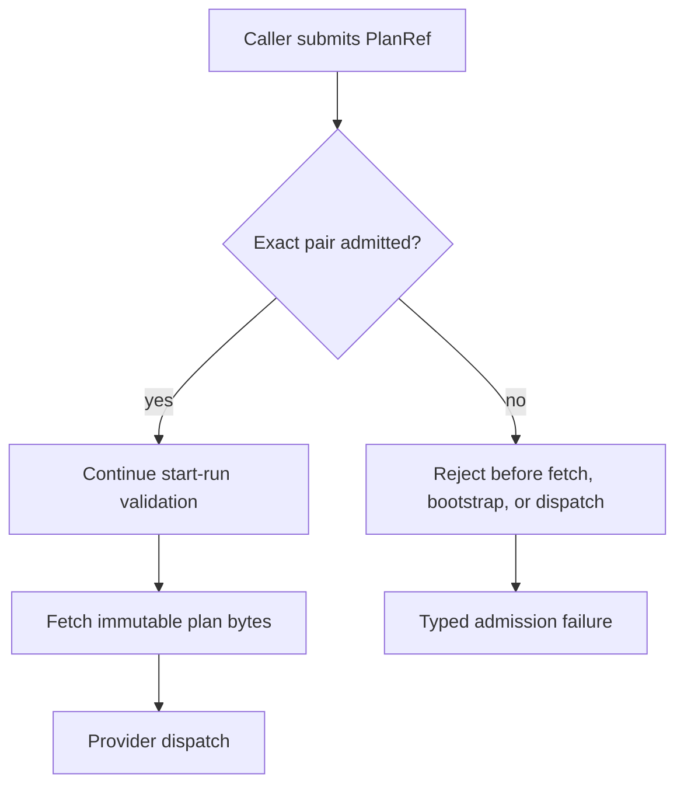

# Plan Admission User Stories

These stories define the executable scenarios for the `ExecutionPlan`
`planVersion` and `schemaVersion` admission boundary.

## Scope

The plan admission component answers one question before plan fetch, run
creation, or provider dispatch:

> Is this exact `(planVersion, schemaVersion)` pair admitted by this runtime?

It does not verify plan content hash, tenant access, plan storage, planner
emission, or provider execution.

## Stories

| ID        | Story                                                                               | Acceptance scenario                                                                                                    |
| --------- | ----------------------------------------------------------------------------------- | ---------------------------------------------------------------------------------------------------------------------- |
| `US-PA-1` | As a runtime operator, I want the current plan/schema pair admitted.                | Given the current pair `(1.0, v1.2)`, when admission runs, then the pair is accepted.                                  |
| `US-PA-2` | As a runtime operator, I want future schemas rejected until deliberately admitted.  | Given an unsupported future schema `v1.future`, when admission runs, then the pair is rejected before provider work.   |
| `US-PA-3` | As a runtime operator, I want older schemas rejected by default after the hard cut. | Given an older schema `v1.0`, when admission runs, then the pair is rejected even though the plan version is current.  |
| `US-PA-4` | As a contract maintainer, I want unknown plan versions rejected.                    | Given an unknown plan version `9.0`, when admission runs, then the pair is rejected even if the schema is current.     |
| `US-PA-5` | As an engine maintainer, I want blank values treated as invalid ingress.            | Given blank admission inputs, when admission runs, then the engine raises the typed schema-version error.              |
| `US-PA-6` | As a platform owner, I want unsupported pairs rejected before side effects.         | Given any unsupported pair, when `startRun` validates preconditions, then no run is created and no adapter dispatches. |
| `US-PA-7` | As a reviewer, I want renamed admission surfaces protected from old naming drift.   | Given a renamed admission surface, when architecture tests run, then retired names and missing docs fail the build.    |

## Negative Scenarios

- Future schema: `planVersion = 1.0`, `schemaVersion = v1.future`.
- Older schema: `planVersion = 1.0`, `schemaVersion = v1.0`.
- Unknown plan version: `planVersion = 9.0`, `schemaVersion = v1.2`.
- Blank plan version: `planVersion = ""`, `schemaVersion = v1.2`.
- Blank schema version: `planVersion = 1.0`, `schemaVersion = ""`.
- Documentation drift: component guide, mailbox analysis, or owned-concern
  docblocks missing after a semantic change.

## Scenario Flow

## Test Mapping

| Scenario family         | Test surface                                                              |
| ----------------------- | ------------------------------------------------------------------------- |
| Current admitted pair   | `packages/@dvt/contracts/test/plan-admission-matrix.contract.test.ts`     |
| Negative pair cases     | `packages/@dvt/contracts/test/plan-admission-matrix.contract.test.ts`     |
| No-dispatch behavior    | `packages/@dvt/engine/test/core/WorkflowEngine.test.ts`                   |
| Semantic documentation  | `packages/@dvt/contracts/test/plan-admission-matrix.architecture.test.ts` |
| Naming drift prevention | `packages/@dvt/contracts/test/plan-admission-matrix.architecture.test.ts` |
