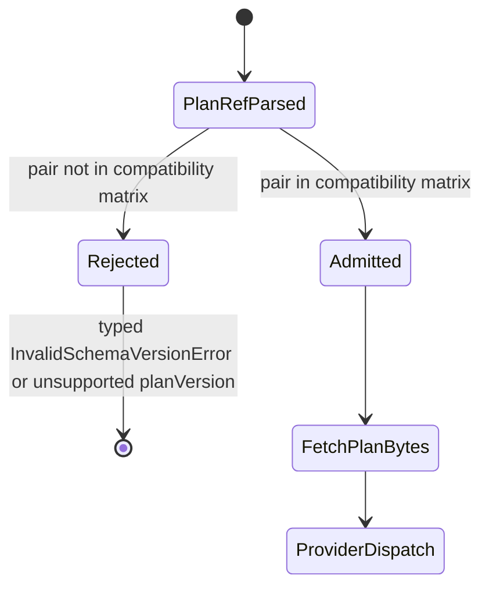
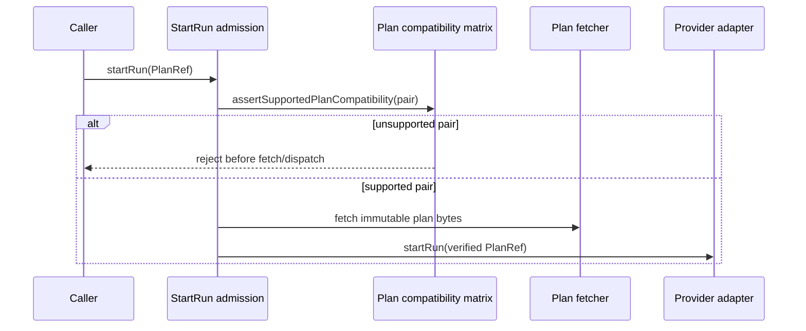

# Plan Admission Matrix

This component note defines how start-run admission binds `planVersion` and
`schemaVersion` before the engine fetches plan bytes or dispatches to a
provider.

## Owned Concern

The admission matrix owns the executable answer to this question:

> Can this runtime admit the `PlanRef` pair
> `(planVersion, schemaVersion)`?

It is a current-admission surface. It does not own plan hashing, plan storage,
adapter execution, or planner emission policy. Those remain governed by
ADR-0012, ADR-0017, ADR-0036, and the planner contract pack.

## Public API

Code surface:

- `packages/@dvt/contracts/src/contracts/planner/PlanCompatibility.v1.ts`
- `packages/@dvt/engine/src/contracts/PlanCompatibilityPolicy.ts`

Exports:

- `SUPPORTED_EXECUTION_PLAN_COMPATIBILITY_PAIRS`
- `EXECUTION_PLAN_COMPATIBILITY_MATRIX`
- `EXECUTION_PLAN_COMPATIBILITY_REGISTRY`
- `isSupportedExecutionPlanCompatibility(planVersion, schemaVersion)`
- `assertSupportedPlanCompatibility({ planVersion, schemaVersion })`

Current admitted pair:

| `planVersion` | `schemaVersion` | Status    |
| ------------- | --------------- | --------- |
| `1.0`         | `v1.2`          | `current` |

## Invariants

- Start-run admission MUST reject any undeclared
  `(planVersion, schemaVersion)` pair before adapter dispatch.
- A valid `planVersion` does not make an unknown `schemaVersion` executable.
- A valid `schemaVersion` does not make an unknown `planVersion` executable.
- `schemaVersion = v1.future` is unsupported.
- The engine MUST NOT use a broad `v1.*` prefix rule as runtime compatibility
  truth.
- Older plan/schema pairs remain undeclared unless they are the active pair.

## Transitions

## Runtime Sequence

## Consumers

- `StartRunValidationPolicy` uses the engine policy before run creation.
- `@dvt/contracts` tests guard the canonical matrix surface.
- Engine start-run tests guard negative admission and no-dispatch behavior.

## Hard-Cut Change Rule

Replacing the active pair requires a deliberate bounded change:

1. Extend the plan-version registry if `planVersion` changes.
2. Extend the schema/contract definition if `schemaVersion` changes.
3. Replace the admitted pair in `EXECUTION_PLAN_COMPATIBILITY_MATRIX`.
4. Add negative and positive tests proving old, future, and malformed pairs
   reject.
5. Update ARC-2 evidence and risk entries for contract or engine changes.
