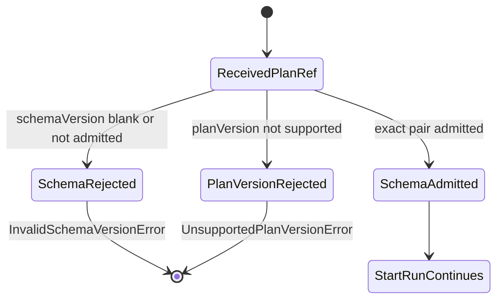
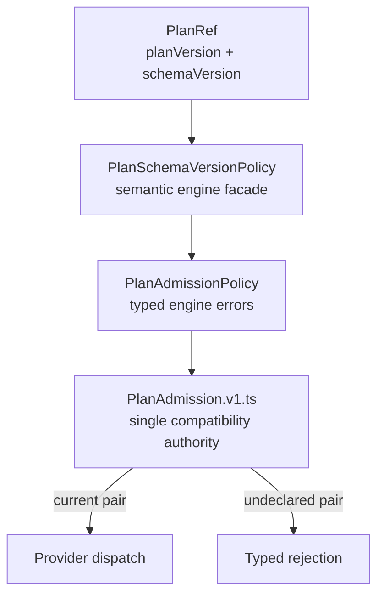

# Plan Schema-Version Admission Component

## Owned Concern

Plan schema-version admission owns the engine ingress decision that an
`ExecutionPlan` schema shape is executable by the current runtime before
provider dispatch.

It does not own plan storage, plan hashing, adapter execution, or matrix data.
Those remain owned by ADR-0012, `PlanAdmission.v1.ts`, and provider adapters.

## Public API

Code surface:

- `packages/@dvt/engine/src/contracts/PlanSchemaVersionPolicy.ts`
- `packages/@dvt/engine/src/contracts/PlanAdmissionPolicy.ts`
- `packages/@dvt/contracts/src/contracts/planner/PlanAdmission.v1.ts`

Exports:

- `PlanSchemaVersionAdmissionInput`
- `assertSupportedPlanSchemaVersion(input)`

The API requires both `planVersion` and `schemaVersion` because ADR-0017 and
ADR-0036 define compatibility as an exact pair, not schema-only semver math.

## Invariants

- The current pair `(1.0, v1.2)` is admitted.
- Blank `schemaVersion` rejects with `InvalidSchemaVersionError`.
- `schemaVersion = v1.future` rejects.
- `schemaVersion = v2.0` rejects.
- Unknown `planVersion` rejects even when `schemaVersion` is current.
- Rejection happens before plan fetch, run bootstrap, or provider dispatch.
- The component delegates to the existing matrix and does not duplicate rows.

## Transitions

## Consumers

- `StartRunValidationPolicy` calls `assertSupportedPlanSchemaVersion` during
  start-run precondition validation.
- `WorkflowEngine` receives the fail-closed behavior through the start-run
  application path.
- Engine contract and architecture tests guard current and negative cases.
- Component docs and mailbox analysis record the Fowler rationale.

## Diagrams

## Drift Guards

- `PlanSchemaVersionPolicy.test.ts` proves current, blank, future, major, and
  unknown-plan-version cases.
- `planSchemaVersionAdmission.architecture.test.ts` proves the semantic policy,
  docs, user stories, and mailbox analysis stay aligned.
- `WorkflowEngine.test.ts` proves unsupported schema versions do not dispatch
  to the adapter and do not create events.

## Command Rail

The governing command rail is `StartRun`. This component is an internal policy
for that command and does not introduce a separate command or query.
