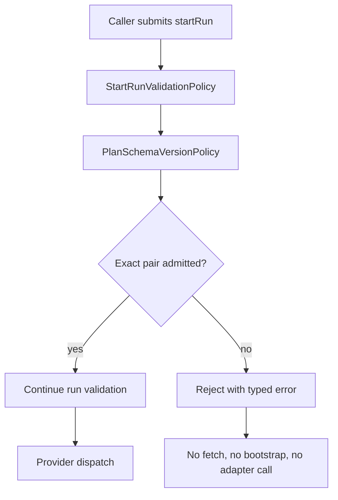

# Plan Schema-Version Admission User Stories

## Scope

These stories cover the `StartRun` command precondition that rejects unsupported
plan schema versions before runtime side effects.

## Stories

- `US-EA-20260429-01-001` - As a runtime operator, I want the current
  `(planVersion, schemaVersion)` pair admitted so current plans continue to
  start.
- `US-EA-20260429-01-002` - As a runtime operator, I want blank schema
  versions rejected so malformed references cannot enter runtime.
- `US-EA-20260429-01-003` - As a platform maintainer, I want `v1.future`
  rejected so a future schema cannot be treated as compatible by prefix.
- `US-EA-20260429-01-004` - As a platform maintainer, I want `v2.0` rejected
  so unsupported major schema lines fail closed.
- `US-EA-20260429-01-005` - As a contract maintainer, I want unknown
  `planVersion` values rejected even with the current schema.
- `US-EA-20260429-01-006` - As an adapter maintainer, I want rejection before
  provider dispatch so adapters never discover unsupported schemas after side
  effects begin.

## Negative Scenarios

| Scenario           | Input                                            | Expected outcome                   |
| ------------------ | ------------------------------------------------ | ---------------------------------- |
| Blank schema       | `planVersion = 1.0`, `schemaVersion = ""`        | `InvalidSchemaVersionError`        |
| Future schema      | `planVersion = 1.0`, `schemaVersion = v1.future` | `InvalidSchemaVersionError`        |
| Major schema drift | `planVersion = 1.0`, `schemaVersion = v2.0`      | `InvalidSchemaVersionError`        |
| Unknown plan line  | `planVersion != 1.0`, `schemaVersion = v1.2`     | `UnsupportedPlanVersionError`      |
| Side-effect guard  | unsupported pair in `startRun`                   | no adapter dispatch, no run events |

## Scenario Flow

## Test Mapping

| Story                   | Test surface                                                |
| ----------------------- | ----------------------------------------------------------- |
| `US-EA-20260429-01-001` | `PlanSchemaVersionPolicy.test.ts`                           |
| `US-EA-20260429-01-002` | `PlanSchemaVersionPolicy.test.ts`                           |
| `US-EA-20260429-01-003` | `PlanSchemaVersionPolicy.test.ts`, `WorkflowEngine.test.ts` |
| `US-EA-20260429-01-004` | `PlanSchemaVersionPolicy.test.ts`                           |
| `US-EA-20260429-01-005` | `PlanSchemaVersionPolicy.test.ts`                           |
| `US-EA-20260429-01-006` | `WorkflowEngine.test.ts`                                    |
