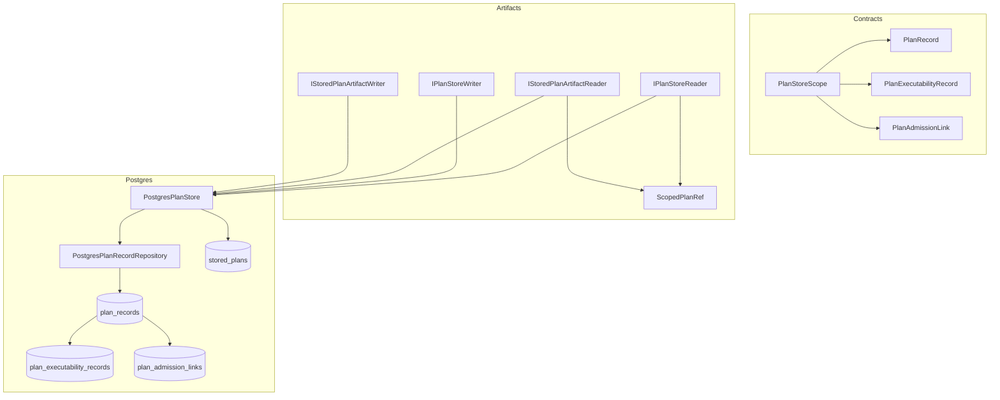
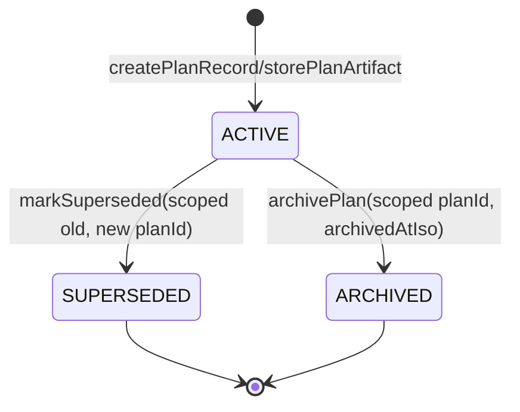
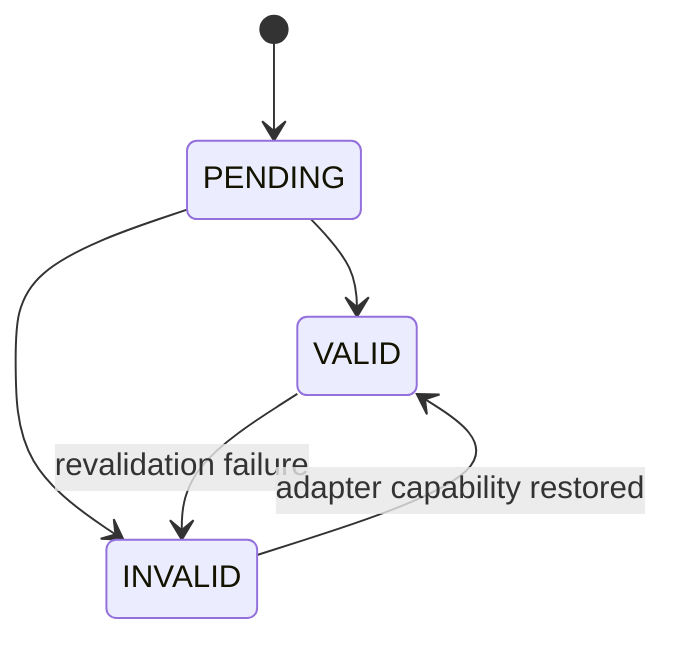
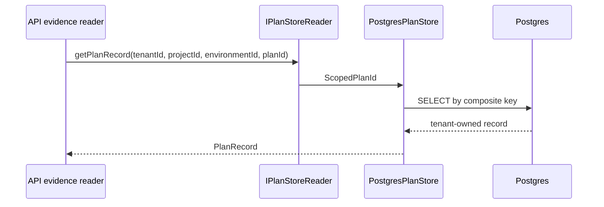
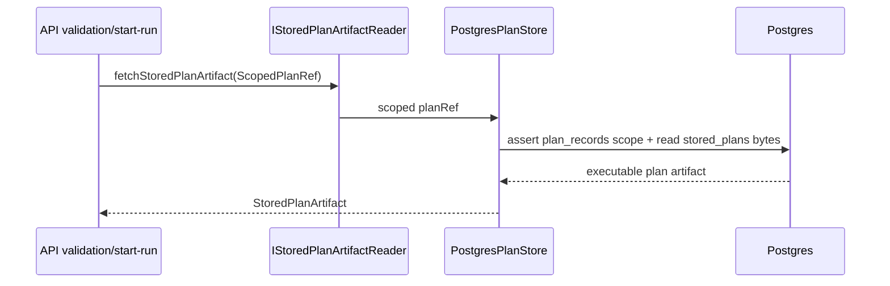

# Plan Store Records Component

## Public API

The component publishes tenant-owned plan-store records for the governed
ExecutionPlan v1 line.

- `PlanStoreScope`: `{ tenantId, projectId, environmentId }`.
- `ScopedPlanId`: `PlanStoreScope + planId`.
- `ScopedPlanRef`: `PlanStoreScope + planRef`.
- `PlanRecord`: tenant-owned persisted plan record.
- `PlanExecutabilityRecord`: adapter-specific executability state.
- `PlanAdmissionLink`: relation between scoped plan and run.
- `IPlanStoreReader`: scoped queries.
- `IPlanStoreWriter`: scoped commands.
- `IStoredPlanArtifactReader`: scoped plan-artifact materialization queries.
- `IStoredPlanArtifactWriter`: stored-plan artifact lifecycle commands.
- `IStoredPlanArtifactStore`: combined artifact lifecycle and materialization
  port for composition roots and adapters that implement both sides.
- `PostgresPlanStore`: Postgres adapter for scoped records plus stored-plan
  artifact lifecycle operations.

## Command And Query API

The component exposes three semantic port groups. They are kept in
`@dvt/artifacts` because ADR-0043 assigns behavior-port ownership to the
Artifacts bounded context, while `@dvt/contracts` owns only the serialized
record shapes.

| Rail     | Port/interface              | API                                                                        | Owner/read model                                    |
| -------- | --------------------------- | -------------------------------------------------------------------------- | --------------------------------------------------- |
| `PS-C01` | `IStoredPlanArtifactWriter` | `storePlanArtifact(input: StorePlanArtifactInput)`                         | Stored-plan artifact lifecycle command              |
| `PS-C07` | `IStoredPlanArtifactWriter` | `markStoredPlanArtifactValid(input: ScopedPlanRef)`                        | Stored-plan artifact validation-state command       |
| `PS-C08` | `IStoredPlanArtifactWriter` | `markStoredPlanArtifactInvalid(input: MarkStoredPlanArtifactInvalidInput)` | Stored-plan artifact validation-state command       |
| `PS-Q06` | `IStoredPlanArtifactReader` | `getStoredPlanValidationRecord(input: ScopedPlanId)`                       | Stored-plan validation read model                   |
| `PS-Q07` | `IStoredPlanArtifactReader` | `fetchStoredPlanArtifactForValidation(input: ScopedPlanRef)`               | Validation materialization read model               |
| `PS-Q08` | `IStoredPlanArtifactReader` | `fetchStoredPlanArtifact(input: ScopedPlanRef)`                            | Runtime materialization read model                  |
| `PS-C02` | `IPlanStoreWriter`          | `createPlanRecord(record: PlanRecord)`                                     | `PlanRecord` aggregate command                      |
| `PS-C03` | `IPlanStoreWriter`          | `recordExecutability(record: PlanExecutabilityRecord)`                     | Plan executability domain-service command           |
| `PS-C04` | `IPlanStoreWriter`          | `markAdmitted(link: PlanAdmissionLink)`                                    | Admission relation command                          |
| `PS-C05` | `IPlanStoreWriter`          | `markSuperseded(input: MarkPlanSupersededInput)`                           | `PlanRecord` lifecycle command                      |
| `PS-C06` | `IPlanStoreWriter`          | `archivePlan(input: ArchivePlanInput)`                                     | `PlanRecord` retention command                      |
| `PS-Q01` | `IPlanStoreReader`          | `getPlanRecord(input: ScopedPlanId)`                                       | Plan record read model                              |
| `PS-Q02` | `IPlanStoreReader`          | `getPlanRecordByRef(input: ScopedPlanRef)`                                 | Plan record by stored artifact reference read model |
| `PS-Q03` | `IPlanStoreReader`          | `listExecutabilityByAdapter(input: ScopedPlanExecutabilityQuery)`          | Adapter executability read model                    |
| `PS-Q04` | `IPlanStoreReader`          | `getAdmissionLinks(input: ScopedPlanId)`                                   | Admission-link read model                           |
| `PS-Q05` | `IPlanStoreReader`          | `getSupersession(input: ScopedPlanId)`                                     | Supersession read model                             |

`IStoredPlanArtifactStore` is only a composition convenience:
`IStoredPlanArtifactWriter & IStoredPlanArtifactReader`. It is not a fourth
semantic rail and must not be used to hide command/query ownership.

## Invariants

- `stored_plans.plan_id` remains a tenant-neutral content artifact identity.
- `plan_records` is tenant-owned and keyed by
  `(tenant_id, project_id, environment_id, plan_id)`.
- `PlanRecord.canonicalPlanJson.metadata.ownership` is required and must match
  the top-level `PlanStoreScope`.
- Executability and admission rows must reference the same scoped plan record.
- Stored-plan artifact materialization is canonical in `@dvt/artifacts`; API,
  planner, and engine must not redeclare duplicate artifact lifecycle ports.
- Artifact fetches for runtime or validation accept `ScopedPlanRef`, not a
  naked `PlanRef`.
- A `PlanRecord` can be `ACTIVE`, `SUPERSEDED`, or `ARCHIVED`.
- `ARCHIVED` records require `archivedAtIso`.
- `PlanAdmissionLink` does not mutate `PlanRecord.state`.
- No compatibility shim exists for an unscoped plan-record command or query.
  Missed consumers must fail fast in tests or type-checks.
- Existing unscoped plan-record tables are not silently upgraded; schema
  migration must fail fast and require explicit remediation.

## Component Map

## Transitions

Executability is independent from plan-record state:

## Consumers

- API run-status evidence reads use scoped run metadata to resolve a plan
  record.
- API preview and planner-backed start-run write stored-plan artifacts through
  `IStoredPlanArtifactWriter`.
- Runtime dispatch and validation flows materialize executable bytes through
  `IStoredPlanArtifactReader` with `ScopedPlanRef`.
- Postgres read models use scoped keys for records, executability, and
  admission.
- Governance status uses this component to classify `SYS-PLANSTORE-POSTGRES`
  drift.

## User Stories

See
[plan-store-records-user-stories.md](./plan-store-records-user-stories.md).

## Diagrams

## Drift Guards

- Architecture test:
  `packages/@dvt/contracts/test/plan-store-records.architecture.test.ts`.
- Contract validation:
  `packages/@dvt/contracts/test/validation/plan-records.ts`.
- Shape sync:
  `packages/@dvt/contracts/test/plan-store-records-shape-sync.test.ts`.
- Postgres SQL invariant tests:
  `packages/@dvt/adapter-postgres/test/PostgresPlanStore.sql.test.ts`.
- Engine boundary architecture test:
  `packages/@dvt/engine/test/architecture/workflowEngineBoundaryOwnership.architecture.test.ts`.
