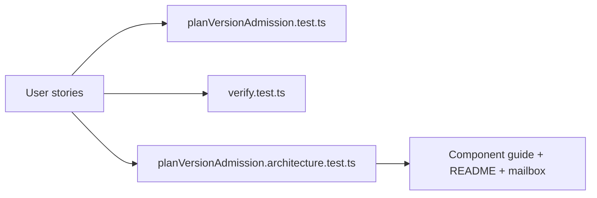

# Plan Verifier Admission User Stories

| Story      | Actor                      | Scenario                                                | Acceptance                                                                                                            | Negative coverage                                                                                           |
| ---------- | -------------------------- | ------------------------------------------------------- | --------------------------------------------------------------------------------------------------------------------- | ----------------------------------------------------------------------------------------------------------- |
| US-PVA-001 | Runtime adapter maintainer | Admit the current execution-plan pair                   | `verifyPlanAdmissionOrThrow({ planVersion: "1.0", schemaVersion: "v1.2", runtime })` returns for every known runtime. | Unknown runtime rejects before provider execution.                                                          |
| US-PVA-002 | Runtime adapter maintainer | Reject a future schema under the current plan version   | `planVersion = "1.0"` with `schemaVersion = "v1.future"` throws before hashing.                                       | The test message names `schemaVersion`.                                                                     |
| US-PVA-003 | Runtime adapter maintainer | Reject an unknown plan version under the current schema | `planVersion = "1.0-unsupported"` with `schemaVersion = "v1.2"` throws before hashing.                                | The test message names `planVersion`.                                                                       |
| US-PVA-004 | Operator                   | Avoid wasted hash work for non-admitted pairs           | `verifyPlanOrThrow` performs pair admission before `sha256(canonicalPlanCoreJson)`.                                   | Unsupported pairs never reach provider execution through verifier consumers.                                |
| US-PVA-005 | Reviewer                   | Detect documentation drift                              | Component guide, README, and architecture test all name `EXECUTION_PLAN_ADMISSION_MATRIX`.                            | `PLAN_RUNTIME_ADMISSION_MATRIX`, `admittedPlanVersions`, and semver fallback terms fail architecture tests. |
| US-PVA-006 | Architect                  | Compare with mature systems                             | The mailbox records Fowler comparison, antipatterns, grouping, teachings, repetitions, opportunities, and drift.      | Missing mailbox reference fails component documentation guard.                                              |

## Coverage Map

