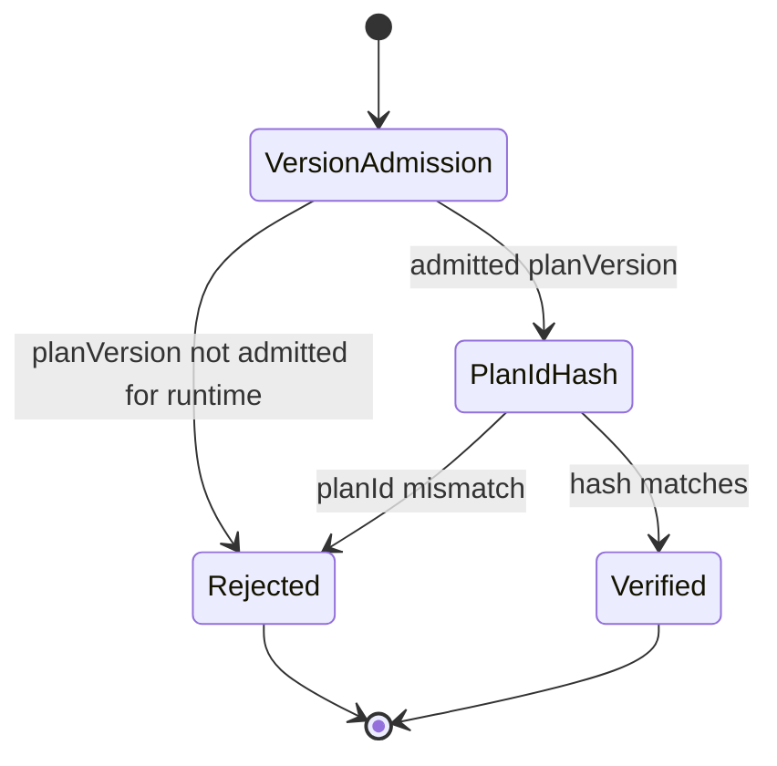
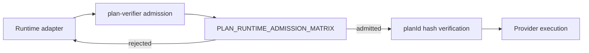

# Plan Verifier Admission

`@dvt/plan-verifier` owns deterministic plan verification helpers shared by
runtime adapters. Its plan-version concern is admission, not semver
compatibility.

## Owned Concern

The component answers:

> Is this `planVersion` admitted for this runtime before plan integrity work
> continues?

It does not own planner emission, plan storage, engine start-run policy, or
step execution.

## Public API

Code surface:

- `packages/@dvt/plan-verifier/src/planVersion.ts`
- `packages/@dvt/plan-verifier/src/verify.ts`

Exports:

- `PLAN_RUNTIME_ADMISSION_MATRIX`
- `getSupportedPlanVersionsForRuntime(runtime)`
- `verifyPlanVersionOrThrow({ planVersion, runtime })`
- `verifyPlanOrThrow({ canonicalPlanCoreJson, planId, planVersion, runtime })`

## Invariants

- Active development admits only `planVersion = 1.0`.
- Runtime admission is explicit; there is no major/minor fallback.
- Unsupported `planVersion` values fail before plan-id hashing.
- Plan-id verification still requires canonical JSON produced by the planner.
- The verifier MUST NOT introduce a second plan-version truth beside
  ADR-0036 and the contracts registry.

## Transitions

## Consumers

- Runtime adapters call verifier helpers before provider-specific execution.
- Contract and adapter tests use the verifier to prove negative admission and
  integrity behavior.
- Architecture tests guard against reintroducing semver compatibility paths.

## User Stories

- As a runtime adapter maintainer, I want `planVersion = 1.0` admitted for my
  runtime so current plans execute.
- As a runtime adapter maintainer, I want non-`1.0` plan versions rejected so a
  local future literal cannot bypass governance.
- As a reviewer, I want no `supportedMajor` or `strictSameMinor` API so
  semver compatibility does not reappear as a parallel path.
- As an operator, I want plan-id hashing skipped for non-admitted versions so
  failures are cheaper and clearer.

## Diagrams

## Drift Guards

- `planVersionAdmission.architecture.test.ts` rejects compatibility matrix
  names and legacy semver parameters.
- `planVersionAdmission.test.ts` proves current admission and unsupported
  negative cases.
- `verify.test.ts` proves `verifyPlanOrThrow` checks admission before hashing.
