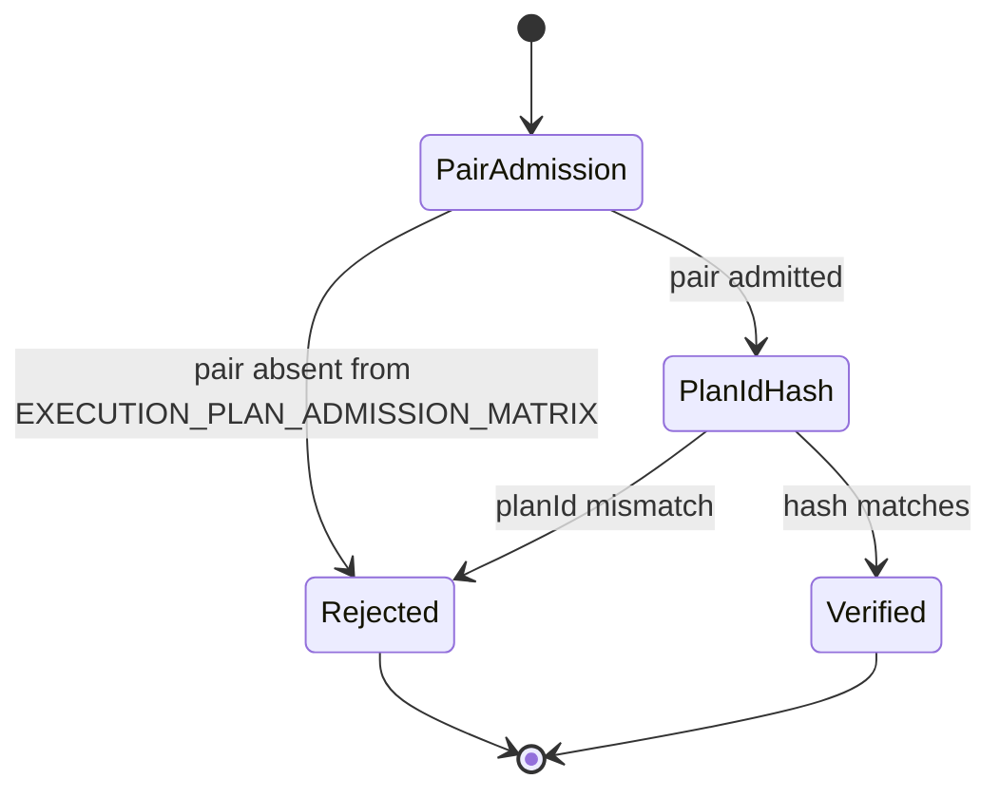
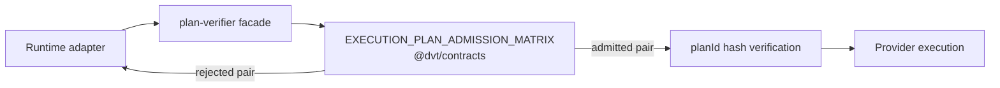
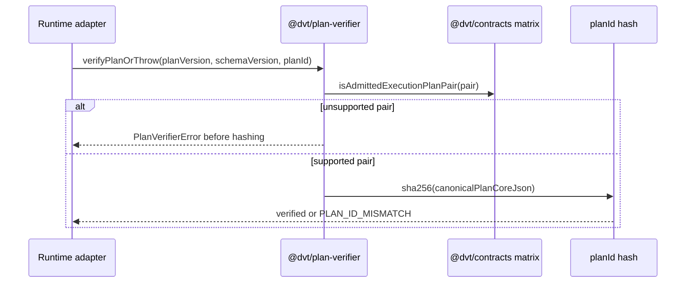

# Plan Verifier Admission

`@dvt/plan-verifier` owns deterministic plan verification helpers shared by
runtime adapters. Its admission concern is the adapter-side enforcement facade
for the canonical `planVersion` and `schemaVersion` compatibility matrix owned
by `@dvt/contracts`.

## Owned Concern

The component answers:

> Is this runtime allowed to continue with this
> `(planVersion, schemaVersion)` pair before plan integrity work starts?

It does not own planner emission, plan storage, engine start-run policy,
contract version publication, or step execution.

## Public API

Code surface:

- `packages/@dvt/plan-verifier/src/planVersion.ts`
- `packages/@dvt/plan-verifier/src/verify.ts`

Exports:

- `EXECUTION_PLAN_ADMISSION_MATRIX`
- `SUPPORTED_EXECUTION_PLAN_ADMISSION_PAIRS`
- `getSupportedPlanAdmissionPairsForRuntime(runtime)`
- `verifyPlanAdmissionOrThrow({ planVersion, schemaVersion, runtime })`
- `verifyPlanOrThrow({ canonicalPlanCoreJson, planId, planVersion, schemaVersion, runtime })`

The exported matrix is re-exported from `@dvt/contracts`; the verifier does not
publish a second `PLAN_RUNTIME_ADMISSION_MATRIX`.

## Invariants

- Runtime admission is explicit by pair; there is no major/minor fallback.
- `planVersion = 1.0` only admits `schemaVersion = v1.2` while that pair is the
  current contracts matrix entry.
- A supported `planVersion` does not admit an unsupported `schemaVersion`.
- A supported `schemaVersion` does not admit an unsupported `planVersion`.
- Unsupported pairs fail before plan-id hashing.
- Plan-id verification still requires canonical JSON produced by the planner.
- The verifier MUST NOT introduce a second admission truth beside
  `EXECUTION_PLAN_ADMISSION_MATRIX`.

## Transitions

## Consumers

- Runtime adapters call verifier helpers before provider-specific execution.
- Planner and engine tests use the same matrix to prove cross-runtime
  admission semantics.
- Architecture tests guard against reintroducing local runtime matrices or
  semver compatibility paths.

## User Stories

The executable story set lives in
[Plan verifier admission user stories](./plan-verifier-admission-user-stories.md).
It covers admitted current pairs, unsupported schema values, unsupported plan
values, hash ordering, documentation drift, and mature-system comparison.

## Diagrams

## Drift Guards

- `planVersionAdmission.architecture.test.ts` rejects local runtime admission
  matrices, legacy semver parameters, and docs without `schemaVersion`.
- `planVersionAdmission.test.ts` proves current pair admission plus negative
  pair cases.
- `verify.test.ts` proves `verifyPlanOrThrow` checks pair admission before
  hashing.
- Fowler analysis is recorded in
  `buzon/20260514-codex-fowler-ea-20260429-02-plan-admission-matrix-analysis.md`.
