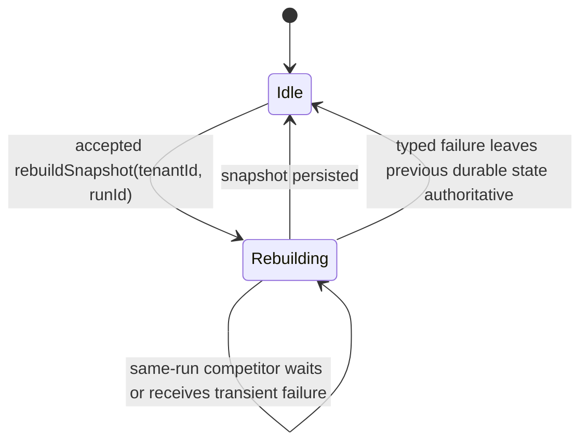
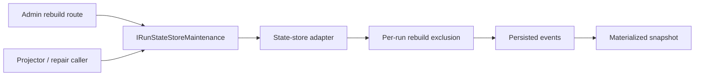

# Snapshot Rebuild Concurrency Component

## Owned Concern

Owns the portable concurrency invariant for
`IRunStateStoreMaintenance.rebuildSnapshot`: rebuilding a materialized snapshot
is a tenant-scoped maintenance command that mutates derived state and must be
serialized per `(tenantId, runId)` across concurrent callers.

## Public API

```ts
interface IRunStateStoreMaintenance {
  rebuildSnapshot(tenantId: string, runId: string): Promise<WorkflowSnapshot>;
}
```

The command:

- validates tenant ownership before replay and mutation;
- replays persisted events in `runSeq ASC` order;
- overwrites or advances the durable materialized snapshot;
- returns the rebuilt `WorkflowSnapshot`;
- rejects missing or cross-tenant runs with `RUN_NOT_FOUND` semantics.

## Invariants

1. For the same `(tenantId, runId)`, only one rebuild may mutate the durable
   snapshot at a time.
2. Competing rebuild commands for the same run must either serialize behind the
   active rebuild or fail with a typed transient concurrency error.
3. The contract does not require PostgreSQL advisory locks; it requires
   equivalent mutual exclusion semantics.
4. Rebuild replay consumes the event log ordered by `runSeq ASC`.
5. Snapshots remain derived state; the append-only event log remains the source
   of truth.
6. Tenant ownership is checked before acquiring rebuild ownership or mutating a
   snapshot row.

## Transitions



## Component Map



## Consumers

- API admin rebuild route: operator repair command.
- Projector and repair workers: background catch-up or recovery.
- State-store adapters: implement the same concurrency invariant with their
  backend-native mechanism.
- Tests and architecture guards: prevent regression to Postgres-only semantics.

## Adapter Guidance

PostgreSQL uses transaction-scoped advisory locks today. Other adapters may use
serializable transactions, backend leases, compare-and-swap on a snapshot
version, or a stored procedure that guarantees one active writer per run. The
implementation choice is private to the adapter as long as the public invariant
holds.
