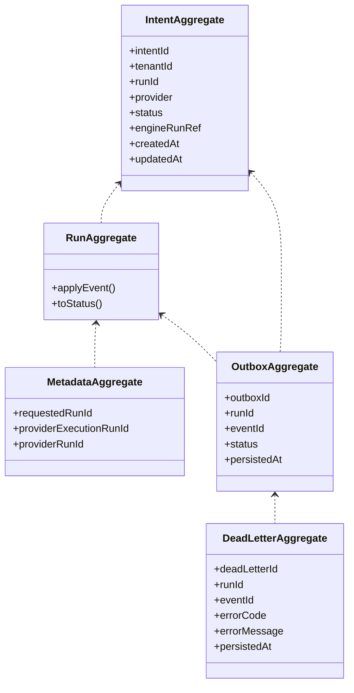

# Aggregate Model — DVT Engine

## Canonical Aggregates

### RunAggregate

- **Root:** RunAggregate
- **Fields:**
  - runId
  - status
  - paused
  - cancelling
  - startedAt
  - completedAt
  - gatewayDecisions
  - steps
- **Events:**
  - RunQueued
  - RunStarted
  - RunPaused
  - RunResumed
  - RunCancelRequested
  - RunCancelled
  - RunCompleted
  - RunFailed
  - StepStarted
  - StepCompleted
  - StepFailed
  - StepSkipped
- **Snapshot:** WorkflowSnapshot
- **Projection:** RunStatusSnapshot

### MetadataAggregate

- **Root:** RunMetadata
- **Fields:**
  - requestedRunId
  - providerExecutionRunId
  - providerRunId
- **Projection:** Used for correlation, provider reconciliation, and audit.

## Supporting Aggregates

### OutboxAggregate

- **Root:** OutboxRecord
- **Fields:**
  - outboxId
  - runId
  - eventId
  - status
  - persistedAt
- **Projection:** Outbox delivery status, DLQ tracking.

### DeadLetterAggregate

- **Root:** DeadLetterRecord
- **Fields:**
  - deadLetterId
  - runId
  - eventId
  - errorCode
  - errorMessage
  - persistedAt
- **Projection:** Dead letter queue, error audit.

## IntentAggregate (GAP: Not fully formalized)

- **Root:** StartRunIntent
- **Fields:**
  - intentId
  - tenantId
  - runId
  - provider
  - status (enum: PENDING, DISPATCHED, RESOLVED, EXPIRED; missing ERROR/DLQ)
  - engineRunRef
  - createdAt
  - updatedAt
- **Projection:** Intent lifecycle, reconciliation, crash consistency, orphan detection.
- **Dependencies:**
  - RunMetadata (provider verification)
  - OutboxAggregate (failed intents → DLQ)
- **Gaps:**
  - No formal aggregate for reconciliation, audit, or error handling.
  - No idempotency key or duplicate policy documented.
  - No integration with DLQ for failed intents.
  - Tenant isolation not fully enforced/documented.
  - Status enum lacks ERROR/DLQ states.
  - No audit trail for status transitions.
  - Constraints on engineRunRef shape incomplete (missing runId, etc).
  - No automatic expiration for orphaned intents.

## Aggregate Relationships

## Delivery Gaps / Outstanding Issues

### Intent Store & Reconciliation

- GAP: No formal aggregate for intent log and reconciliation.
- GAP: No explicit relationship between intents, run metadata, and provider verification.
- GAP: Crash consistency and reconciliation not fully modeled.
- GAP: No audit aggregate for intent transitions.
- GAP: Tenant isolation not fully enforced.
- GAP: Error handling and compensation not modeled as aggregates.
- GAP: No integration with outbox/DLQ for failed or unreconciled intents.
- GAP: Idempotency and duplicate dispatch policy not documented.

### Schema Migration & Operational Risks

- GAP: Status enum limited; missing ERROR/DLQ states.
- GAP: Constraints on engineRunRef shape incomplete.
- GAP: No constraint for intent uniqueness across all relevant states.
- GAP: No automatic expiration for orphaned intents.
- GAP: No audit trail for schema migrations or status changes.
- GAP: No integration with error, DLQ, reconciliation, and audit aggregates.
- GAP: Migration concurrency risks (advisory lock, rollback).

## Dependencies

- RunAggregate: Core lifecycle, event sourcing.
- MetadataAggregate: Provider reconciliation, audit.
- OutboxAggregate: Delivery, DLQ, error tracking.
- DeadLetterAggregate: Error audit, DLQ.
- IntentAggregate: Intent lifecycle, reconciliation, crash consistency.

---

**Update this model as new aggregates are formalized or gaps are closed. Gaps and risks are explicitly marked for visibility.**
