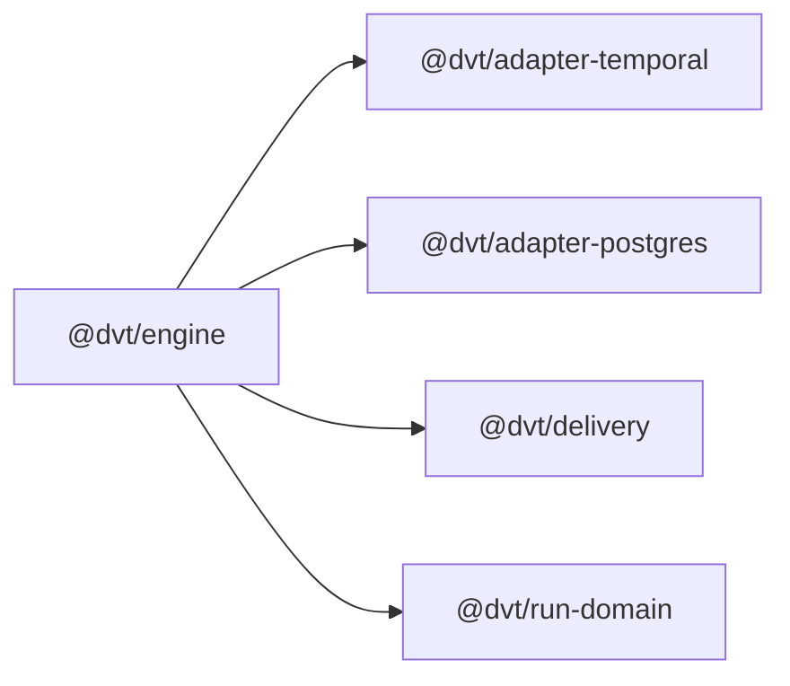
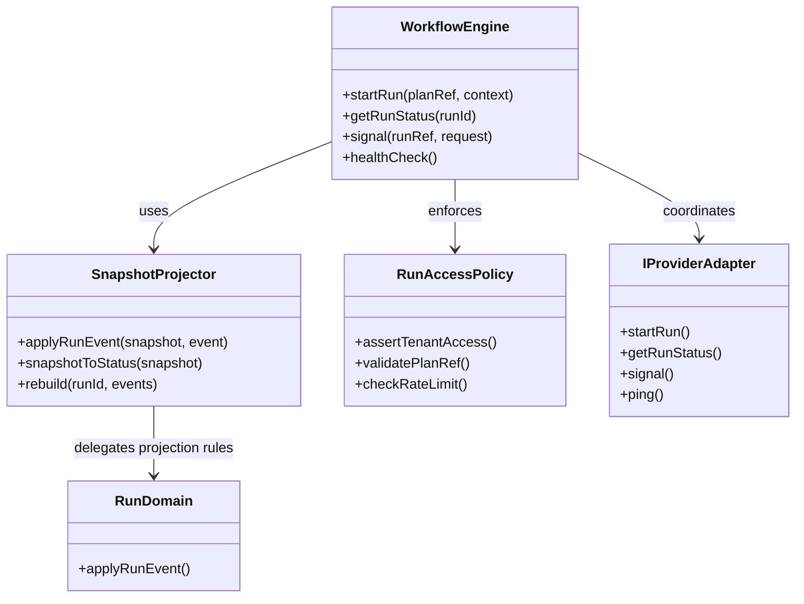
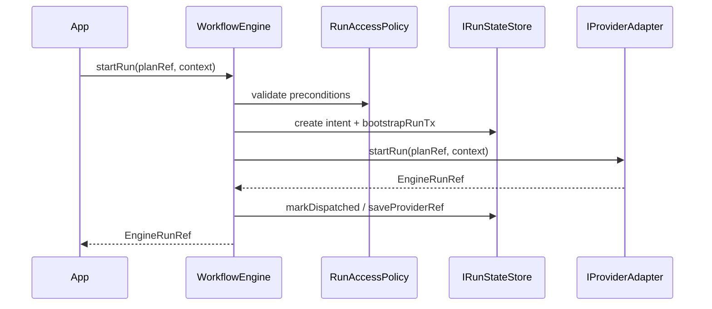

# @dvt/engine

## Component Map

## Location

- `packages/@dvt/engine`

## Domain

- [Execution Domain](../../domain-execution.md)

## Main Responsibilities

- Orchestrate run lifecycle through `WorkflowEngine`.
- Enforce execution invariants such as adapter registration, plan integrity,
  access policy, crash consistency, and deterministic event emission.
- Expose projected status reads through `SnapshotProjector` and the run-state
  store boundary.
- Coordinate provider adapters without delegating semantic ownership to them.

## Internal Shape

### `WorkflowEngine`

Current facade and orchestration service. Responsibilities include:

- `startRun`, `getRunStatus`, `signal`, `healthCheck`
- intent-log-aware crash consistency
- provider registration and capability checks

### `SnapshotProjector`

Engine-local helper for replaying events into a `WorkflowSnapshot` and deriving
`RunStatusSnapshot`. Delegates mutation rules to `@dvt/run-domain`.

### `RunAccessPolicy`

Grouped policy boundary that encapsulates tenant access checks, plan reference
validation, and rate-limit validation.

## Structure Diagram

## Sequence: `startRun`

## Constraints and Invariants

| Constraint / Invariant | Where Enforced                                           | Description                                                                          |
| ---------------------- | -------------------------------------------------------- | ------------------------------------------------------------------------------------ |
| PlanRef integrity      | `WorkflowEngine`, `RunAccessPolicy`                      | `PlanRef` must be valid and reference the expected plan/version/hash.                |
| Adapter registration   | `WorkflowEngine`                                         | Provider adapter must be registered before orchestration continues.                  |
| Crash consistency      | `WorkflowEngine`, intent log, state store                | `startRun` preserves recovery semantics through pre-dispatch intent handling.        |
| Event sourcing         | `WorkflowEngine`, `SnapshotProjector`, `@dvt/run-domain` | State is derived from canonical events and deterministic replay.                     |
| Access policy          | `RunAccessPolicy`                                        | Tenant, project, environment, and rate-limit checks happen before lifecycle changes. |
| Determinism            | `SnapshotProjector`, `@dvt/run-domain`                   | Same event stream produces the same logical state and hash.                          |
| Read-model separation  | `WorkflowEngine`, state store                            | Default status reads use projected state rather than live provider lookup.           |

## Key Files

- `packages/@dvt/engine/src/core/WorkflowEngine.ts`
- `packages/@dvt/engine/src/core/SnapshotProjector.ts`
- `packages/@dvt/engine/src/security/RunAccessPolicy.ts`
- `packages/@dvt/run-domain/src/applyRunEvent.ts`

## Canonical Engine References

- [Engine index](../../engine/index.md)
- [C4 view](../../engine/c4-engine.md)
- [Contract versioning policy](../../engine/VERSIONING.md)
- [Contract registry](../../engine/contracts/README.md)
- [Security policies](../../engine/security/THREAT_MODEL.md)
- [Operations and runbooks](../../engine/ops/observability.md)

## Related

- [Component Map](../../component-map.md)
- [Execution Domain](../../domain-execution.md)
- [Delivery Component](../delivery/index.md)
