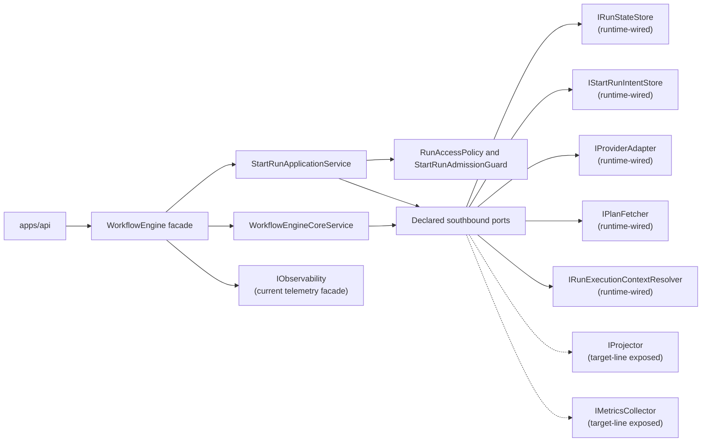

---
title: '@dvt/engine'
status: Active
owner: Architecture / Engine
last_reviewed: 2026-04-09
---

# @dvt/engine

`@dvt/engine` is the canonical component home for the execution core package.

This page is the single active home for the component's public surface, the
main methods a caller cares about, and the supporting folders that explain how
this component is wired today.

## Southbound Port Surface

`@dvt/engine` exposes seven southbound ports as its declared architecture
surface. Five are wired on the current runtime path; two remain intentionally
exposed as target-line seams that the architecture keeps visible while their
dedicated runtime adoption is still in progress.

This table is the canonical doc-level inventory for engine port membership and
posture. Deeper architecture pages refine usage and ownership, but they should
not redefine which ports belong to the seven-port surface.

| Port                           | Current posture       | Notes                                                                                         |
| ------------------------------ | --------------------- | --------------------------------------------------------------------------------------------- |
| `IRunStateStore`               | `runtime-wired`       | Canonical run metadata, event log, snapshot, and maintenance store seam                       |
| `IStartRunIntentStore`         | `runtime-wired`       | Crash-consistency seam for pre-dispatch start-run intents                                     |
| `IProviderAdapter`             | `runtime-wired`       | Provider runtime seam                                                                         |
| `IPlanFetcher`                 | `runtime-wired`       | Plan/artifact fetch seam on the start-run path                                                |
| `IRunExecutionContextResolver` | `runtime-wired`       | Conditional seam when `runExecutionContextRef` is supplied                                    |
| `IProjector`                   | `target-line exposed` | Kept visible as a projector seam even though mainline uses `SnapshotProjector` directly today |
| `IMetricsCollector`            | `target-line exposed` | Kept visible as a telemetry seam even though mainline injects `IObservability` today          |

`IObservability` remains the current telemetry facade in the shipped runtime.
It is not counted inside the seven-port southbound surface.

Target note:

- the active transformation-runtime target keeps executor seams capability-led,
  not vendor-led
- PostgreSQL is the first implementation of the relational SQL execution
  capability, not the semantic shape of the engine core
- see
  [workflow-engine-target-architecture.v1](./architecture/workflow-engine-target-architecture.v1.md)
  for the target seam and its rationale

## Current Responsibilities

- own run lifecycle semantics and provider dispatch;
- enforce run access policy, plan integrity, and start-run admission;
- project and enrich run status from state-store reads and emitted events;
- expose operational health and maintenance services around the workflow
  runtime.

## Public Operations

- `WorkflowEngine.startRun(...)`
- `WorkflowEngine.recoverRun(...)`
- `WorkflowEngine.cancelRun(...)`
- `WorkflowEngine.getRunStatus(...)`
- `WorkflowEngine.enrichRunStatus(...)`
- `WorkflowEngine.signal(...)`
- `WorkflowEngine.healthCheck()`
- `StartRunApplicationService.startRun(...)`

## Primary Code Anchors

- package entry:
  [index.ts](../../../../packages/@dvt/engine/src/index.ts)
- component facade:
  [WorkflowEngine.ts](../../../../packages/@dvt/engine/src/core/WorkflowEngine.ts)
- start-run application path:
  [StartRunApplicationService.ts](../../../../packages/@dvt/engine/src/application/StartRunApplicationService.ts)
- lifecycle core:
  [WorkflowEngineCoreService.ts](../../../../packages/@dvt/engine/src/core/WorkflowEngineCoreService.ts)
- public contract:
  [IWorkflowEngine.v1_1_1.ts](../../../../packages/@dvt/engine/src/contracts/IWorkflowEngine.v1_1_1.ts)

## Component Topology

## Component Folders

- [Architecture](./architecture/index.md): structure, C4, workflows, current
  core shape, and target shape.
- [Adapters](./adapters/index.md): provider/state-store adapter surfaces.
- [Contracts](./contracts/index.md): engine contracts, schemas, and versioning
  policy.
- [Operations](./ops/index.md): observability, runbooks, metrics, and runtime
  posture.
- [Security](./security/index.md): threat model, invariants, provenance, and
  tenant isolation.
- [Roadmap](./roadmap/index.md): engine-specific projection.
- [Reviews](./reviews/index.md): audits and analysis notes.
- [Developer tooling](./dev/index.md): determinism and contract-tooling docs.
- [Schemas](./schemas/index.md): signal schema pack and related machine-readable
  artifacts.

## Access Map

- `architecture/`
  - [index](./architecture/index.md)
  - [core](./architecture/core.md)
  - [workflows](./architecture/workflows.md)
  - [c4-engine](./architecture/c4-engine.md)
  - [workflow-engine-subsystem-context](./architecture/workflow-engine-subsystem-context.md)
  - [workflow-engine-target-architecture.v1](./architecture/workflow-engine-target-architecture.v1.md)
- `adapters/`
  - [index](./adapters/index.md)
  - [temporal](./adapters/temporal/index.md)
  - [conductor](./adapters/conductor/index.md)
  - [state-store](./adapters/state-store/index.md)
- `contracts/`
  - [index](./contracts/index.md)
  - [engine](./contracts/engine/index.md)
  - [capabilities](./contracts/capabilities/index.md)
  - [security](./contracts/security/index.md)
  - [state-store](./contracts/state-store/index.md)
  - [extensions](./contracts/extensions/index.md)
  - [schemas](./contracts/schemas/index.md)
  - [versioning](./contracts/VERSIONING.md)
- `ops/`
  - [index](./ops/index.md)
  - [runbooks](./ops/runbooks/index.md)
- `security/`
  - [index](./security/index.md)
- `roadmap/`
  - [index](./roadmap/index.md)
- `reviews/`
  - [index](./reviews/index.md)
- `dev/`
  - [index](./dev/index.md)
- `schemas/`
  - [index](./schemas/index.md)
  - [signal](./schemas/signal/index.md)

## Related Pages

- [Canonical run lifecycle subsystem](../../system/subsystems/canonical-run-lifecycle/index.md)
- [Read subsystem](../../system/subsystems/read/index.md)
- [DVT Component Map](../../component-map.md)
- [System Delivery Status](../../system-delivery-status.md)
