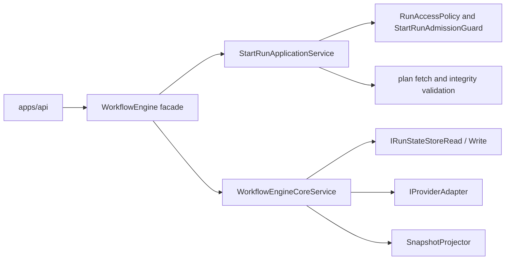

# @dvt/engine

`@dvt/engine` is the canonical component home for the execution core package.

Subsystem context and longer execution narratives still live under
`docs/architecture/engine/`, but this page is the single active home for the
component's public surface.

## Current Responsibilities

- own run lifecycle semantics and provider dispatch;
- enforce run access policy, plan integrity, and start-run admission;
- project and enrich run status from state-store reads and emitted events;
- expose operational health and maintenance services around the workflow
  runtime.

## Public Operations

- `WorkflowEngine.startRun(...)`
- `WorkflowEngine.recoverRun(...)`
- `WorkflowEngine.cancelRun(...)`
- `WorkflowEngine.getRunStatus(...)`
- `WorkflowEngine.enrichRunStatus(...)`
- `WorkflowEngine.signal(...)`
- `WorkflowEngine.healthCheck()`
- `StartRunApplicationService.startRun(...)`

## Primary Code Anchors

- package entry:
  [index.ts](../../../../packages/@dvt/engine/src/index.ts)
- component facade:
  [WorkflowEngine.ts](../../../../packages/@dvt/engine/src/core/WorkflowEngine.ts)
- start-run application path:
  [StartRunApplicationService.ts](../../../../packages/@dvt/engine/src/application/StartRunApplicationService.ts)
- lifecycle core:
  [WorkflowEngineCoreService.ts](../../../../packages/@dvt/engine/src/core/WorkflowEngineCoreService.ts)
- public contract:
  [IWorkflowEngine.v1_1_1.ts](../../../../packages/@dvt/engine/src/contracts/IWorkflowEngine.v1_1_1.ts)

## Component Topology

## Supporting Component Pages

- [Core](core.md)
- [Adapters](adapters.md)
- [Contracts](contracts.md)
- [Capabilities](capabilities.md)
- [Security](security.md)
- [Operations](operations.md)
- [Workflows](workflows.md)

## Related Pages

- [Execution subsystem compatibility pack](../../engine/index.md)
- [Read subsystem](../../subsystems/read/index.md)
- [DVT Component Map](../../component-map.md)
- [System Delivery Status](../../system-delivery-status.md)
