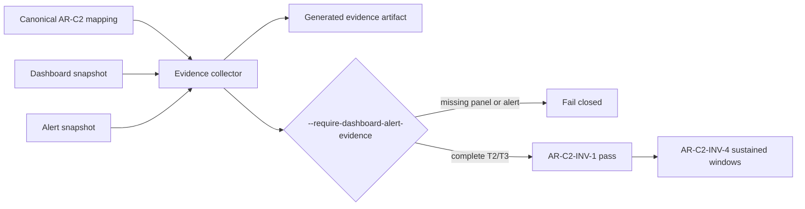
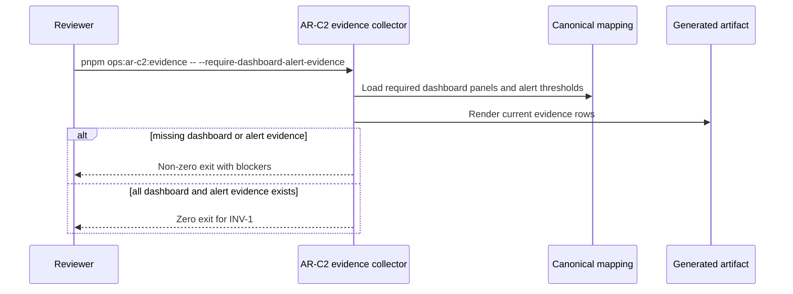

# AR-C2 Immutable Evidence Gate Component

## Owned concern

This component owns the AR-C2 closure assertion that dashboard and alert
evidence is immutable and complete before AR-C2 can be marked done.

It does not own metric emission, live Grafana provisioning, Alertmanager
routing, or sustained validation windows.

## Public API

- Command rail: `AR-C2OperationalEvidenceCommand`.
- CLI surface: `pnpm ops:ar-c2:evidence`.
- Assertion flag: `--require-dashboard-alert-evidence`.
- Optional inputs:
  - `AR_C2_DASHBOARD_SNAPSHOT_FILE`
  - `AR_C2_ALERT_SNAPSHOT_FILE`
  - `AR_C2_METRICS_SNAPSHOT_FILE`
  - `AR_C2_EVIDENCE_OUTPUT_PATH`
- Dashboard snapshot schema:
  - `panels[].panelKey`
  - `panels[].dashboardSystem`
  - `panels[].environment`
  - `panels[].immutableDashboardReference`
  - `panels[].queryExpression`
  - `panels[].capturedAt`
  - `panels[].reviewer`
- Alert snapshot schema:
  - `rules[].thresholdKey`
  - `rules[].alertRuleId`
  - `rules[].expression`
  - `rules[].window`
  - `rules[].severity`
  - `rules[].routingTarget`
  - `rules[].configSource`
  - `rules[].capturedAt`
  - `rules[].reviewer`
- Output artifact:
  `docs/runbooks/ar-c2-evidence-generated-latest.md`.

## Invariants

1. The collector must read signal identity from the canonical AR-C2 mapping.
2. Missing dashboard panels are closure blockers.
3. Missing alert rules are closure blockers.
4. Key-only dashboard or alert snapshots are closure blockers because they do
   not prove immutable references, query expressions, capture metadata, or
   reviewer accountability.
5. A generated artifact with blockers is useful evidence, but not closure
   approval.
6. Sustained window evidence remains owned by `AR-C2-INV-4`.

## Transitions

| State                                                  | Input                  | Result                                             |
| ------------------------------------------------------ | ---------------------- | -------------------------------------------------- |
| No snapshot                                            | assertion flag present | artifact generated, command exits non-zero         |
| Partial dashboard snapshot                             | assertion flag present | missing panel blockers reported                    |
| Partial alert snapshot                                 | assertion flag present | missing alert blockers reported                    |
| Key-only dashboard and alert snapshots                 | assertion flag present | incomplete evidence blockers reported              |
| Complete dashboard and alert snapshots                 | assertion flag present | command exits zero for `AR-C2-INV-1`               |
| Complete dashboard/alert but missing sustained windows | assertion flag present | `AR-C2-INV-1` can pass; `AR-C2-INV-4` remains open |

## Consumers

- Lane C planning closure for `AR-C2` and `AR-C2-INV-1`.
- `docs/runbooks/ar-c2-dashboard-alert-wiring-evidence-20260404.md`.
- `docs/runbooks/ar-c2-evidence-generated-latest.md`.
- `docs/guides/ar-c2-observability-technical-manual-20260404.md`.
- `docs/planning/closeouts/20260404-ar-c2-sla-operational-closure-closeout.md`.

## Diagrams

