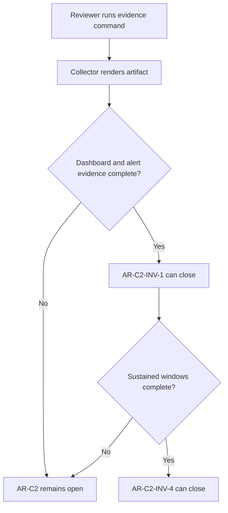

# AR-C2 Immutable Evidence Gate User Stories

## Stories

### US-AR-C2-INV-1-001 Missing evidence blocks closure

As a release reviewer, I want `pnpm ops:ar-c2:evidence` to fail closed when
dashboard panels or alert rules are missing, so AR-C2 cannot be marked done from
documentation intent alone.

Acceptance criteria:

- Given no dashboard snapshot, every required panel is reported as missing.
- Given no alert snapshot, every required threshold rule is reported as missing.
- Given `--require-dashboard-alert-evidence`, the command exits non-zero.

### US-AR-C2-INV-1-002 Complete T2/T3 evidence passes

As an SRE, I want complete dashboard and alert snapshots to satisfy
`AR-C2-INV-1`, so the remaining closure work can focus on sustained validation
windows.

Acceptance criteria:

- Given all mapped panel keys with dashboard system, environment, immutable
  dashboard reference, query expression, capture time, and reviewer, dashboard
  evidence passes.
- Given all mapped threshold rules with rule id, expression, window, severity,
  routing target, config source, capture time, and reviewer, alert evidence
  passes.
- Missing sustained windows do not fail this invariant; they remain
  `AR-C2-INV-4`.

### US-AR-C2-INV-1-003 Key-only snapshots are not closure evidence

As an architecture reviewer, I want the collector to reject snapshots that only
list panel or threshold keys, so AR-C2 closure cannot hide missing immutable
dashboard and alert proof.

Acceptance criteria:

- Given every dashboard key but no immutable dashboard metadata, the assertion
  exits non-zero.
- Given every alert threshold key but no rule expression, window, routing,
  config source, capture time, or reviewer, the assertion exits non-zero.
- The command reports incomplete evidence counts separately from missing keys.

### US-AR-C2-INV-1-004 Generated artifact remains inspectable

As an architecture reviewer, I want the generated artifact to be written even
when the assertion fails, so blockers are visible in review.

Acceptance criteria:

- The artifact records `missing_panel` and `missing_alert` rows.
- The command reports blocker counts in stderr.
- The runbook points closure reviewers to the assertion mode.

### US-AR-C2-INV-4-001 Missing sustained windows block closure

As a release reviewer, I want `pnpm ops:ar-c2:evidence` to fail closed when
sustained validation windows are missing, so AR-C2 cannot be marked done from
one-shot or dashboard-only evidence.

Acceptance criteria:

- Given no metrics snapshot, every required T4 row is reported as a sustained
  validation blocker.
- Given `--require-sustained-validation-windows`, the command exits non-zero.
- The generated artifact remains inspectable and records
  `insufficient_window_data` rows.

### US-AR-C2-INV-4-002 Complete sustained windows pass

As an SRE, I want complete metrics snapshots to satisfy `AR-C2-INV-4`, so AR-C2
closure can distinguish missing evidence from passing sustained observations.

Acceptance criteria:

- Given one passing metrics window per mapped AR-C2 signal and expected
  threshold, the sustained-window assertion exits zero.
- Duplicate logical signals, such as stale and unknown ratios derived from
  staleness counts, are matched to their distinct expected threshold rows.
- Dashboard and alert evidence remain separately governed by `AR-C2-INV-1`.

## Scenario diagram

