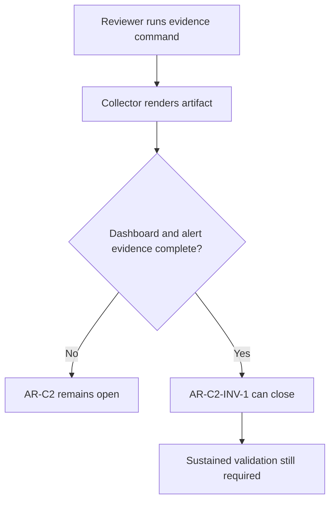

# AR-C2 Immutable Evidence Gate User Stories

## Stories

### US-AR-C2-INV-1-001 Missing evidence blocks closure

As a release reviewer, I want `pnpm ops:ar-c2:evidence` to fail closed when
dashboard panels or alert rules are missing, so AR-C2 cannot be marked done from
documentation intent alone.

Acceptance criteria:

- Given no dashboard snapshot, every required panel is reported as missing.
- Given no alert snapshot, every required threshold rule is reported as missing.
- Given `--require-dashboard-alert-evidence`, the command exits non-zero.

### US-AR-C2-INV-1-002 Complete T2/T3 evidence passes

As an SRE, I want complete dashboard and alert snapshots to satisfy
`AR-C2-INV-1`, so the remaining closure work can focus on sustained validation
windows.

Acceptance criteria:

- Given all mapped panel keys, dashboard evidence passes.
- Given all mapped threshold rules, alert evidence passes.
- Missing sustained windows do not fail this invariant; they remain
  `AR-C2-INV-4`.

### US-AR-C2-INV-1-003 Generated artifact remains inspectable

As an architecture reviewer, I want the generated artifact to be written even
when the assertion fails, so blockers are visible in review.

Acceptance criteria:

- The artifact records `missing_panel` and `missing_alert` rows.
- The command reports blocker counts in stderr.
- The runbook points closure reviewers to the assertion mode.

## Scenario diagram

