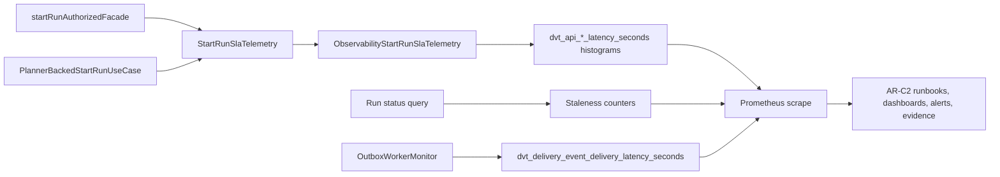
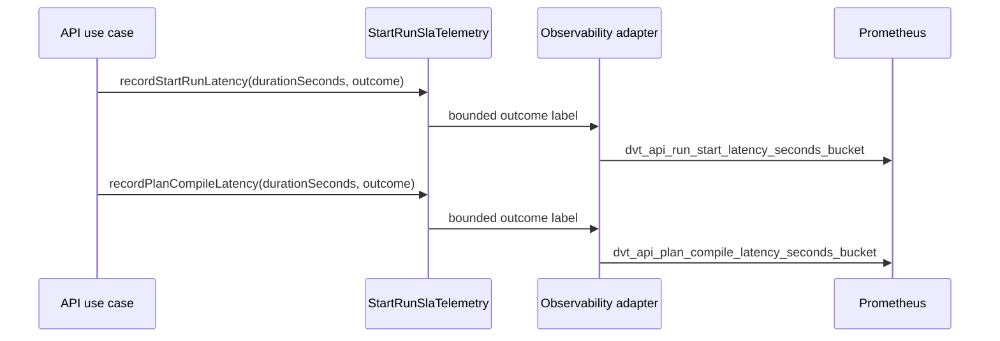

---
title: AR-C2 Prometheus SLA Component
status: Active
owner: Runtime / SRE / Docs
last_reviewed: 2026-05-14
---

# AR-C2 Prometheus SLA Component

## Owned concern

This component owns AR-C2 SLA metric identity, units, bounded-label semantics,
and Prometheus query alignment for API runtime, snapshot freshness, event
delivery, and outbox drain signals.

It does not own OpenLineage lineage events, Grafana provisioning,
Alertmanager routing, or backwards-compatible metric aliases.

## Public API

### API telemetry port

- `StartRunSlaTelemetry.recordStartRunLatency(durationSeconds, outcome)`
- `StartRunSlaTelemetry.recordPlanCompileLatency(durationSeconds, outcome)`
- `StartRunLatencyOutcome`: `accepted`, `rejected`, `unauthenticated`,
  `exception`
- `PlanCompileLatencyOutcome`: `built`, `reused`, `error`

### Prometheus metric identity

| Signal                      | Prometheus metric                                     | Type      | Labels           |
| --------------------------- | ----------------------------------------------------- | --------- | ---------------- |
| Start-run latency           | `dvt_api_run_start_latency_seconds`                   | histogram | `outcome`        |
| Plan compile latency        | `dvt_api_plan_compile_latency_seconds`                | histogram | `outcome`        |
| Snapshot freshness result   | `dvt.api.run_status.snapshot_staleness_result_total`  | counter   | `kind`, `status` |
| Snapshot freshness fallback | `dvt.api.run_status.snapshot_staleness_unknown_total` | counter   | none             |
| Outbox oldest claimed lag   | `dvt_outbox_oldest_claimed_lag_seconds`               | gauge     | none             |
| Outbox drain lag            | `dvt_delivery_outbox_drain_lag_seconds`               | gauge     | none             |
| Event delivery latency      | `dvt_delivery_event_delivery_latency_seconds`         | histogram | none             |

## Invariants

1. AR-C2 latency histograms use seconds as the stored Prometheus unit.
2. No legacy `_ms` AR-C2 latency alias is exported.
3. Human-facing thresholds may remain written in milliseconds when the PromQL
   expression converts seconds explicitly or the threshold value is stated in
   seconds.
4. Exported metric labels must stay bounded; tenant IDs, run IDs, plan IDs,
   workspace IDs, and event IDs are not metric labels.
5. The runbook, component guide, evidence artifact, code constants, and tests
   must name the same current-version metrics.
6. Snapshot freshness ratios are derived from counters and remain documented as
   operational queries rather than separately emitted metrics.

## Transitions

| State                     | Input                                 | Result                                                                           |
| ------------------------- | ------------------------------------- | -------------------------------------------------------------------------------- |
| Run start accepted        | API facade completes admission        | Start-run latency observation is recorded in seconds with `outcome="accepted"`.  |
| Run start rejected        | API facade rejects request            | Start-run latency observation is recorded in seconds with the rejection outcome. |
| Plan compile built        | Planner-backed use case builds a plan | Plan compile latency observation is recorded in seconds with `outcome="built"`.  |
| Plan compile reused       | Existing compiled plan is reused      | Plan compile latency observation is recorded in seconds with `outcome="reused"`. |
| Event delivered or failed | Outbox observer callback completes    | Event delivery latency histogram records elapsed seconds.                        |
| Snapshot stale/unknown    | Status query evaluates freshness      | Staleness counters increment with bounded labels.                                |

## Consumers

- API start-run authorization and planner-backed use cases.
- Outbox worker monitor Prometheus scrape endpoint.
- AR-C2 SLA canonical runbook.
- AR-C2 signal-threshold mapping.
- AR-C2 evidence collector and generated evidence artifact.
- Dashboard and alert authors using the current Prometheus metric version.

## Diagrams

