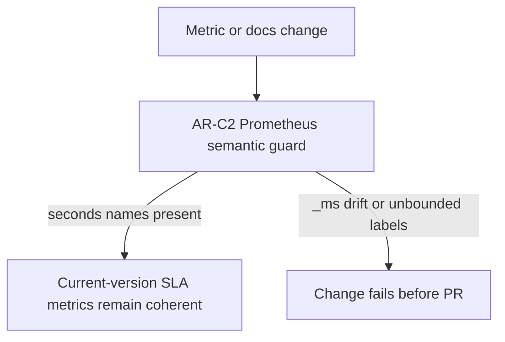

---
title: AR-C2 Prometheus SLA User Stories
status: Active
owner: Runtime / SRE / Docs
last_reviewed: 2026-05-14
---

# AR-C2 Prometheus SLA User Stories

## Stories

### US-AR-C2-PROM-001 Current metrics use Prometheus base units

As an SRE, I want AR-C2 latency histograms to use `_seconds` metric names and
second-valued observations, so dashboards and alerts follow Prometheus
conventions.

Acceptance criteria:

- API start-run latency is exported as
  `dvt_api_run_start_latency_seconds_bucket`.
- API plan compile latency is exported as
  `dvt_api_plan_compile_latency_seconds_bucket`.
- Event delivery latency is exported as
  `dvt_delivery_event_delivery_latency_seconds_bucket`.
- No AR-C2 latency `_ms` alias is exported.

### US-AR-C2-PROM-002 Labels remain bounded

As an operations owner, I want AR-C2 metric labels to exclude tenant, run,
workspace, event, and plan identifiers, so operational metrics do not create
unbounded cardinality.

Acceptance criteria:

- API latency histograms use only `outcome`.
- Snapshot freshness counters use only `kind` and `status` where needed.
- Event delivery latency has no entity identifier labels.
- The architecture guard fails if AR-C2 telemetry code exports identifier
  labels.

### US-AR-C2-PROM-003 Docs and code cannot drift silently

As an architecture reviewer, I want a semantic guard to compare AR-C2 metric
identity across docs and code, so future edits cannot update only one surface.

Acceptance criteria:

- The guard reads code, runbooks, evidence docs, and component docs.
- The guard asserts all current AR-C2 metric names are present.
- The guard asserts old AR-C2 `_ms` latency names are absent from current
  surfaces.

### US-AR-C2-PROM-004 Thresholds stay readable

As a release reviewer, I want human threshold tables to remain readable in
milliseconds while PromQL uses seconds, so review intent is clear without
breaking Prometheus semantics.

Acceptance criteria:

- Threshold tables may say `p99 <= 2500ms`.
- PromQL examples query `_seconds_bucket` series.
- Where a literal threshold is written inside PromQL, it uses seconds.

### US-AR-C2-PROM-005 Module ownership is explicit

As a maintainer, I want each AR-C2 telemetry module to declare its owned
concern, so later refactors do not mix API telemetry, outbox delivery metrics,
and evidence generation.

Acceptance criteria:

- Start-run SLA metric constants declare the AR-C2 metric identity concern.
- API telemetry adapter declares the recording concern.
- Outbox monitor and delivery telemetry declare the worker metric concern.
- Renderer declares Prometheus text exposition as its concern.

## Scenario Diagram

