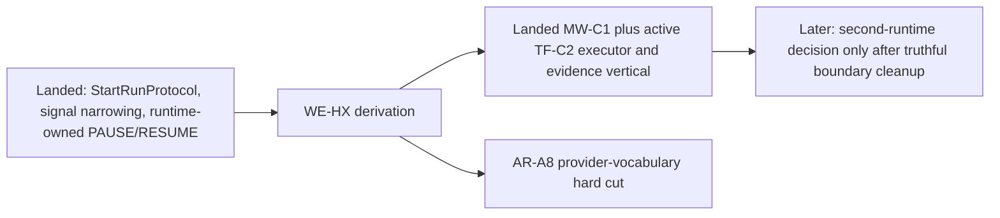
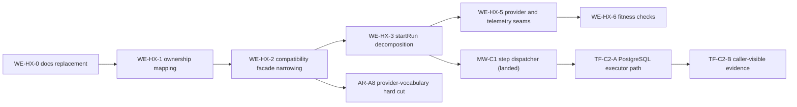

# Engine Roadmap

This is the active engine-specific projection surface.

Use it to answer these questions:

- what engine work is actually active now;
- which engine slices are already absorbed into mainline;
- which next engine changes unblock the runtime vertical;
- which older engine promises are no longer active planning truth.

It does not replace:

- [System Delivery Status](../../../system-delivery-status.md) for what is true in code now;
- [WorkflowEngine target architecture v1](../workflow-engine-target-architecture.v1.md)
  for the target subsystem shape;
- Lane YAML for executable task ownership and blockers;
- [Roadmap Of Record](../../../../planning/roadmap/index.md) for repository-wide
  roadmap authority.

## Canonical companions

- [WorkflowEngine subsystem context](../workflow-engine-subsystem-context.md)
- [WorkflowEngine target architecture v1](../workflow-engine-target-architecture.v1.md)
- [StartRun Protocol v1](../contracts/engine/StartRunProtocol.v1.md)
- [Roadmap By Domain](../../../../planning/roadmap/roadmap-by-domain.md)
- `docs/planning/state/agent-lane-a.yaml`
- `docs/planning/state/agent-lane-c.yaml`

## Current posture

The current engine story is not the old phase plan anymore.

What is true now:

- Temporal is the only implemented provider runtime path.
- Mock exists as a testing/runtime support surface.
- The active runtime-provider vocabulary is now aligned with executable code:
  Temporal is the only implemented provider runtime.
- The active engine architecture program is `WE-HX`, not a quarterly phase
  ladder.
- The active value path after the recent signal-boundary cleanup is the first
  execution-first transformation runtime vertical on top of landed `MW-C1`
  (`TF-C2-A`, `TF-C2-B`).
- The outbox runtime and standalone read-model path are already shipped and are
  not future engine roadmap items anymore.

## Engine program map

## Active tracks

| Track                                             | Governing tasks      | Status      | What it changes                                                                                  | What it unblocks                                                   |
| ------------------------------------------------- | -------------------- | ----------- | ------------------------------------------------------------------------------------------------ | ------------------------------------------------------------------ |
| Canonical engine narrative replacement            | `WE-HX-0`            | In progress | Replaces stale engine navigation with canonical subsystem docs and current routing               | Makes the rest of the engine pack readable and governable          |
| Boundary ownership mapping                        | `WE-HX-1`            | Queued      | Locks ownership for `PlanRef`, execution-context, artifact, and resolver seams                   | Enables facade narrowing without ownership drift                   |
| Compatibility-facade narrowing                    | `WE-HX-2`            | Queued      | Shrinks `WorkflowEngine` toward delegation over narrow use-case services                         | Enables real decomposition and cleanup of portability claims       |
| Start-run decomposition                           | `WE-HX-3`            | Queued      | Narrows admission, dispatch, failure, and bootstrap concerns into smaller collaborators          | Makes engine orchestration easier to change safely                 |
| Query and signal split hardening                  | `WE-HX-4`            | Completed   | Closed signal ownership, canonical signal narrowing, provider mapping, and read/enrichment split | Removed a major source of semantic drift                           |
| Provider and telemetry seam tightening            | `WE-HX-5`, `WE-HX-6` | Queued      | Consolidates provider resolution, telemetry seams, and fitness checks                            | Reduces orchestration duplication and hidden boundary drift        |
| Provider-vocabulary hard cut                      | `AR-A8`              | Completed   | Removes stub-driven portability promises from runtime typing and docs                            | Prevents roadmap and product claims from outrunning implementation |
| Step-kind dispatch generalization                 | `MW-C1`              | Completed   | Moved Temporal runtime dispatch from dbt-only assumptions to step-kind routing                   | Enabled capability-specific non-dbt execution paths                |
| First PostgreSQL execution-first runtime vertical | `TF-C2-A`, `TF-C2-B` | In progress | Adds executor path plus caller-visible materialization evidence                                  | Closes the first real transformation run loop                      |

## Near-term sequencing

## Already absorbed into mainline

These are not future engine roadmap items anymore:

- `StartRunProtocol.v1` exists and documents the current start-run protocol.
- Runtime-owned `PAUSE` / `RESUME` lifecycle ownership is governed and landed.
- Canonical `SignalType` is narrowed to run-control semantics.
- Retry concerns are governed as dedicated future use cases, not generic signal
  verbs.
- `MW-C1` step dispatch generalization is landed in the Temporal runtime path.
- Outbox runtime and standalone read-model/projector delivery are already part
  of the shipped architecture surface.

## Not active roadmap truth

These topics should not be treated as current engine delivery commitments:

- a near-term second-runtime production adapter program;
- multi-language SDK delivery as an engine-core roadmap item;
- plugin marketplace work as part of the engine roadmap;
- staffing, budget, and quarter-based gate tables from the February snapshot.

If a second runtime becomes real work again, it needs an explicit ADR-backed
plan and lane tasking first. Until then, old provider-draft material is
historical context, not an active phase.

## Decision rules

- If the question is `what is true in code now?`, read
  [System Delivery Status](../../../system-delivery-status.md).
- If the question is `what shape is the engine moving toward?`, read
  [WorkflowEngine target architecture v1](../workflow-engine-target-architecture.v1.md).
- If the question is `what engine slice should we execute next?`, read this page
  and then Lane A or Lane C.
- If the question is `what unblocks the first governed runtime vertical now?`,
  trace the remaining `TF-C2` acceptance on top of landed `MW-C1`, `TF-C2-A`,
  and `TF-C2-B` in Lane C.

## Historical snapshot

The earlier phase ladder is preserved for archive-only context:

- [Engine roadmap phases snapshot (2026-02-11)](../../../../archive/architecture/engine-roadmap-phases-20260211.md)

That archived snapshot is not active planning authority anymore.
